## Oppgave 7: Implementering av høy tilgjengelighet med ECS

I denne oppgaven skal vi forbedre oppgavestyringssystemets tilgjengelighet ved å implementere en høytilgjengelig arkitektur med Amazon ECS.

### Oppgavebeskrivelse:

1. Opprett et nytt public subnet i en annen Availability Zone i den eksisterende VPC.
2. Konfigurer en Application Load Balancer (ALB) som distribuerer trafikk mellom de to Availability Zones.
3. Oppdater ECS-clusteret til å kjøre tasks i begge Availability Zones.
4. Implementer en ECS service med minimum to tasks som alltid kjører.
5. Test høy tilgjengelighet ved å simulere en feil i én Availability Zone.

### Mermaid-diagram:

```mermaid
architecture-beta
   service alb(logos:aws-ec2)[Application Load Balancer]
   service ecs(logos:aws-ecs)[ECS Cluster]
   service task1(logos:aws-ecs)[Task AZ1]
   service task2(logos:aws-ecs)[Task AZ2]
   service container1(logos:docker)[Container 1]
   service container2(logos:docker)[Container 2]

   alb:B --> T:ecs
   ecs:L --> R:task1
   ecs:R --> L:task2
   task1:B --> T:container1
   task2:B --> T:container2
```

Løsning

1. Opprett et nytt public subnet:
   - Gå til VPC Dashboard i AWS Console
   - Velg eksisterende VPC
   - Klikk "Subnets" og deretter "Create subnet"
   - Velg en annen Availability Zone enn det eksisterende subnet
   - Konfigurer route table med rute til Internet Gateway

2. Konfigurer Application Load Balancer:
   - Gå til EC2 Dashboard
   - Klikk "Load Balancers" i venstre meny
   - Klikk "Create Load Balancer"
   - Velg "Application Load Balancer"
   - Velg begge public subnets
   - Opprett en ny security group som tillater innkommende trafikk på port 80
   - Konfigurer en target group for ECS-tjenesten

3. Oppdater ECS-clusteret:
   - Gå til ECS Dashboard
   - Velg clusteret
   - Klikk "Update Cluster"
   - Legg til det nye public subnet i konfigurasjonen

4. Implementer ECS service:
   - I ECS-clusteret, klikk "Create"
   - Velg "EC2 launch type"
   - Velg task definition for oppgavestyringssystemet
   - Sett "Number of tasks" til 2
   - Velg begge public subnets
   - Velg Application Load Balancer som lastbalanserer
   - Klikk "Create"

5. Test høy tilgjengelighet:
   - Gå til EC2 Dashboard
   - Velg en av EC2-instansene som kjører ECS-tasks
   - Klikk "Instance state" og velg "Stop instance"
   - Overvåk ECS-clusteret og se at en ny task automatisk startes i den andre Availability Zone
   - Verifiser at applikasjonen fortsatt er tilgjengelig via ALB-ens DNS-navn

Ved å implementere høy tilgjengelighet, sikrer du at oppgavestyringssystemet forblir operativt selv om én Availability Zone skulle feile. Dette øker systemets robusthet og pålitelighet betydelig.

> [!NOTE]
> Høy tilgjengelighet er kritisk for produksjonssystemer. Ved å distribuere applikasjonen over flere Availability Zones, reduserer du risikoen for nedetid og forbedrer den generelle brukeropplevelsen.