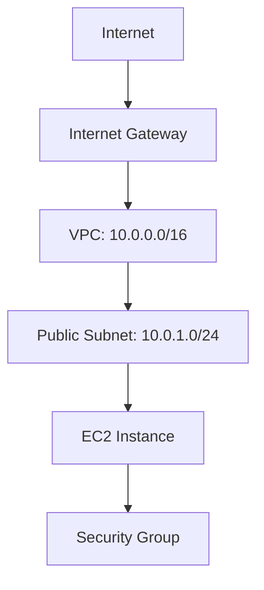
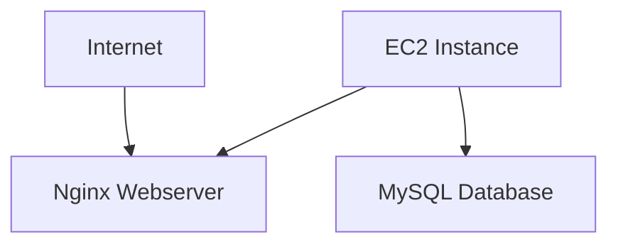
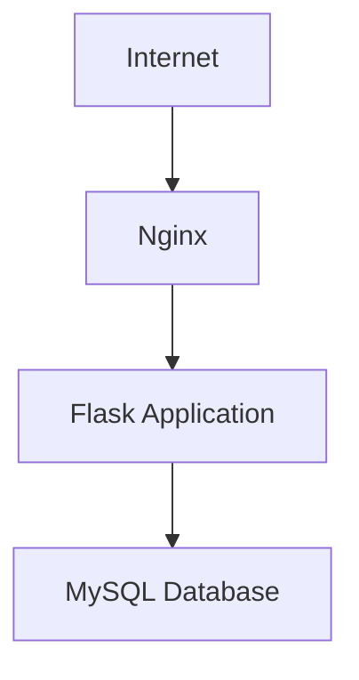
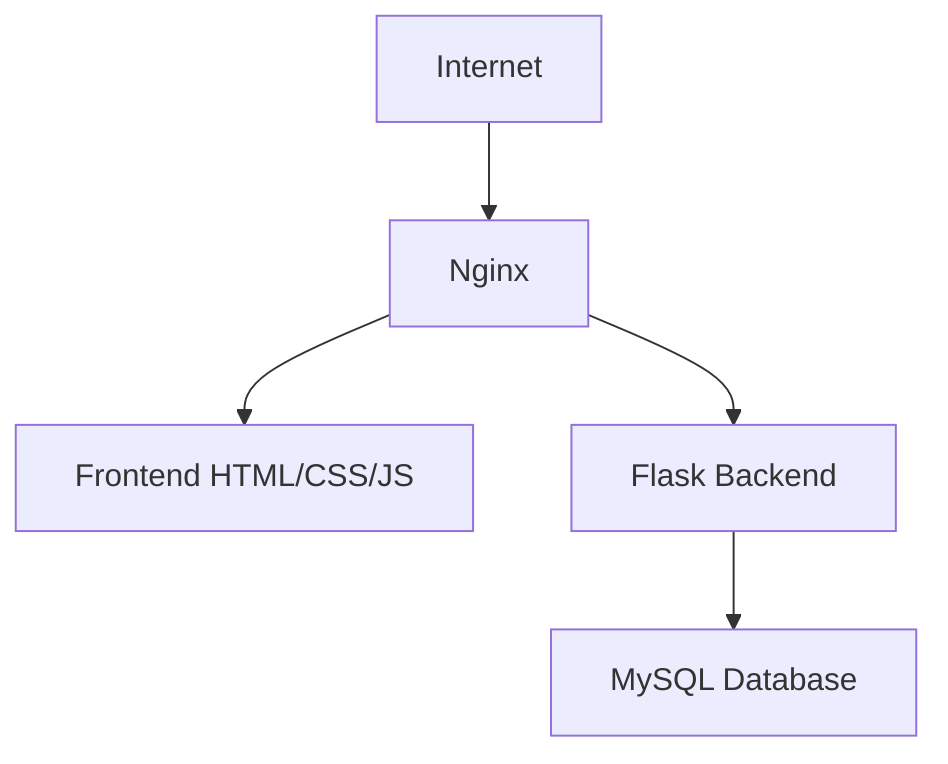
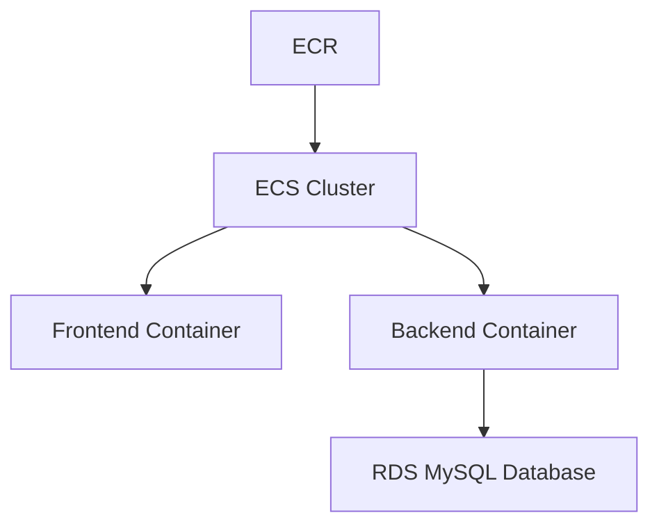
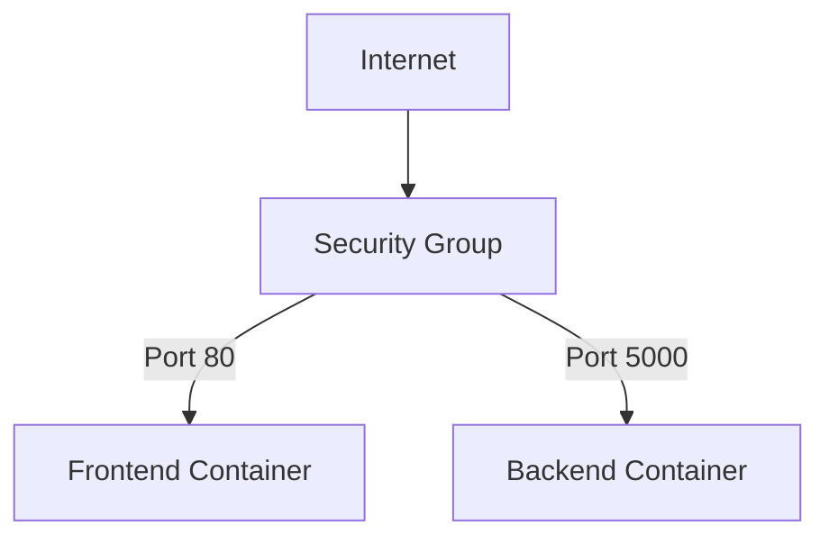

# Oppgavesett: AWS - Console, VPC og EC2
# Innholdsfortegnelse


# Introduksjon til skyteknologi med AWS: Oppgavestyringssystem

I dette kurset skal vi bygge et enkelt oppgavestyringssystem ved hjelp av AWS-tjenester. Vi vil starte med grunnleggende oppsett og gradvis bygge ut funksjonaliteten. Kurset vil fokusere på infrastruktur og AWS-tjenester, med minimal vekt på applikasjonskode.

## Oppgave 1: Oppsett av VPC og EC2-instans

I denne oppgaven skal du sette opp en Virtual Private Cloud (VPC) og lansere en EC2-instans som vil fungere som vår webserver.

### Oppgavebeskrivelse:

1. Opprett en ny VPC med CIDR-blokk 10.0.0.0/16.
2. Lag et public subnet med CIDR-blokk 10.0.1.0/24.
3. Opprett en Internet Gateway og koble den til VPC-en.
4. Konfigurer route table for public subnet.
5. Lanser en t2.micro EC2-instans med Amazon Linux 2 i public subnet.
6. Konfigurer en security group for EC2-instansen som tillater innkommende trafikk på port 22 (SSH) og 80 (HTTP).

### Mermaid-diagram:



<details>
<summary>Løsning</summary>

1. Opprett VPC:
   - Gå til VPC Dashboard i AWS Console
   - Klikk \"Create VPC\
   - Angi navn og CIDR-blokk 10.0.0.0/16

2. Opprett public subnet:
   - I VPC Dashboard, velg \"Subnets\" og klikk \"Create subnet\
   - Velg VPC-en du opprettet
   - Angi navn og CIDR-blokk 10.0.1.0/24

3. Opprett Internet Gateway:
   - I VPC Dashboard, velg \"Internet Gateways\" og klikk \"Create internet gateway\
   - Gi den et navn og klikk \"Create\
   - Velg den nye Internet Gateway og klikk \"Attach to VPC\
   - Velg VPC-en du opprettet

4. Konfigurer route table:
   - I VPC Dashboard, velg \"Route Tables\
   - Finn route table assosiert med VPC-en
   - Legg til en ny rute: Destination 0.0.0.0/0, Target: Internet Gateway

5. Lanser EC2-instans:
   - Gå til EC2 Dashboard
   - Klikk \"Launch Instance\
   - Velg Amazon Linux 2 AMI
   - Velg t2.micro instance type
   - Konfigurer instance details: Velg VPC og public subnet
   - Konfigurer security group: Tillat inngående trafikk på port 22 og 80
   - Launch instance

Dette setter opp grunnleggende infrastruktur for vårt oppgavestyringssystem.

</details>

## Oppgave 2: Installasjon av webserver og database

I denne oppgaven skal du installere og konfigurere en webserver (Nginx) og en database (MySQL) på EC2-instansen.

### Oppgavebeskrivelse:

1. Koble til EC2-instansen via SSH.
2. Installer Nginx webserver.
3. Installer MySQL database server.
4. Konfigurer Nginx til å servere en enkel HTML-side som sier \"Velkommen til oppgavestyringssystemet\".
5. Opprett en database kalt \"taskmanager\" i MySQL.

### Mermaid-diagram:



<details>
<summary>Løsning</summary>

1. Koble til EC2-instansen:
   ```
   ssh -i your-key.pem ec2-user@your-instance-ip
   ```

2. Installer Nginx:
   ```
   sudo amazon-linux-extras install nginx1
   sudo systemctl start nginx
   sudo systemctl enable nginx
   ```

3. Installer MySQL:
   ```
   sudo yum install mysql-server
   sudo systemctl start mysqld
   sudo systemctl enable mysqld
   ```

4. Konfigurer Nginx:
   ```
   sudo nano /usr/share/nginx/html/index.html
   ```
   Skriv inn:
   ```html
   <html>
     <body>
       <h1>Velkommen til oppgavestyringssystemet</h1>
     </body>
   </html>
   ```

5. Opprett database:
   ```
   sudo mysql
   CREATE DATABASE taskmanager;
   exit
   ```

Du har nå satt opp en webserver og en database på EC2-instansen. Du kan åpne en nettleser og gå til EC2-instansens offentlige IP-adresse for å se velkomstsiden.

</details>

## Oppgave 3: Implementer backend for oppgavestyring

I denne oppgaven skal du implementere en enkel backend for oppgavestyringssystemet ved hjelp av Python og Flask.

### Oppgavebeskrivelse:

1. Installer Python og nødvendige pakker på EC2-instansen.
2. Skriv en enkel Flask-applikasjon som kobler til MySQL-databasen.
3. Implementer API-endepunkter for å liste, opprette, oppdatere og slette oppgaver.
4. Konfigurer Nginx til å videresende forespørsler til Flask-applikasjonen.

### Mermaid-diagram:



<details>
<summary>Løsning</summary>

1. Installer Python og pakker:
   ```
   sudo yum install python3 python3-pip
   sudo pip3 install flask flask-sqlalchemy mysqlclient
   ```

2. Opprett Flask-applikasjon (app.py):
   ```python
   from flask import Flask, request, jsonify
   from flask_sqlalchemy import SQLAlchemy

   app = Flask(__name__)
   app.config['SQLALCHEMY_DATABASE_URI'] = 'mysql://root:@localhost/taskmanager'
   db = SQLAlchemy(app)

   class Task(db.Model):
       id = db.Column(db.Integer, primary_key=True)
       title = db.Column(db.String(100), nullable=False)
       description = db.Column(db.String(200))
       status = db.Column(db.String(20), default='To Do')

   @app.route('/tasks', methods=['GET'])
   def get_tasks():
       tasks = Task.query.all()
       return jsonify([{'id': task.id, 'title': task.title, 'description': task.description, 'status': task.status} for task in tasks])

   @app.route('/tasks', methods=['POST'])
   def create_task():
       data = request.json
       new_task = Task(title=data['title'], description=data['description'])
       db.session.add(new_task)
       db.session.commit()
       return jsonify({'message': 'Task created successfully'}), 201

   if __name__ == '__main__':
       db.create_all()
       app.run(host='0.0.0.0', port=5000)
   ```

3. Konfigurer Nginx (/etc/nginx/nginx.conf):
   ```
   server {
       listen 80;
       server_name _;

       location / {
           proxy_pass http://127.0.0.1:5000;
           proxy_set_header Host $host;
           proxy_set_header X-Real-IP $remote_addr;
       }
   }
   ```

4. Start Flask-applikasjonen:
   ```
   python3 app.py &
   ```

5. Omstart Nginx:
   ```
   sudo systemctl restart nginx
   ```

Du har nå implementert en enkel backend for oppgavestyringssystemet. Du kan teste API-endepunktene ved å sende HTTP-forespørsler til EC2-instansens offentlige IP-adresse.

</details>

## Oppgave 4: Implementer frontend for oppgavestyring

I denne oppgaven skal du implementere en enkel frontend for oppgavestyringssystemet ved hjelp av HTML, CSS og JavaScript.

### Oppgavebeskrivelse:

1. Opprett en HTML-side med grunnleggende struktur for oppgavestyringssystemet.
2. Legg til CSS for å style siden.
3. Implementer JavaScript-kode for å interagere med backend-API-et.
4. Konfigurer Nginx til å servere frontend-filene.

### Mermaid-diagram:



<details>
<summary>Løsning</summary>

1. Opprett HTML-fil (index.html):
   ```html
   <!DOCTYPE html>
   <html lang=\"en\">
   <head>
       <meta charset=\"UTF-8\">
       <meta name=\"viewport\" content=\"width=device-width, initial-scale=1.0\">
       <title>Oppgavestyringssystem</title>
       <link rel=\"stylesheet\" href=\"style.css\">
   </head>
   <body>
       <h1>Oppgavestyringssystem</h1>
       <div id=\"task-list\"></div>
       <form id=\"task-form\">
           <input type=\"text\" id=\"task-title\" placeholder=\"Oppgavetittel\" required>
           <textarea id=\"task-description\" placeholder=\"Oppgavebeskrivelse\"></textarea>
           <button type=\"submit\">Legg til oppgave</button>
       </form>
       <script src=\"script.js\"></script>
   </body>
   </html>
   ```

2. Opprett CSS-fil (style.css):
   ```css
   body {
       font-family: Arial, sans-serif;
       max-width: 800px;
       margin: 0 auto;
       padding: 20px;
   }

   #task-list {
       margin-bottom: 20px;
   }

   .task {
       border: 1px solid #ddd;
       padding: 10px;
       margin-bottom: 10px;
   }

   form {
       display: flex;
       flex-direction: column;
   }

   input, textarea, button {
       margin-bottom: 10px;
       padding: 5px;
   }
   ```

3. Opprett JavaScript-fil (script.js):
   ```javascript
   async function getTasks() {
       const response = await fetch('/tasks');
       const tasks = await response.json();
       const taskList = document.getElementById('task-list');
       taskList.innerHTML = '';
       tasks.forEach(task => {
           const taskElement = document.createElement('div');
           taskElement.className = 'task';
           taskElement.innerHTML = `
               <h3>${task.title}</h3>
               <p>${task.description}</p>
               <p>Status: ${task.status}</p>
           `;
           taskList.appendChild(taskElement);
       });
   }

   document.getElementById('task-form').addEventListener('submit', async (e) => {
       e.preventDefault();
       const title = document.getElementById('task-title').value;
       const description = document.getElementById('task-description').value;
       await fetch('/tasks', {
           method: 'POST',
           headers: {
               'Content-Type': 'application/json',
           },
           body: JSON.stringify({ title, description }),
       });
       getTasks();
       e.target.reset();
   });

   getTasks();
   ```

4. Konfigurer Nginx (oppdater /etc/nginx/nginx.conf):
   ```
   server {
       listen 80;
       server_name _;

       location / {
           root /usr/share/nginx/html;
           index index.html;
           try_files $uri $uri/ /index.html;
       }

       location /tasks {
           proxy_pass http://127.0.0.1:5000;
           proxy_set_header Host $host;
           proxy_set_header X-Real-IP $remote_addr;
       }
   }
   ```

5. Kopier frontend-filer til Nginx-mappen:
   ```
   sudo cp index.html style.css script.js /usr/share/nginx/html/
   ```

6. Omstart Nginx:
   ```
   sudo systemctl restart nginx
   ```

Du har nå implementert en enkel frontend for oppgavestyringssystemet. Du kan åpne en nettleser og gå til EC2-instansens offentlige IP-adresse for å se og bruke applikasjonen.

</details>

## Oppgave 5: Migrering til containere med Docker og ECS

I denne oppgaven skal du migrere applikasjonen fra EC2 til containere ved hjelp av Docker og Amazon ECS (Elastic Container Service).

### Oppgavebeskrivelse:

1. Opprett Dockerfiler for frontend og backend.
2. Bygg Docker-images og push dem til Amazon ECR (Elastic Container Registry).
3. Opprett en ECS cluster.
4. Definer task definitions for frontend og backend.
5. Opprett ECS services for å kjøre containerne.

### Mermaid-diagram:



<details>
<summary>Løsning</summary>

1. Opprett Dockerfile for backend (Dockerfile-backend):
   ```dockerfile
   FROM python:3.8-slim-buster
   WORKDIR /app
   COPY requirements.txt .
   RUN pip install -r requirements.txt
   COPY app.py .
   CMD [\"python\", \"app.py\"]
   ```

   Opprett Dockerfile for frontend (Dockerfile-frontend):
   ```dockerfile
   FROM nginx:alpine
   COPY index.html /usr/share/nginx/html/
   COPY style.css /usr/share/nginx/html/
   COPY script.js /usr/share/nginx/html/
   ```

2. Bygg og push Docker-images:
   ```
   aws ecr create-repository --repository-name taskmanager-frontend
   aws ecr create-repository --repository-name taskmanager-backend
   
   docker build -t taskmanager-frontend:latest -f Dockerfile-frontend .
   docker build -t taskmanager-backend:latest -f Dockerfile-backend .
   
   docker tag taskmanager-frontend:latest <your-account-id>.dkr.ecr.<your-region>.amazonaws.com/taskmanager-frontend:latest
   docker tag taskmanager-backend:latest <your-account-id>.dkr.ecr.<your-region>.amazonaws.com/taskmanager-backend:latest
   
   aws ecr get-login-password --region <your-region> | docker login --username AWS --password-stdin <your-account-id>.dkr.ecr.<your-region>.amazonaws.com

    docker push <your-account-id>.dkr.ecr.<your-region>.amazonaws.com/taskmanager-frontend:latest
    docker push <your-account-id>.dkr.ecr.<your-region>.amazonaws.com/taskmanager-backend:latest
    ```

3. Opprett ECS Cluster:
    - Gå til Amazon ECS i AWS Console
    - Klikk "Create Cluster"
    - Velg "EC2 Linux + Networking"
    - Gi clusteret et navn (f.eks. "taskmanager-cluster")
    - Velg instanstype (t2.micro for testing)
    - Sett ønsket antall instanser (1 for testing)
    - Velg VPC og subnet fra tidligere oppsett
    - Klikk "Create"

4. Opprett Task Definitions:
    - I ECS Console, velg "Task Definitions"
    - Klikk "Create new Task Definition"
    - Velg "EC2"
    - Backend Task Definition:
      * Navn: "taskmanager-backend"
      * Container Definition:
         - Navn: "backend"
         - Image: [ECR URL for backend]
         - Memory Limits: 256MB
         - Port mappings: 5000
    - Frontend Task Definition:
      * Navn: "taskmanager-frontend"
      * Container Definition:
         - Navn: "frontend"
         - Image: [ECR URL for frontend]
         - Memory Limits: 256MB
         - Port mappings: 80

5. Opprett ECS Services:
    - I ECS Cluster, velg "Services"
    - Klikk "Create"
    - For hver service (frontend og backend):
      * Launch type: EC2
      * Task Definition: velg respektiv definisjon
      * Service name: "taskmanager-[frontend/backend]"
      * Number of tasks: 1
      * Deployment type: Rolling update

Du kan nå aksessere frontend og backend direkte via deres respektive container porter på ECS instance IP.

</details>

## Oppgave 6: Konfigurering av Security Groups

I denne oppgaven skal du konfigurere security groups for å sikre riktig nettverkstilgang til containerne.

### Oppgavebeskrivelse:

1. Finn security group for ECS cluster.
2. Legg til inbound regler for frontend og backend.
3. Verifiser at reglene er korrekt implementert.
4. Test tilgjengeligheten til applikasjonen.

### Mermaid-diagram:



<details>
<summary>Løsning</summary>

1. Naviger til Security Groups:
   ```
   - Gå til EC2 Dashboard i AWS Console
   - Velg "Security Groups" fra venstre meny
   - Finn security group tilknyttet ECS cluster
   ```

2. Konfigurer inbound regler:
   ```
   - Velg security group
   - Klikk "Edit inbound rules"
   - Legg til regel: Type=Custom TCP, Port=80, Source=0.0.0.0/0
   - Legg til regel: Type=Custom TCP, Port=5000, Source=0.0.0.0/0
   - Klikk "Save rules"
   ```

3. Verifiser regler:
   ```
   - Sjekk at begge regler vises i inbound rules list
   - Kontroller at portene er korrekt spesifisert
   - Verifiser at source er satt riktig
   ```

4. Test tilgang:
   ```
   - Åpne nettleser
   - Gå til ECS instance public IP på port 80
   - Verifiser at frontend er tilgjengelig
   - Test backend-endepunkt på port 5000
   ```

Dette sikrer at applikasjonen er korrekt tilgjengelig via internett med nødvendige sikkerhetsrestriksjoner.

</details>


## Oppgave 7: Implementering av høy tilgjengelighet med ECS

I denne oppgaven skal vi forbedre oppgavestyringssystemets tilgjengelighet ved å implementere en høytilgjengelig arkitektur med Amazon ECS.

### Oppgavebeskrivelse:

1. Opprett et nytt public subnet i en annen Availability Zone i den eksisterende VPC.
2. Konfigurer en Application Load Balancer (ALB) som distribuerer trafikk mellom de to Availability Zones.
3. Oppdater ECS-clusteret til å kjøre tasks i begge Availability Zones.
4. Implementer en ECS service med minimum to tasks som alltid kjører.
5. Test høy tilgjengelighet ved å simulere en feil i én Availability Zone.

### Mermaid-diagram:


<details>
<summary>Løsning</summary>

```mermaid
architecture-beta
   service alb(logos:aws-ec2)[Application Load Balancer]
   service ecs(logos:aws-ecs)[ECS Cluster]
   service task1(logos:aws-ecs)[Task AZ1]
   service task2(logos:aws-ecs)[Task AZ2]
   service container1(logos:docker)[Container 1]
   service container2(logos:docker)[Container 2]

   alb:B --> T:ecs
   ecs:L --> R:task1
   ecs:R --> L:task2
   task1:B --> T:container1
   task2:B --> T:container2
```

1. Opprett et nytt public subnet:
   - Gå til VPC Dashboard i AWS Console
   - Velg eksisterende VPC
   - Klikk "Subnets" og deretter "Create subnet"
   - Velg en annen Availability Zone enn det eksisterende subnet
   - Konfigurer route table med rute til Internet Gateway

2. Konfigurer Application Load Balancer:
   - Gå til EC2 Dashboard
   - Klikk "Load Balancers" i venstre meny
   - Klikk "Create Load Balancer"
   - Velg "Application Load Balancer"
   - Velg begge public subnets
   - Opprett en ny security group som tillater innkommende trafikk på port 80
   - Konfigurer en target group for ECS-tjenesten

3. Oppdater ECS-clusteret:
   - Gå til ECS Dashboard
   - Velg clusteret
   - Klikk "Update Cluster"
   - Legg til det nye public subnet i konfigurasjonen

4. Implementer ECS service:
   - I ECS-clusteret, klikk "Create"
   - Velg "EC2 launch type"
   - Velg task definition for oppgavestyringssystemet
   - Sett "Number of tasks" til 2
   - Velg begge public subnets
   - Velg Application Load Balancer som lastbalanserer
   - Klikk "Create"

5. Test høy tilgjengelighet:
   - Gå til EC2 Dashboard
   - Velg en av EC2-instansene som kjører ECS-tasks
   - Klikk "Instance state" og velg "Stop instance"
   - Overvåk ECS-clusteret og se at en ny task automatisk startes i den andre Availability Zone
   - Verifiser at applikasjonen fortsatt er tilgjengelig via ALB-ens DNS-navn

Ved å implementere høy tilgjengelighet, sikrer du at oppgavestyringssystemet forblir operativt selv om én Availability Zone skulle feile. Dette øker systemets robusthet og pålitelighet betydelig.

</details>

> [!NOTE]
> Høy tilgjengelighet er kritisk for produksjonssystemer. Ved å distribuere applikasjonen over flere Availability Zones, reduserer du risikoen for nedetid og forbedrer den generelle brukeropplevelsen.


