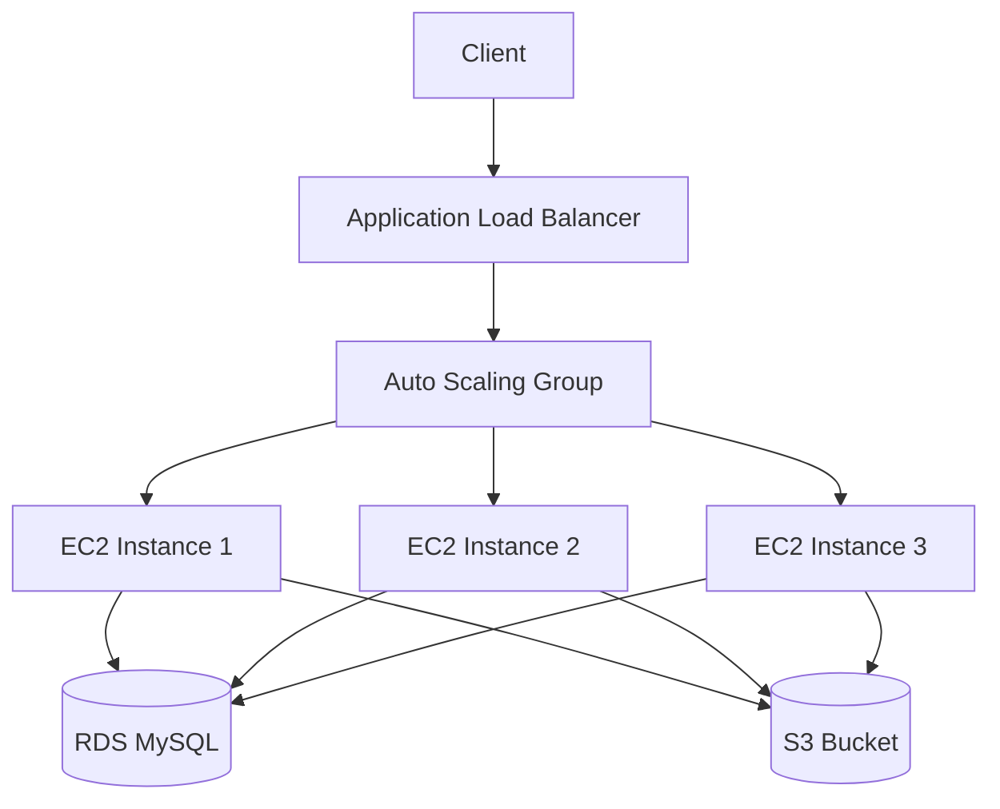

## Oppgave 7: Implementering av Auto Scaling for EC2

I denne oppgaven skal du sette opp Auto Scaling for EC2-instansen som kjører oppgavestyringssystemet. Dette vil hjelpe med å håndtere varierende belastning på systemet.

### Oppgavebeskrivelse

1. Opprett en Launch Template basert på den eksisterende EC2-instansen.
2. Sett opp en Auto Scaling Group med den nye Launch Template.
3. Konfigurer scaling policies basert på CPU-utnyttelse.
4. Test Auto Scaling ved å simulere høy belastning.

<details>
<summary>Løsning</summary>

1. Opprett en Launch Template:
   - Gå til EC2 Dashboard
   - Velg \"Launch Templates\" fra sidemenyen
   - Klikk på \"Create launch template\
   - Gi templaten et navn, f.eks. \"TaskManagerLaunchTemplate\
   - For AMI, velg Amazon Linux 2
   - Instance type: t2.micro
   - Key pair: Velg samme som den eksisterende instansen
   - Network settings: Velg eksisterende security group (WebServerSG)
   - Advanced details:
     - IAM instance profile: Velg rollen du opprettet tidligere
   - Under \"User data\", legg til følgende script for å sette opp applikasjonen:
     ```bash
     #!/bin/bash
     yum update -y
     yum install -y nginx python3 python3-pip
     pip3 install flask flask-sqlalchemy pymysql boto3
     
     # Kopier app.py fra S3 (du må laste opp app.py til S3 først)
     aws s3 cp s3://taskmanager-files-<unique-identifier>/app.py /home/ec2-user/app.py
     
     # Start applikasjonen
     python3 /home/ec2-user/app.py &
     
     # Start Nginx
     systemctl start nginx
     ```
   - Klikk på \"Create launch template\

2. Opprett en Auto Scaling Group:
   - I EC2 Dashboard, velg \"Auto Scaling Groups\" fra sidemenyen
   - Klikk på \"Create Auto Scaling group\
   - Velg den nyopprettede Launch Template
   - Velg VPC og subnets (bruk det offentlige subnettet)
   - Konfigurer gruppedetaljer:
     - Group name: TaskManagerASG
     - Desired capacity: 1
     - Minimum capacity: 1
     - Maximum capacity: 3
   - Konfigurerscaling policies:
     - Velg \"Target tracking scaling policy\
     - Metric type: Average CPU utilization
     - Target value: 70
   - Klikk på \"Create Auto Scaling group\

3. Test Auto Scaling:
   - SSH inn på den eksisterende EC2-instansen
   - Installer stress-verktøyet:
     ```
     sudo amazon-linux-extras install epel -y
     sudo yum install stress -y
     ```
   - Kjør stress-test:
     ```
     stress --cpu 1 --timeout 300
     ```
   - Overvåk Auto Scaling gruppen i AWS Console for å se om nye instanser blir lagt til

Du har nå satt opp Auto Scaling for oppgavestyringssystemet, som vil hjelpe med å håndtere varierende belastning automatisk.

</details>

### Mermaid Diagram



> [!NOTE]
> Auto Scaling er en kraftig funksjon i AWS som automatisk justerer antall EC2-instanser basert på definerte betingelser. Dette hjelper med å opprettholde applikasjonens tilgjengelighet og tillater den å skalere sømløst med endringer i trafikkmengden.

## Oppgave 8: Implementering av Application Load Balancer

I denne oppgaven skal du sette opp en Application Load Balancer (ALB) for å distribuere trafikk mellom EC2-instansene i Auto Scaling gruppen.

### Oppgavebeskrivelse

1. Opprett en Application Load Balancer.
2. Konfigurer en target group for ALB.
3. Oppdater Auto Scaling gruppen til å bruke ALB.
4. Modifiser security groups for å tillate trafikk fra ALB til EC2-instansene.
5. Test lastbalanseringen ved å sende forespørsler til ALB.

<details>
<summary>Løsning</summary>

1. Opprett en Application Load Balancer:
   - Gå til EC2 Dashboard
   - Velg \"Load Balancers\" fra sidemenyen
   - Klikk på \"Create Load Balancer\
   - Velg \"Application Load Balancer\
   - Gi ALB et navn, f.eks. \"TaskManagerALB\
   - Scheme: Internet-facing
   - IP address type: IPv4
   - Listeners: HTTP på port 80
   - VPC: Velg din VPC
   - Availability Zones: Velg alle tilgjengelige AZs
   - Security Group: Opprett en ny SG som tillater innkommende HTTP-trafikk (port 80) fra hvor som helst

2. Konfigurer Target Group:
   - På \"Configure Routing\" siden:
   - Target group: New target group
   - Name: TaskManagerTG
   - Protocol: HTTP
   - Port: 80
   - Health checks: 
     - Path: /
     - Advanced health check settings:
       - Healthy threshold: 2
       - Unhealthy threshold: 5
       - Timeout: 5 seconds
       - Interval: 30 seconds
   - Klikk på \"Create\

3. Oppdater Auto Scaling gruppen:
   - Gå til Auto Scaling Groups
   - Velg TaskManagerASG
   - Gå til \"Details\" fanen og klikk \"Edit\
   - Under \"Load balancing\", velg \"Attach to an existing load balancer\
   - Velg \"Choose from your load balancer target groups\
   - Velg TaskManagerTG
   - Klikk på \"Update\

4. Modifiser Security Groups:
   - Gå til EC2 Dashboard -> Security Groups
   - Finn WebServerSG (som brukes av EC2-instansene)
   - Legg til en ny inbound rule:
     - Type: HTTP
     - Source: Velg security group for ALB
   - Klikk på \"Save rules\

5. Test lastbalanseringen:
   - Finn DNS-navnet til ALB (under \"Description\" fanen for ALB)
   - Åpne en nettleser og gå til ALB DNS-navnet
   - Oppdater siden flere ganger og se at forespørslene blir distribuert mellom instansene

For å verifisere at lastbalanseringen fungerer, kan du legge til følgende kode i app.py på hver instans for å vise instans-ID:

```python
import requests

@app.route('/instance')
def instance():
    instance_id = requests.get('http://169.254.169.254/latest/meta-data/instance-id').text
    return f'Du er koblet til instans: {instance_id}'
```

Husk å installere requests-biblioteket på hver instans:
```
pip3 install requests
```

Nå kan du gå til ALB DNS-navnet/instance for å se hvilken instans som betjener forespørselen.

Du har nå satt opp en Application Load Balancer som distribuerer trafikk mellom EC2-instansene i Auto Scaling gruppen, noe som øker både tilgjengeligheten og skalerbarheten til oppgavestyringssystemet.

</details>

### Mermaid Diagram


> [!IMPORTANT]
> Application Load Balancer er en kritisk komponent for å bygge skalerbare og høytilgjengelige applikasjoner i AWS. Ved å distribuere trafikk mellom flere instanser, kan ALB hjelpe med å forbedre både ytelsen og påliteligheten til applikasjonen din.
