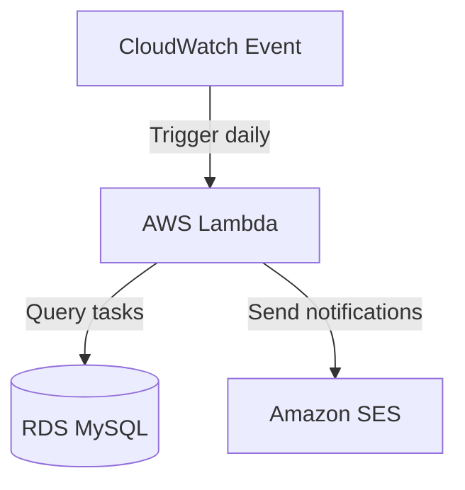

## Oppgave 10: Implementering av AWS Lambda for periodiske oppgaver

I denne oppgaven skal du implementere en AWS Lambda-funksjon for å utføre periodiske oppgaver relatert til oppgavestyringssystemet.

### Oppgavebeskrivelse

1. Opprett en IAM-rolle for Lambda-funksjonen med nødvendige tillatelser.
2. Skriv en Lambda-funksjon i Python som sjekker for forfallsdatoer på oppgaver og sender varslinger.
3. Konfigurer en CloudWatch Events regel for å kjøre Lambda-funksjonen daglig.
4. Test Lambda-funksjonen og verifiser at varslingene blir sendt.

<details>
<summary>Løsning</summary>

1. Opprett en IAM-rolle for Lambda:
   - Gå til IAM i AWS Console
   - Klikk på \"Roles\" og deretter \"Create role\
   - Velg AWS service og Lambda
   - Legg til følgende policies:
     - AWSLambdaBasicExecutionRole
     - AmazonRDSReadOnlyAccess
     - AmazonSESFullAccess (hvis du bruker Amazon SES for e-postvarsling)
   - Gi rollen et navn, f.eks. \"TaskManagerLambdaRole\

2. Skriv Lambda-funksjonen:
   - Gå til Lambda i AWS Console
   - Klikk på \"Create function\
   - Velg \"Author from scratch\
   - Gi funksjonen et navn, f.eks. \"check_task_due_dates\
   - Velg Python som runtime
   - Velg den IAM-rollen du opprettet
   - Klikk på \"Create function\
   - Erstatt standardkoden med følgende:

```python
import boto3
import pymysql
import os
from datetime import datetime, timedelta

def lambda_handler(event, context):
    # Connect to RDS
    conn = pymysql.connect(
        host=os.environ['RDS_HOST'],
        user=os.environ['RDS_USER'],
        password=os.environ['RDS_PASSWORD'],
        db=os.environ['RDS_DB_NAME']
    )
    
    try:
        with conn.cursor() as cursor:
            # Check for tasks due in the next 24 hours
            tomorrow = datetime.now() + timedelta(days=1)
            cursor.execute(\"SELECT id, title, due_date FROM tasks WHERE due_date <= %s\", (tomorrow,))
            due_tasks = cursor.fetchall()
            
            # Send notifications for due tasks
            ses = boto3.client('ses', region_name='us-west-2')  # Change region as needed
            for task in due_tasks:
                subject = f\"Task Due Soon: {task[1]}\
                body = f\"Your task '{task[1]}' is due on {task[2]}.\
                ses.send_email(
                    Source='your-email@example.com',
                    Destination={'ToAddresses': ['recipient@example.com']},
                    Message={
                        'Subject': {'Data': subject},
                        'Body': {'Text': {'Data': body}}
                    }
                )
                
            return f\"Processed {len(due_tasks)} due tasks\
    finally:
        conn.close()
```

3. Konfigurer miljøvariabler:
   - I Lambda-funksjonen, gå til \"Configuration\" -> \"Environment variables\
   - Legg til følgende variabler:
     - RDS_HOST: RDS-endepunkt
     - RDS_USER: Databasebrukernavn
     - RDS_PASSWORD: Databasepassord
     - RDS_DB_NAME: Databasenavn

4. Konfigurer CloudWatch Events:
   - I Lambda-funksjonen, gå til \"Configuration\" -> \"Triggers\
   - Klikk på \"Add trigger\
   - Velg \"CloudWatch Events/EventBridge\
   - Opprett en ny regel:
     - Rule type: Schedule expression
     - Schedule expression: cron(0 0 * * ? *) (kjører hver dag kl. 00:00 UTC)
   - Klikk på \"Add\

5. Test Lambda-funksjonen:
   - Klikk på \"Test\" i Lambda-konsollen
   - Opprett en testbegivenhet (kan være tom JSON: {})
   - Kjør testen og sjekk loggene for resultater

Du har nå implementert en Lambda-funksjon som automatisk sjekker for oppgaver som snart forfaller og sender varslinger. Dette forbedrer brukeropplevelsen ved å minne brukere på forestående frister.

</details>

### Mermaid Diagram



> [!IMPORTANT]
> AWS Lambda er en serverløs teknologi som lar deg kjøre kode uten å administrere servere. Ved å kombinere Lambda med CloudWatch Events, kan du enkelt sette opp periodiske oppgaver som kjører automatisk, noe som er ideelt for bakgrunnsjobber og vedlikeholdsoppgaver.
