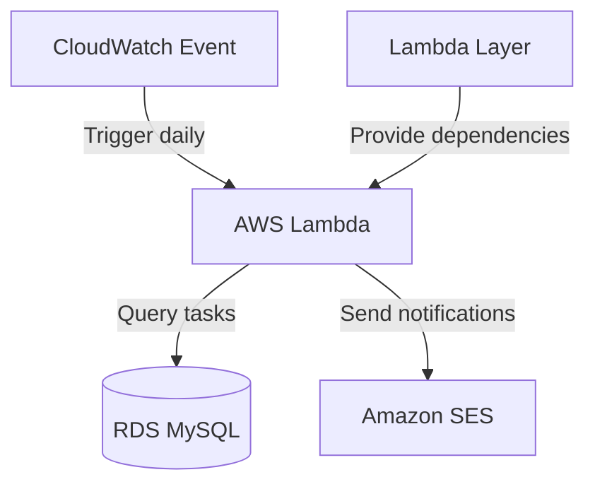

## Oppgave 7 (ekstra-oppgave for de som vil teste, er i utgangspunktet neste ukes pensum): Implementering av AWS Lambda for periodiske oppgaver

I denne oppgaven skal du implementere en AWS Lambda-funksjon for å utføre periodiske oppgaver relatert til oppgavestyringssystemet.

Før man begynner på denne oppgaven må man legge inn eposten sin som `Verified Identity` i AWS SES (Simple Email Service). Her er guide på hvordan det gjøres:

1. Verifiser epost i SES:
    - Åpne AWS Console
    - Søk etter "SES" eller "Simple Email Service"
    - Velg din region (f.eks. "eu-west-1")
    - Klikk på "Verified identities"
    - Velg "Create identity"
    - Velg "Email address"
    - Skriv inn din epostadresse
    - Klikk "Create identity"
    - Sjekk innboksen din for verifiseringslink
    - Klikk på linken for å verifisere

> [!NOTE]
> For testing, gjenta prosessen over for mottaker-eposten også.

Nå har du muligheten til å sende epost gjennom AWS SES og kan gå videre med oppgaven under.

### Oppgavebeskrivelse

1. Opprett en IAM-rolle for Lambda-funksjonen med nødvendige tillatelser.
2. Opprett nødvendige Lambda Layers for eksterne biblioteker.
3. Skriv en Lambda-funksjon i Python som sjekker for forfallsdatoer på oppgaver og sender varslinger.
4. Konfigurer en CloudWatch Events regel for å kjøre Lambda-funksjonen daglig.
5. Test Lambda-funksjonen og verifiser at varslingene blir sendt.

Her er et eksempel på hvordan du kan sende epost via Python og AWS SES:

```python
import boto3

def send_email(subject, body, recipient):
    ses_client = boto3.client('ses', region_name='eu-west-1')  # Endre region etter behov
    
    try:
        response = ses_client.send_email(
            Source='din-verifiserte-epost@example.com',  # Må være verifisert i SES
            Destination={
                'ToAddresses': [recipient]  # Mottaker må være verifisert i sandbox mode
            },
            Message={
                'Subject': {
                    'Data': subject
                },
                'Body': {
                    'Text': {
                        'Data': body
                    }
                }
            }
        )
        return response['MessageId']
    except Exception as e:
        print(f"Error sending email: {str(e)}")
        raise e

# Eksempel på bruk:
# send_email("Test Subject", "Hello World!", "mottaker@example.com")
```

### Mermaid Diagram



> [!IMPORTANT]
> AWS Lambda er en serverløs teknologi som lar deg kjøre kode uten å administrere servere. Ved å kombinere Lambda med CloudWatch Events, kan du enkelt sette opp periodiske oppgaver som kjører automatisk, noe som er ideelt for bakgrunnsjobber og vedlikeholdsoppgaver.


<details>
<summary>Løsning</summary>

1. Opprett en IAM-rolle for Lambda:
    - Gå til IAM i AWS Console
    - Klikk på \"Roles\" og deretter \"Create role\"
    - Velg AWS service og Lambda
    - Legg til følgende policies:
      - AWSLambdaBasicExecutionRole
      - AmazonRDSReadOnlyAccess
      - AmazonSESFullAccess

2. Opprett Lambda Layer for PyMySQL:
    - Opprett en ny mappe på din lokale maskin
    - Kjør følgende kommandoer:
    ```bash
    mkdir python
    pip install pymysql -t python/
    zip -r pymysql_layer.zip python/
    ```
    - Gå til Lambda i AWS Console
    - Velg "Layers" og "Create layer"
    - Last opp zip-filen
    - Velg kompatible runtime (Python 3.x)
    - Gi layer et navn (f.eks. "pymysql-layer")

3. Skriv Lambda-funksjonen:
    - Gå til Lambda i AWS Console
    - Klikk på "Create function"
    - Velg "Author from scratch"
    - Gi funksjonen et navn
    - Velg Python som runtime
    - Velg IAM-rollen du opprettet
    - Under "Layers", legg til layer du opprettet
    - Erstatt standardkoden med følgende:

```python
import boto3
import pymysql
import os
from datetime import datetime, timedelta

def lambda_handler(event, context):
     # Connect to RDS
     conn = pymysql.connect(
          host=os.environ['RDS_HOST'],
          user=os.environ['RDS_USER'],
          password=os.environ['RDS_PASSWORD'],
          db=os.environ['RDS_DB_NAME']
     )
     
     try:
          with conn.cursor() as cursor:
                # Check for tasks due in the next 24 hours
                tomorrow = datetime.now() + timedelta(days=1)
                cursor.execute("SELECT id, title, due_date FROM tasks WHERE due_date <= %s", (tomorrow,))
                due_tasks = cursor.fetchall()
                
                # Send notifications for due tasks
                ses = boto3.client('ses', region_name='us-west-2')  # Change region as needed
                for task in due_tasks:
                     subject = f"Task Due Soon: {task[1]}"
                     body = f"Your task '{task[1]}' is due on {task[2]}."
                     ses.send_email(
                          Source='your-email@example.com',
                          Destination={'ToAddresses': ['recipient@example.com']},
                          Message={
                                'Subject': {'Data': subject},
                                'Body': {'Text': {'Data': body}}
                          }
                     )
                     
                return f"Processed {len(due_tasks)} due tasks"
     finally:
          conn.close()
```

4. Konfigurer miljøvariabler:
    - I Lambda-funksjonen, gå til "Configuration" -> "Environment variables"
    - Legg til følgende variabler:
      - RDS_HOST: RDS-endepunkt
      - RDS_USER: Databasebrukernavn
      - RDS_PASSWORD: Databasepassord
      - RDS_DB_NAME: Databasenavn

5. Konfigurer CloudWatch Events:
    - I Lambda-funksjonen, gå til "Configuration" -> "Triggers"
    - Klikk på "Add trigger"
    - Velg "CloudWatch Events/EventBridge"
    - Opprett en ny regel:
      - Rule type: Schedule expression
      - Schedule expression: cron(0 0 * * ? *) (kjører hver dag kl. 00:00 UTC)
    - Klikk på "Add"

6. Test Lambda-funksjonen:
    - Klikk på "Test" i Lambda-konsollen
    - Opprett en testbegivenhet (kan være tom JSON: {})
    - Kjør testen og sjekk loggene for resultater

> [!NOTE]
> Hvis du får feilmeldinger relatert til manglende biblioteker, sjekk at Lambda Layer er korrekt konfigurert og at alle avhengigheter er inkludert i laget.

Du har nå implementert en Lambda-funksjon med nødvendige avhengigheter som automatisk sjekker for oppgaver som snart forfaller og sender varslinger.

</details>