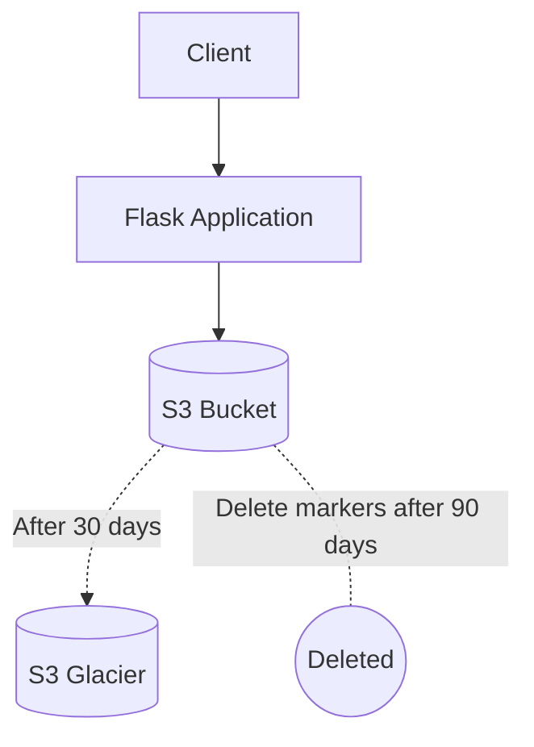

## Oppgave 12: Implementering av S3 Versioning og Lifecycle Policies

I denne oppgaven skal du aktivere versjonskontroll på S3-bucketen og implementere livssykluspolicyer for å administrere lagringskostnader effektivt.

### Oppgavebeskrivelse

1. Aktiver versjonskontroll på S3-bucketen som brukes for fillagring.
2. Implementer en livssykluspolicy for å flytte eldre versjoner av filer til S3 Glacier etter 30 dager.
3. Sett opp en policy for å slette markerte slettede objekter etter 90 dager.
4. Modifiser applikasjonen for å støtte gjenoppretting av tidligere versjoner av filer.

<details>
<summary>Løsning</summary>

1. Aktiver versjonskontroll på S3-bucket:
   - Gå til S3 i AWS Console
   - Velg din bucket for fillagring
   - Gå til \"Properties\" fanen
   - Under \"Bucket Versioning\", klikk på \"Edit\
   - Velg \"Enable\" og klikk på \"Save changes\

2. Implementer livssykluspolicy:
   - I samme bucket, gå til \"Management\" fanen
   - Scroll ned til \"Lifecycle rules\" og klikk på \"Create lifecycle rule\
   - Gi regelen et navn, f.eks. \"Move old versions to Glacier\
   - Under \"Choose a rule scope\", velg \"Apply to all objects in the bucket\
   - I \"Lifecycle rule actions\", velg:
     - \"Move noncurrent versions of objects between storage classes\
   - Sett \"Move noncurrent versions of objects to\" til \"Glacier Flexible Retrieval\" etter 30 dager
   - Klikk på \"Create rule\

3. Sett opp policy for sletting av markerte objekter:
   - Opprett en ny livssyklusregel
   - Gi den et navn, f.eks. \"Delete expired delete markers\
   - Velg \"Apply to all objects in the bucket\
   - I \"Lifecycle rule actions\", velg:
     - \"Permanently delete expired object delete markers\
   - Sett \"Number of days after objects become noncurrent\" til 90
   - Klikk på \"Create rule\

4. Modifiser applikasjonen for å støtte gjenoppretting:
   - Åpne `app.py` i din favoritt-editor
   - Legg til følgende funksjon:

   ```python
   import boto3

   s3 = boto3.client('s3')

   def get_file_versions(bucket_name, file_key):
       versions = s3.list_object_versions(Bucket=bucket_name, Prefix=file_key)
       return versions.get('Versions', [])

   def restore_file_version(bucket_name, file_key, version_id):
       s3.copy_object(
           Bucket=bucket_name,
           Key=file_key,
           CopySource={
               'Bucket': bucket_name,
               'Key': file_key,
               'VersionId': version_id
           }
       )

   @app.route('/file_versions/<file_id>')
   def file_versions(file_id):
       file = File.query.get_or_404(file_id)
       versions = get_file_versions(app.config['S3_BUCKET'], file.s3_key)
       return render_template('file_versions.html', file=file, versions=versions)

   @app.route('/restore_file/<file_id>/<version_id>')
   def restore_file(file_id, version_id):
       file = File.query.get_or_404(file_id)
       restore_file_version(app.config['S3_BUCKET'], file.s3_key, version_id)
       return redirect(url_for('file_versions', file_id=file_id))
   ```

   - Opprett en ny template `file_versions.html`:

   ```html
   
   
   <h2>Versions of {{ file.filename }}</h2>
   <ul>
   
       <li>
           Version {{ version.VersionId }} ({{ version.LastModified }})
           <a href=\"{{ url_for('restore_file', file_id=file.id, version_id=version.VersionId) }}\">Restore</a>
       </li>
   
   </ul>
   
   ```

   - Oppdater `requirements.txt` for å inkludere boto3:
   ```
   boto3==1.18.44
   ```

Du har nå implementert versjonskontroll og livssykluspolicyer for S3-bucketen, samt lagt til funksjonalitet for å gjenopprette tidligere versjoner av filer. Dette forbedrer datasikkerheten og gir mer fleksibilitet i filhåndteringen, samtidig som det hjelper med å kontrollere lagringskostnader.

</details>

### Mermaid Diagram



> [!IMPORTANT]
> S3 Versioning og Lifecycle Policies er kraftige verktøy for å administrere data og kostnader i skybaserte applikasjoner. Ved å implementere disse funksjonene, kan du beskytte mot utilsiktet sletting, opprettholde en fullstendig endringshistorikk, og optimalisere lagringskostnader ved å automatisk flytte eller slette data basert på definerte regler.
