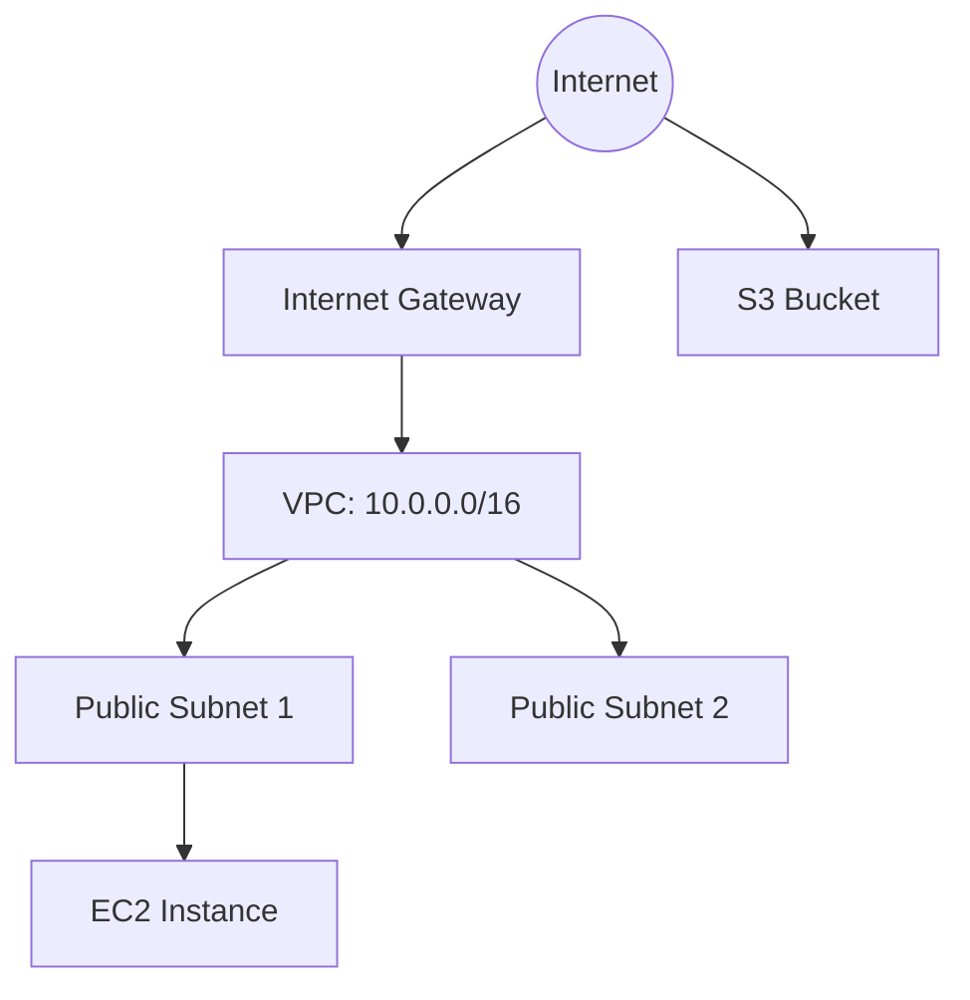
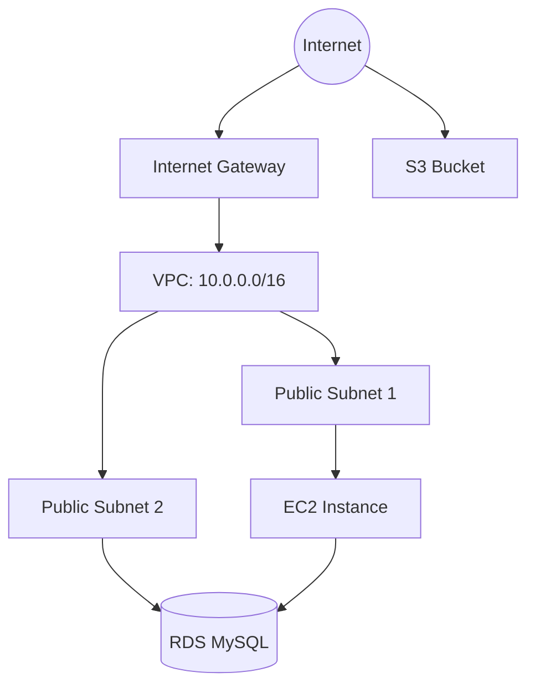
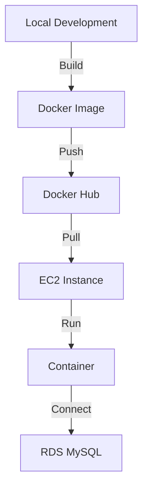
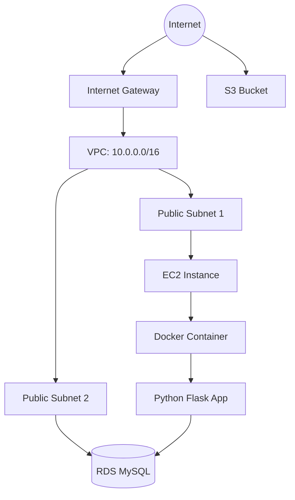
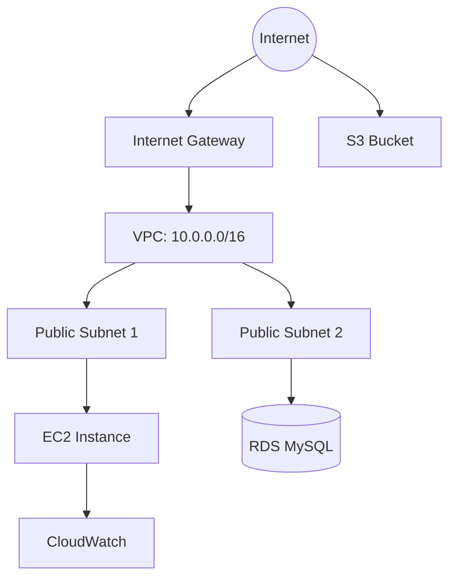
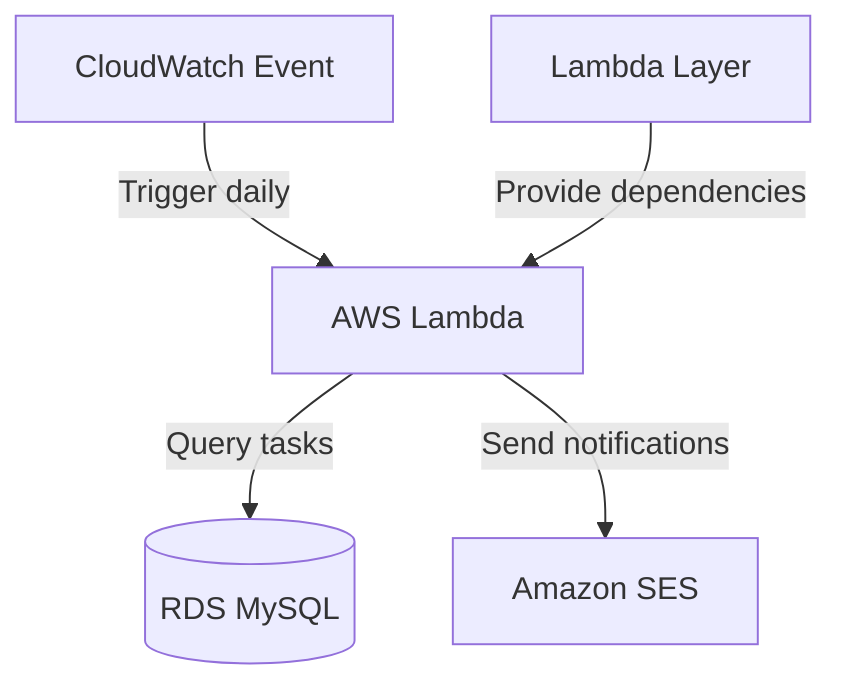

# Oppgavesett: AWS - Console, VPC og EC2
# Innholdsfortegnelse

# Innholdsfortegnelse 

1. [Oppsett av infrastruktur](#oppgave-1-sett-opp-infrastruktur)
2. [Sett opp database](#oppgave-2-sett-opp-database)
3. [Sett opp backend-applikasjon med Docker](#oppgave-3-sett-opp-backend-applikasjon-med-docker)
4. [Implementer logging og overvåkning](#oppgave-4-implementer-logging-og-overvåkning)
5. [Custom CloudWatch Metrics](#oppgave-5-custom-cloudwatch-metrics)
6. [Implementering av AWS Lambda for periodiske oppgaver](#oppgave-6-ekstra-oppgave-for-de-som-vil-teste-er-i-utgangspunktet-neste-ukes-pensum-implementering-av-aws-lambda-for-periodiske-oppgaver)

# Introduksjon til skyteknologi med AWS: Oppgavestyringssystem

I dette kurset skal vi bygge et enkelt oppgavestyringssystem ved hjelp av AWS-tjenester. Vi vil starte med grunnleggende oppsett og gradvis bygge ut funksjonaliteten. Kurset vil fokusere på infrastruktur og AWS-tjenester, med minimal vekt på applikasjonskode.

> [!NOTE]
> **Før du begynner er det viktig at du setter deg inn i AWS Free Tier, se artikkel [her](../aws.md).**

> [!NOTE]
> **Hvis du bruker Windows er det lurt å laste ned Git Bash og bruke det som terminal for oppgavene, fremfor f.eks. PowerShell som er typisk på Windows. Du vil da kunne kjøre samme kommandoer som vist i ukesoppgavene Se video for hvordan Git Bash installeres [her](https://www.youtube.com/watch?v=qdwWe9COT9k).**


# Oppgaver: Oppgavestyringssystem i AWS

I disse oppgavene skal vi bygge et enkelt oppgavestyringssystem ved hjelp av AWS-tjenester. Vi vil fokusere på å bruke AWS Console, VPC, EC2, ECS, CloudWatch, IAM, S3 og RDS. Oppgavene bygger på hverandre, så sørg for å fullføre dem i rekkefølge.

## Oppgave 1: Sett opp infrastruktur

I denne oppgaven skal du sette opp grunnleggende infrastruktur for oppgavestyringssystemet vårt.

### 1a. Opprett en VPC

Opprett en ny VPC med følgende spesifikasjoner:
- CIDR-blokk: 10.0.0.0/16
- 2 offentlige subnett i forskjellige Availability Zones
- 1 Internet Gateway
- 1 Route Table for de offentlige subnettene

### 1b. Opprett en EC2-instans

Lag en EC2-instans med følgende spesifikasjoner:
- Amazon Linux 2
- t2.micro (Free Tier eligible)
- Plasser den i ett av de offentlige subnettene
- Opprett en ny security group som tillater innkommende trafikk på port 22 (SSH) og 80 (HTTP)

### 1c. Opprett en S3-bucket

Opprett en S3-bucket som vil bli brukt til å lagre statiske filer for oppgavestyringssystemet.

### Arkitekturdiagram



<details>
<summary>Løsning</summary>

### 1a. Opprett en VPC

1. Gå til VPC-konsollet i AWS.
2. Klikk på \"Create VPC\".
3. Velg \"VPC and more\" for å opprette VPC med tilhørende ressurser.
4. Fyll inn følgende detaljer:
   - VPC navn: OppgavestyringVPC
   - IPv4 CIDR block: 10.0.0.0/16
   - Number of Availability Zones: 2
   - Number of public subnets: 2
   - Number of private subnets: 0
   - NAT gateways: None
   - VPC endpoints: None
   - DNS options (Enable DNS hostnames): Aktivert
   - DNS options (Enable DNS resolution): Aktivert
5. Klikk på \"Create VPC\".

### 1b. Opprett en EC2-instans

- Gå til EC2 Dashboard
    - Klikk "Launch Instance"
    - Gi den et navn
    - Velg Amazon Linux 2 AMI
    - Velg t2.micro instance type
    - Ved "Key pair (login)":
      * Velg "Create new key pair"
      * Gi key pair et navn (f.eks. "taskmanager-key")
      * Velg RSA og .pem format
      * Last ned key pair-filen og lagre den sikkert
      * Endre tillatelser på key pair: `chmod 400 taskmanager-key.pem`
    - Konfigurer \"Network Settings \" -> Trykk på Edit
        - Konfigurer instance details: Velg ditt VPC og **public** subnettet (se på navnet for å vite at det er public) i sone `eu-west-1a`
        - `Auto-assign public IP`: Enable
        - `Firewall`: Create Security Group
            - Gi den et navn
            - Inbound Security Group Rules: 
                - Type: ssh, Protocol: TCP, Port range: 22, Source Type: anywhere
                - `Add security group rule` -> Type: http, Protocol TCP, port: 80, Source Type: 0.0.0.0/0 (anywhere)
    - Launch instance

### 1c. Opprett en S3-bucket

1. Gå til S3-konsollet i AWS.
2. Klikk på \"Create bucket\" -> General Purpose
3. Velg et unikt navn for bucketen (f.eks. oppgavestyring-filer-\<ditt-navn\>).
4. La alle andre innstillinger være som standard.
5. Klikk på \"Create bucket\".

Du har nå satt opp grunnleggende infrastruktur for oppgavestyringssystemet vårt.

</details>

## Oppgave 2: Sett opp database

I denne oppgaven skal vi sette opp en MySQL-database ved hjelp av Amazon RDS for å lagre oppgaver og brukerinformasjon.

Opprett en Amazon RDS MySQL-instans med følgende spesifikasjoner:
- Easy Create
- Engine: MySQL
- Instance class: Free Tier (db.t4g.micro)
- DB Instance Identifier: taskmanager 
- Plasser den i samme VPC som EC2-instansen, men i et annet subnet
- Bruk `Connect to an EC2 compute resource` for å sørge for at RDS-instansen tillater innkommende trafikk på port 3306 (MySQL) fra EC2-instansens security group.

### Arkitekturdiagram




<details>
<summary>Løsning</summary>

**Se bilde i steg 4. Default selektert RDS Database Instance size koster penger. Selekter `Free Tier` med `tb.t4g.micro`**


1. Gå til RDS-konsollet i AWS.
2. Klikk på \"Create database\".
3. Velg "Standard Create" og MySQL som engine type.
4. Fyll inn følgende detaljer:
   - DB instance identifier: oppgavestyring-db
   - Master username: admin
   - Master password: Velg et passord
5. Bekreft at DB instance type er satt til Free tier (db.4tg.micro) -> se bilde. De andre typene er ikke under free tier og koster penger.
6. Set up EC2 connection (under `Connectivity`):
   - Sjekk av på "Connect to an EC2 compute resource" (AWS vil da sette opp nødvendige rettigheter, security groups etc. automatisk for deg slik at EC2-instansen og databasen kan snakke sammen)
   - Selekter EC2-instansen du skal koble til databasen
7. Under \"Additional configuration\":
  - Sett initial database name til \"taskmanager\".
  - Skru av `Enable automated backups`
8. La alle andre innstillinger være som standard.
9. Bekrefte at det står noe ala følgende under `Estimated monthly costs`:
   - The Amazon RDS Free Tier is available to you for 12 months. Each calendar month, the free tier will allow you to use the Amazon RDS resources listed below for free:
   - 750 hrs of Amazon RDS in a Single-AZ db.t2.micro, db.t3.micro or db.t4g.micro Instance.
   - 20 GB of General Purpose Storage (SSD).
   - 20 GB for automated backup storage and any user-initiated DB Snapshots.
10. Klikk på \"Create database\". Det tar noen minutter før den er klar (med status `Available`)

Trykk `Close` hvis du får følgende popup:


Nå har du satt opp en MySQL-database og konfigurert sikkerhetsgrupper for å tillate tilkobling fra EC2-instansen.

> [!NOTE]
> Husk å lagre tilkoblingsinformasjonen for databasen (endpoint, brukernavn, passord) på et sikkert sted. Du vil trenge denne informasjonen senere når du skal koble applikasjonen til databasen.

</details>

## Oppgave 3: Sett opp backend-applikasjon med Docker

I denne oppgaven skal du containerize og deploye en Python backend til AWS EC2. Bruk følgende kode:

```python
# filepath: app.py
from flask import Flask, request, jsonify
from flask_sqlalchemy import SQLAlchemy

app = Flask(__name__)
app.config['SQLALCHEMY_DATABASE_URI'] = 'mysql+pymysql://admin:<your_password>@<YOUR_RDS_ENDPOINT>/taskmanager'
db = SQLAlchemy(app)

class Task(db.Model):
  id = db.Column(db.Integer, primary_key=True)
  title = db.Column(db.String(100), nullable=False)
  description = db.Column(db.String(200))
  status = db.Column(db.String(20), default='To Do')

@app.route('/tasks', methods=['GET'])
def get_tasks():
  tasks = Task.query.all()
  return jsonify([{'id': task.id, 'title': task.title, 'description': task.description, 'status': task.status} for task in tasks])

@app.route('/tasks', methods=['POST'])
def create_task():
  data = request.json
  new_task = Task(title=data['title'], description=data.get('description', ''))
  db.session.add(new_task)
  db.session.commit()
  return jsonify({'id': new_task.id, 'title': new_task.title, 'description': new_task.description, 'status': new_task.status}), 201

if __name__ == '__main__':
  db.create_all()
  app.run(host='0.0.0.0', port=80)
```

### Oppgavebeskrivelse:

1. Lag prosjektstruktur med følgende filer:
   - `requirements.txt` med Flask dependencies
   - `app.py` med CRUD-endepunkter
   - `Dockerfile` for containerization

2. Bygg Docker image og publiser til Docker Hub

3. Kjør containeren på EC2-instansen

### Mermaid-diagram:


<details>
<summary>Løsning</summary>

### 3a. Utvikle lokal applikasjon

1. Opprett en ny mappe for prosjektet:
```bash
mkdir taskmanager
cd taskmanager
```

2. Opprett `requirements.txt`:
```text
flask
flask-sqlalchemy
pymysql
```

3. Opprett `app.py` med samme innhold som før. Endre `YOUR_RDS_ENDPOINT` til ditt RDS endpoint. Det finner du i AWS-konsollet på RDS-siden inne på din RDS database. TODO: Legg til bilde


```python
# filepath: app.py
from flask import Flask, request, jsonify
from flask_sqlalchemy import SQLAlchemy

app = Flask(__name__)
app.config['SQLALCHEMY_DATABASE_URI'] = 'mysql+pymysql://admin:<your_password>@<YOUR_RDS_ENDPOINT>/taskmanager'
db = SQLAlchemy(app)

class Task(db.Model):
  id = db.Column(db.Integer, primary_key=True)
  title = db.Column(db.String(100), nullable=False)
  description = db.Column(db.String(200))
  status = db.Column(db.String(20), default='To Do')

@app.route('/tasks', methods=['GET'])
def get_tasks():
  tasks = Task.query.all()
  return jsonify([{'id': task.id, 'title': task.title, 'description': task.description, 'status': task.status} for task in tasks])

@app.route('/tasks', methods=['POST'])
def create_task():
  data = request.json
  new_task = Task(title=data['title'], description=data.get('description', ''))
  db.session.add(new_task)
  db.session.commit()
  return jsonify({'id': new_task.id, 'title': new_task.title, 'description': new_task.description, 'status': new_task.status}), 201

if __name__ == '__main__':
  db.create_all()
  app.run(host='0.0.0.0', port=80)
```

### 3b. Dockerize applikasjonen

1. Opprett `Dockerfile`:
```dockerfile
FROM python:3.9-slim
WORKDIR /app
COPY requirements.txt .
RUN pip install -r requirements.txt
COPY app.py .
EXPOSE 80
CMD ["python", "app.py"]
```

2. Bygg og push Docker image:
```bash
docker build --platform linux/amd64 -t taskmanager .
docker tag taskmanager:latest <your-docker-hub-username>/taskmanager:latest
docker push <your-docker-hub-username>/taskmanager:latest
```

### 3c. Kjør på EC2

1. SSH til EC2-instansen:
```bash
ssh -i /path/to/your-key.pem ec2-user@your-ec2-public-ip
```

2. Installer Docker:
```bash
sudo yum update -y
sudo yum install docker -y
sudo service docker start
sudo usermod -a -G docker ec2-user
exec sudo su -l ec2-user
```

3. Pull og kjør container:
```bash
docker pull <your-docker-hub-username>/taskmanager:latest
docker run -d -p 80:80 <your-docker-hub-username>/taskmanager:latest
```

### Arkitekturdiagram



</details>

<details>
<summary>Tips for feilsøking</summary>

1. Sjekk container logs:
```bash
docker logs $(docker ps -q)
```

2. Verifiser at container kjører:
```bash
docker ps
```

3. Test API-endepunktet:
```bash
curl http://localhost/tasks
```

</details>

## Oppgave 4: Implementer logging og overvåkning

I denne oppgaven skal vi implementere logging og overvåkning for vår backend-applikasjon ved hjelp av Amazon CloudWatch.

### 4a. Konfigurer IAM-rolle for CloudWatch
- Opprett en IAM-rolle med nødvendige CloudWatch-rettigheter
- Tildel rollen til EC2-instansen
- Verifiser at EC2 har tilgang til CloudWatch

### 4b. Konfigurer CloudWatch Agent
- Installer CloudWatch Agent på EC2-instansen
- Opprett konfigurasjonsfil for CloudWatch Agent
- Konfigurer agenten til å samle CPU, minne og disk metrics
- Start CloudWatch Agent

### 4c. Modifiser Python-applikasjonen
- Legg til logging i Python-applikasjonen
- Konfigurer logging til å skrive til /var/log/taskmanager.log
- Implementer logging for alle API-kall

### 4d. Opprett CloudWatch Dashboard
- Opprett et nytt dashboard kalt "TaskManager-Dashboard"
- Legg til widgets for CPU, minne og disk metrics
- Legg til widget for applikasjonslogger

### Arkitekturdiagram



<details>
<summary>Løsning</summary>

### 4a. Konfigurer IAM-rolle

1. Opprett IAM-rolle:
   - Gå til IAM i AWS Console
   - Velg "Roles" -> "Create role"
   - Velg "AWS service" og "EC2" -> Next
   - Legg til "Permissions Policy" som heter `AWSOpsWorksCloudWatchLogs`. Den har følgende policy:
```json
{
    "Version": "2012-10-17",
    "Statement": [
        {
            "Effect": "Allow",
            "Action": [
                "cloudwatch:PutMetricData",
                "logs:CreateLogGroup",
                "logs:CreateLogStream",
                "logs:PutLogEvents",
                "logs:DescribeLogStreams"
            ],
            "Resource": "*"
        }
    ]
}
```
  - Gi rollen et navn
  - Bekreft at `AWSOpsWorksCloudWatchLogs` ligger under `Permissions policy summary`
  - Trykk på `Create role`

2. Tildel rollen til EC2:
   - Gå til EC2 i AWS Console
   - Velg din instans
   - Gå til `Actions` (knapp i høyre hjørne) -> `Security` -> Modify IAM role
   - Velg den nye rollen
   - Klikk "Save"


### 4b. Konfigurer CloudWatch Agent

Først skal vi opprette en CloudWatch log group og deretter konfigurere CloudWatch Agent på EC2-instansen.

1. Opprett CloudWatch log group:
    - Gå til CloudWatch i AWS-konsollet
    - Klikk på "Log groups" i venstremenyen
    - Klikk på "Create log group" knappen
    - I "Log group name" feltet, skriv inn "taskmanager-logs"
    - La andre innstillinger være som standard
    - Klikk "Create" knappen for å opprette log gruppen

2. Koble til EC2-instansen og installer CloudWatch Agent:
```bash
sudo yum install amazon-cloudwatch-agent -y
```

3. Opprett konfigurasjonsfil:
```bash
sudo tee /opt/aws/amazon-cloudwatch-agent/bin/config.json << 'EOF'
{
  "agent": {
    "metrics_collection_interval": 60,
    "run_as_user": "root"
  },
  "logs": {
    "logs_collected": {
      "files": {
        "collect_list": [
          {
            "file_path": "/var/log/taskmanager.log",
            "log_group_name": "taskmanager-logs",
            "log_stream_name": "{instance_id}"
          }
        ]
      }
    }
  },
  "metrics": {
    "metrics_collected": {
      "cpu": {
        "measurement": ["cpu_usage_idle", "cpu_usage_user", "cpu_usage_system"]
      },
      "memory": {
        "measurement": ["mem_used_percent"]
      },
      "disk": {
        "measurement": ["used_percent"],
        "resources": ["/"]
      }
    }
  }
}
EOF
```

4. Verifiser at konfigurasjonsfilen ble opprettet:
```bash
cat /opt/aws/amazon-cloudwatch-agent/bin/config.json
```

5. Start agenten:
```bash
sudo /opt/aws/amazon-cloudwatch-agent/bin/amazon-cloudwatch-agent-ctl -a fetch-config -m ec2 -s -c file:/opt/aws/amazon-cloudwatch-agent/bin/config.json
```

### 4b. Modifiser Python-applikasjonen

Husk å endre `YOUR_RDS_ENDPOINT` til ditt RDS endpoint. Det finner du i AWS-konsollet på RDS-siden inne på din RDS database.

1. Oppdater app.py med logging:
```python
import logging
from flask import Flask, request, jsonify
from flask_sqlalchemy import SQLAlchemy

logging.basicConfig(
  filename='/var/log/taskmanager.log',
  level=logging.INFO,
  format='%(asctime)s - %(levelname)s - %(message)s'
)

app = Flask(__name__)
app.config['SQLALCHEMY_DATABASE_URI'] = 'mysql+pymysql://admin:<your_password>@<YOUR_RDS_ENDPOINT>/taskmanager'
db = SQLAlchemy(app)

class Task(db.Model):
  id = db.Column(db.Integer, primary_key=True)
  title = db.Column(db.String(100), nullable=False)
  description = db.Column(db.String(200))
  status = db.Column(db.String(20), default='To Do')

@app.route('/tasks', methods=['GET'])
def get_tasks():
  logging.info('Fetching all tasks')
  tasks = Task.query.all()
  return jsonify([{'id': task.id, 'title': task.title, 'description': task.description, 'status': task.status} for task in tasks])

@app.route('/tasks', methods=['POST'])
def create_task():
  data = request.json
  logging.info(f'Creating new task: {data}')
  try:
    new_task = Task(title=data['title'], description=data.get('description', ''))
    db.session.add(new_task)
    db.session.commit()
    return jsonify({'id': new_task.id, 'title': new_task.title, 'description': new_task.description, 'status': new_task.status}), 201
  except Exception as e:
    logging.error(f'Error creating task: {str(e)}')
    return jsonify({'error': str(e)}), 500

if __name__ == '__main__':
  with app.app_context():    # Add application context
        db.create_all()
  app.run(host='0.0.0.0', port=80)
```

Dytt den oppdaterte opp til Dockerhub og pull den ned på EC2-instansen:

```bash
# Local machine
docker build --platform linux/amd64 -t taskmanager .
docker tag taskmanager:latest <yourusername>/taskmanager:latest
docker push <yourusername>/taskmanager:latest

# SSH into EC2
ssh -i "key.pem" ec2-user@your-ec2-ip

# On EC2
docker stop $(docker ps -q)  # Stop running container
docker rm $(docker ps -a -q)  # Remove old container
docker pull <yourusername>/taskmanager:latest
docker run -d \
  -p 80:80 \
  -v /var/log:/var/log \
  <yourusername>/taskmanager:latest

# Test API med logging
curl -X POST -H "Content-Type: application/json" -d '{"title":"Test Task"}' http://localhost/tasks

# Verify logs
tail -f /var/log/taskmanager.log
```

Du skal nå også kunne se at disse havner i AWS konsollet i Cloudwatch ved å:

1. Logg inn på AWS Management Console
2. Navigér til CloudWatch tjenesten
3. Velg "Log groups" i venstremenyen
4. Søk etter "taskmanager-logs"
5. Klikk på log gruppen for å se strømmende logger
6. For sanntidsovervåkning, klikk på "Start streaming" knappen

## Tips
- Hold øye med responstider og feilmeldinger i loggene
- Verifiser at nye oppgaver blir lagret korrekt
- Sjekk at JSON-formateringen er korrekt i API-kallet
- Ved feil, se etter ERROR eller WARN meldinger i loggstrømmen

### 4d. Opprett CloudWatch Dashboard

1. Gå til CloudWatch i AWS Console
2. Velg "Dashboards" → "Create dashboard"
3. Gi dashboardet navnet "TaskManager-Dashboard"
4. Legg til widgets (line):
   - Data Type: Metrics, Widget Type: Line -> CPU Utilization
   - Data Type: Logs, Widget Type: Logs Table -> Selection Criteria: `taskmanager-logs` -> `Create widget`
5. Trykk på `Save` øverst i høyre hjørne for å lagre Dashboard
</details>

## Oppgave 5: Custom CloudWatch Metrics

I denne oppgaven skal du implementere custom metrics for å spore aktiviteten i oppgavestyringssystemet.

### Oppgavebeskrivelse:

1. Implementer følgende custom metrics i applikasjonen:
   - TasksCreated: Teller nye oppgaver
   - TasksCompleted: Teller fullførte oppgaver
2. Konfigurer IAM rolle for CloudWatch metrics på EC2-instansen
3. Legg til metrikk-widgets i CloudWatch dashboard

### 5a. Implementer Custom Metrics

Oppdater Python-applikasjonen for å inkludere custom metrics:

Bruk følgende kode for å sende metrics:
```python
cloudwatch.put_metric_data(
    Namespace='TaskManagerMetrics',
    MetricData=[{
        'MetricName': 'TasksCreated',
        'Value': 1,
        'Unit': 'Count'
    }]
)
```

<details> <summary>Løsning</summary>

1. Legg til boto3 i `requirements.txt` for å kunne gjøre kall mot AWS i backend-koden: (TODO: ADD GIT DIFF)
```text
flask
flask-sqlalchemy
pymysql
boto3
```

2. Oppdater app.py med custom metrics: (TODO: ADD GIT DIFF)

Husk å endre `YOUR_RDS_ENDPOINT` til ditt RDS endpoint. Det finner du i AWS-konsollet på RDS-siden inne på din RDS database. 

```python
import boto3
import logging
from flask import Flask, request, jsonify
from flask_sqlalchemy import SQLAlchemy

logging.basicConfig(
  filename='/var/log/taskmanager.log',
  level=logging.INFO,
  format='%(asctime)s - %(levelname)s - %(message)s'
)

app = Flask(__name__)
app.config['SQLALCHEMY_DATABASE_URI'] = 'mysql+pymysql://admin:<your_password>@<YOUR_RDS_ENDPOINT>/taskmanager'
db = SQLAlchemy(app)
cloudwatch = boto3.client('cloudwatch', region_name='eu-west-1')

class Task(db.Model):
  id = db.Column(db.Integer, primary_key=True)
  title = db.Column(db.String(100), nullable=False)
  description = db.Column(db.String(200))
  status = db.Column(db.String(20), default='To Do')

@app.route('/tasks', methods=['GET'])
def get_tasks():
  logging.info('Fetching all tasks')
  tasks = Task.query.all()
  return jsonify([{'id': task.id, 'title': task.title, 'description': task.description, 'status': task.status} for task in tasks])

@app.route('/tasks', methods=['POST'])
def create_task():
  data = request.json
  logging.info(f'Creating new task: {data}')
  try:
    new_task = Task(title=data['title'], description=data.get('description', ''))
    db.session.add(new_task)
    db.session.commit()
    
    # Send custom metric
    cloudwatch.put_metric_data(
      Namespace='TaskManagerMetrics',
      MetricData=[{
        'MetricName': 'TasksCreated',
        'Value': 1,
        'Unit': 'Count'
      }]
    )
    
    return jsonify({'id': new_task.id, 'title': new_task.title}), 201
  except Exception as e:
    logging.error(f'Error creating task: {str(e)}')
    return jsonify({'error': str(e)}), 500

if __name__ == '__main__':
  with app.app_context():    # Add application context
        db.create_all()
  app.run(host='0.0.0.0', port=80)
```

Dytt den oppdaterte opp til Dockerhub og pull den ned på EC2-instansen:

```bash
# Local machine
docker build --platform linux/amd64 -t taskmanager .
docker tag taskmanager:latest flaattengokstad/taskmanager:latest
docker push flaattengokstad/taskmanager:latest
```

</details> 

### 5b. Konfigurere IAM rolle for CloudWatch Metrics

Oppdater IAM rollen til å inkludere mulighet for å sende metrics til CloudWatch. Bruk `"cloudwatch:PutMetricData"` i actions. 

<details>
<summary>Løsning</summary>

1. Verifiser at EC2-instansen har riktige IAM-rettigheter:
- Gå til IAM console og finn rollen til EC2-instansen din
- Oppdater IAM rollen ved å trykke på `Add permissions` -> `Create inline policy` -> `JSON` -> og copy-paste JSON under:
```json
{
  "Version": "2012-10-17",
  "Statement": [
    {
      "Effect": "Allow",
      "Action": [
        "cloudwatch:PutMetricData"
      ],
      "Resource": "*"
    }
  ]
}
```
- Trykk på `Next`
- Gi den et navn, f.eks. `PutMetricDataPolicy`
- Valider at du får opp følgende under `Permissions defined in this policy`:
  ``` 
  CloudWatch
  Limited: Write
  All resources
  None
  ```
- Trykk på `Create Policy`

</details>

### 5c. Deploy det nye Docker imaget på EC2-instansen

Det nye Docker imaget inneholder ny kode som pusher opp custom metrics til Cloudwatch. Vi skal nå kjøre i gang dette imaget. 

```bash
# SSH into EC2
ssh -i "key.pem" ec2-user@your-ec2-ip

# On EC2
docker stop $(docker ps -q)  # Stop running container
docker rm $(docker ps -a -q)  # Remove old container
docker pull flaattengokstad/taskmanager:latest
docker run -d \
  -p 80:80 \
  -v /var/log:/var/log \
  flaattengokstad/taskmanager:latest

# Test API med logging
curl -X POST -H "Content-Type: application/json" -d '{"title":"Test Task"}' http://localhost/tasks
```

### 5d. Konfigurer Dashboard

Sett opp et CloudWatch DashBoard som viser den nye metrikken `TaskManagerMetrics`.

<details>
<summary>Løsning</summary>

1. Naviger til CloudWatch Dashboard:
   - Åpne AWS Console
   - Søk etter "CloudWatch"
   - Velg "Dashboards" i venstremenyen
   - Velg "TaskManager-Dashboard" (fra oppgave 4)

2. Legg til widget for custom metrics:
   - Klikk "Add widget"
   - Velg "Line" under "Metrics"
   - Klikk "Configure"
   - Under "Browse", velg "TaskManagerMetrics"
   - Velg "TasksCreated" metric
   - Klikk "Create widget"
   - Trykk på `Save` øverst i høyre hjørne for å lagre Dashboard

3. Konfigurer widget:
   - Endre tidsvindu til "Last hour" (øverst høyre)
   - Endre tittel til "Tasks Created"
   - Under "Graphed metrics":
     - Period: 1 minute
     - Statistic: Sum
     - Unit: Count

4. Verifiser metrics:
   - Test API-endepunkt:
     ```bash
     curl -X POST \
       -H "Content-Type: application/json" \
       -d '{"title":"Test Metric","description":"Testing CloudWatch metrics"}' \
       http://<din-ec2-ip>/tasks
     ```
   - Vent 1-2 minutter (metrics har forsinkelse)
   - Refresh dashboard
   - Verifiser at ny datapunkt vises i grafen

> [!NOTE]
> CloudWatch metrics har typisk 1-2 minutters forsinkelse før de vises i dashboard.

</details>


## Oppgave 6 (ekstra-oppgave for de som vil teste, er i utgangspunktet neste ukes pensum): Implementering av AWS Lambda for periodiske oppgaver

I denne oppgaven skal du implementere en AWS Lambda-funksjon for å utføre periodiske oppgaver relatert til oppgavestyringssystemet.

Før man begynner på denne oppgaven må man legge inn eposten sin som `Verified Identity` i AWS SES (Simple Email Service). Her er guide på hvordan det gjøres:

1. Verifiser epost i SES:
    - Åpne AWS Console
    - Søk etter "SES" eller "Simple Email Service"
    - Velg din region (f.eks. "eu-west-1")
    - Klikk på "Verified identities"
    - Velg "Create identity"
    - Velg "Email address"
    - Skriv inn din epostadresse
    - Klikk "Create identity"
    - Sjekk innboksen din for verifiseringslink
    - Klikk på linken for å verifisere

> [!NOTE]
> For testing, gjenta prosessen over for mottaker-eposten også.

Nå har du muligheten til å sende epost gjennom AWS SES og kan gå videre med oppgaven under.

### Oppgavebeskrivelse

1. Opprett en IAM-rolle for Lambda-funksjonen med nødvendige tillatelser.
2. Opprett nødvendige Lambda Layers for eksterne biblioteker.
3. Skriv en Lambda-funksjon i Python som sjekker for forfallsdatoer på oppgaver og sender varslinger.
4. Konfigurer en CloudWatch Events regel for å kjøre Lambda-funksjonen daglig.
5. Test Lambda-funksjonen og verifiser at varslingene blir sendt.

Her er et eksempel på hvordan du kan sende epost via Python og AWS SES:

```python
import boto3

def send_email(subject, body, recipient):
    ses_client = boto3.client('ses', region_name='eu-west-1')  # Endre region etter behov
    
    try:
        response = ses_client.send_email(
            Source='din-verifiserte-epost@example.com',  # Må være verifisert i SES
            Destination={
                'ToAddresses': [recipient]  # Mottaker må være verifisert i sandbox mode
            },
            Message={
                'Subject': {
                    'Data': subject
                },
                'Body': {
                    'Text': {
                        'Data': body
                    }
                }
            }
        )
        return response['MessageId']
    except Exception as e:
        print(f"Error sending email: {str(e)}")
        raise e

# Eksempel på bruk:
# send_email("Test Subject", "Hello World!", "mottaker@example.com")
```

### Mermaid Diagram



> [!IMPORTANT]
> AWS Lambda er en serverløs teknologi som lar deg kjøre kode uten å administrere servere. Ved å kombinere Lambda med CloudWatch Events, kan du enkelt sette opp periodiske oppgaver som kjører automatisk, noe som er ideelt for bakgrunnsjobber og vedlikeholdsoppgaver.


<details>
<summary>Løsning</summary>

1. Opprett en IAM-rolle for Lambda:
    - Gå til IAM i AWS Console
    - Klikk på \"Roles\" og deretter \"Create role\"
    - Velg AWS service og Lambda
    - Legg til følgende policies:
      - AWSLambdaBasicExecutionRole
      - AmazonRDSReadOnlyAccess
      - AmazonSESFullAccess

2. Opprett Lambda Layer for PyMySQL:
    - Opprett en ny mappe på din lokale maskin
    - Kjør følgende kommandoer:
    ```bash
    mkdir python
    pip install pymysql -t python/
    zip -r pymysql_layer.zip python/
    ```
    - Gå til Lambda i AWS Console
    - Velg "Layers" og "Create layer"
    - Last opp zip-filen
    - Velg kompatible runtime (Python 3.x)
    - Gi layer et navn (f.eks. "pymysql-layer")

3. Skriv Lambda-funksjonen:
    - Gå til Lambda i AWS Console
    - Klikk på "Create function"
    - Velg "Author from scratch"
    - Gi funksjonen et navn
    - Velg Python som runtime
    - Velg IAM-rollen du opprettet
    - Under "Layers", legg til layer du opprettet
    - Erstatt standardkoden med følgende:

```python
import boto3
import pymysql
import os
from datetime import datetime, timedelta

def lambda_handler(event, context):
     # Connect to RDS
     conn = pymysql.connect(
          host=os.environ['RDS_HOST'],
          user=os.environ['RDS_USER'],
          password=os.environ['RDS_PASSWORD'],
          db=os.environ['RDS_DB_NAME']
     )
     
     try:
          with conn.cursor() as cursor:
                # Check for tasks due in the next 24 hours
                tomorrow = datetime.now() + timedelta(days=1)
                cursor.execute("SELECT id, title, due_date FROM tasks WHERE due_date <= %s", (tomorrow,))
                due_tasks = cursor.fetchall()
                
                # Send notifications for due tasks
                ses = boto3.client('ses', region_name='us-west-2')  # Change region as needed
                for task in due_tasks:
                     subject = f"Task Due Soon: {task[1]}"
                     body = f"Your task '{task[1]}' is due on {task[2]}."
                     ses.send_email(
                          Source='your-email@example.com',
                          Destination={'ToAddresses': ['recipient@example.com']},
                          Message={
                                'Subject': {'Data': subject},
                                'Body': {'Text': {'Data': body}}
                          }
                     )
                     
                return f"Processed {len(due_tasks)} due tasks"
     finally:
          conn.close()
```

4. Konfigurer miljøvariabler:
    - I Lambda-funksjonen, gå til "Configuration" -> "Environment variables"
    - Legg til følgende variabler:
      - RDS_HOST: RDS-endepunkt
      - RDS_USER: Databasebrukernavn
      - RDS_PASSWORD: Databasepassord
      - RDS_DB_NAME: Databasenavn

5. Konfigurer CloudWatch Events:
    - I Lambda-funksjonen, gå til "Configuration" -> "Triggers"
    - Klikk på "Add trigger"
    - Velg "CloudWatch Events/EventBridge"
    - Opprett en ny regel:
      - Rule type: Schedule expression
      - Schedule expression: cron(0 0 * * ? *) (kjører hver dag kl. 00:00 UTC)
    - Klikk på "Add"

6. Test Lambda-funksjonen:
    - Klikk på "Test" i Lambda-konsollen
    - Opprett en testbegivenhet (kan være tom JSON: {})
    - Kjør testen og sjekk loggene for resultater

> [!NOTE]
> Hvis du får feilmeldinger relatert til manglende biblioteker, sjekk at Lambda Layer er korrekt konfigurert og at alle avhengigheter er inkludert i laget.

Du har nå implementert en Lambda-funksjon med nødvendige avhengigheter som automatisk sjekker for oppgaver som snart forfaller og sender varslinger.

</details>


# Sletting av ressurser i etterkant:

Resource Explorer klarer ikke alltid å finne RDS databaser, så disse må slettes manuelt. Dette gjøres ved å gå til RDS i konsollen, velge databasen og slette den.

