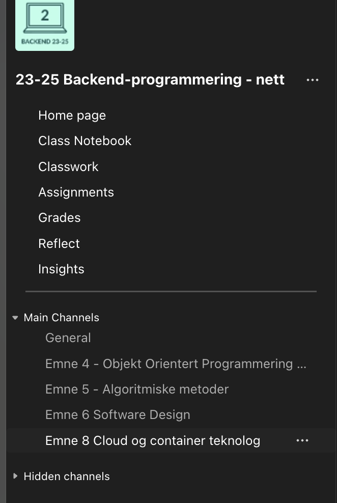
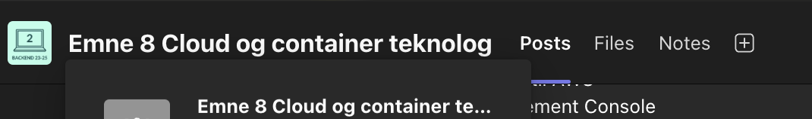

# Introduksjonskurs i Cloud - Uke 4

1. [Kompendium](kompendium.md)
2. [Leseliste](leseliste.md)
3. [Ukesoppgaver Med Løsning](ukesoppgaver.md)
4. [Ukesoppgaver Uten Løsning](ukesoppgaver_no_solution.md)
5. [Slides](./slides/)

Hvor finner jeg opptak?

Opptak ligger på Teams. Gå først inn på emnesiden for backend, gå på emne 8, og trykk deretter på "Files" på Navbaren på toppen. Da finner du en mappe som heter `Recordings`. Se bilder under.

