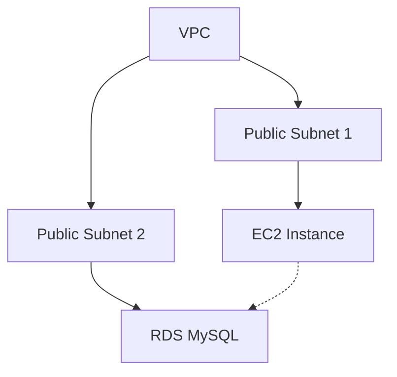
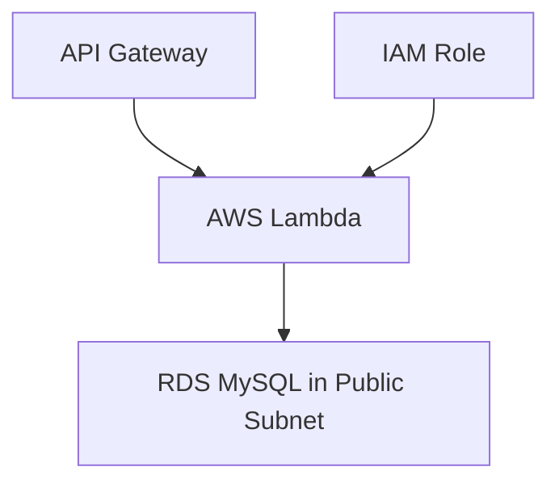
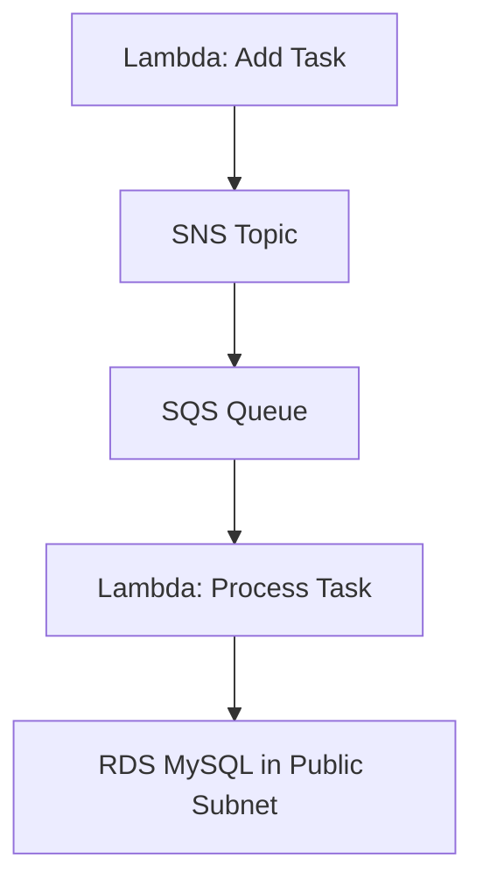
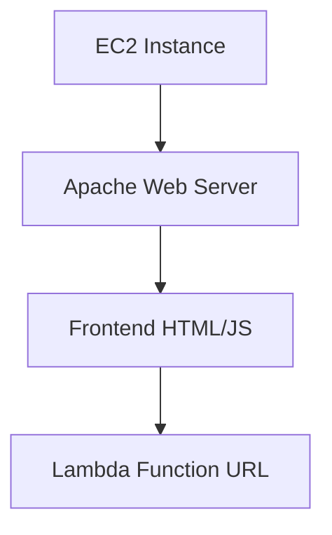

# Introduksjon til skyteknologi med AWS: Oppgavestyringssystem

I dette kurset skal vi bygge et enkelt oppgavestyringssystem ved hjelp av ulike AWS-tjenester. Vi vil fokusere på å bruke AWS Lambda, SNS og SQS, samt integrere med tjenester du allerede har lært om som EC2, S3 og RDS.

## Oppgave 1: Oppsett av grunnleggende infrastruktur

I denne oppgaven skal du sette opp den grunnleggende infrastrukturen for oppgavestyringssystemet vårt.

### Oppgavebeskrivelse

1. Opprett en VPC med to offentlige subnett i forskjellige availability zones.
2. Lag en EC2-instans (t2.micro) i ett av subnettene. Denne vil senere brukes som en webserver.
3. Opprett en RDS MySQL-database i det andre offentlige subnettet.

### Arkitekturdiagram



<details>
<summary>Løsning</summary>

### 1a. Opprett en VPC

1. Gå til VPC-konsollet i AWS.
2. Klikk på "Create VPC".
3. Velg "VPC and more" for å opprette VPC med tilhørende ressurser.
4. Fyll inn følgende detaljer:
   - VPC navn: OppgavestyringVPC
   - IPv4 CIDR block: 10.0.0.0/16
   - Number of Availability Zones: 2
   - Number of public subnets: 2
   - Number of private subnets: 0
   - NAT gateways: None
   - VPC endpoints: None
   - DNS options (Enable DNS hostnames): Aktivert
   - DNS options (Enable DNS resolution): Aktivert
5. Klikk på "Create VPC".

### 1b. Opprett en EC2-instans

- Gå til EC2 Dashboard
  - Klikk "Launch Instance"
  - Gi den et navn
  - Velg Amazon Linux 2 AMI
  - Velg t2.micro instance type
  - Ved "Key pair (login)":
    * Velg "Create new key pair"
    * Gi key pair et navn (f.eks. "taskmanager-key")
    * Velg RSA og .pem format
    * Last ned key pair-filen og lagre den sikkert
    * Endre tillatelser på key pair: `chmod 400 taskmanager-key.pem`
  - Konfigurer "Network Settings" -> Trykk på Edit
    - Konfigurer instance details: Velg ditt VPC og public subnettet i sone `eu-west-1a`
    - `Auto-assign public IP`: Enable
    - `Firewall`: Create Security Group
      - Gi den et navn
      - Inbound Security Group Rules: 
        - Type: ssh, Protocol: TCP, Port range: 22, Source Type: anywhere
        - `Add security group rule` -> Type: http, Protocol TCP, port: 80, Source Type: 0.0.0.0/0 (anywhere)
  - Launch instance

### 1c. Opprette RDS database

**Se bilde i steg 4. Default selektert RDS Database Instance size koster penger. Selekter `Free Tier` med `tb.t4g.micro`**


1. Gå til RDS-konsollet i AWS.
2. Klikk på "Create database".
3. Velg "Standard Create" og MySQL som engine type.
4. Fyll inn følgende detaljer:
   - DB instance identifier: taskmanager
   - Master username: admin
   - Master password: Velg et passord
5. Bekreft at DB instance type er satt til Free tier (db.4tg.micro) -> se bilde. De andre typene er ikke under free tier og koster penger.
6. Set up EC2 connection (under `Connectivity`):
   - Sjekk av på "Connect to an EC2 compute resource" (AWS vil da sette opp nødvendige rettigheter, security groups etc. automatisk for deg slik at EC2-instansen og databasen kan snakke sammen)
   - Selekter EC2-instansen du skal koble til databasen
7. Under "Additional configuration":
   - Sett initial database name til "taskmanager"
   - Skru av `Enable automated backups`
8. La alle andre innstillinger være som standard.
9. Bekrefte at det står noe ala følgende under `Estimated monthly costs`:
   - The Amazon RDS Free Tier is available to you for 12 months. Each calendar month, the free tier will allow you to use the Amazon RDS resources listed below for free:
   - 750 hrs of Amazon RDS in a Single-AZ db.t2.micro, db.t3.micro or db.t4g.micro Instance.
   - 20 GB of General Purpose Storage (SSD).
   - 20 GB for automated backup storage and any user-initiated DB Snapshots.
10. Klikk på "Create database". Det tar noen minutter før den er klar (med status `Available`)

Trykk `Close` hvis du får følgende popup:


Med denne konfigurasjonen har du nå satt opp grunnleggende infrastruktur for oppgavestyringssystemet. EC2-instansen kan nå kommunisere med RDS-databasen, og vi har lagt grunnlaget for å bygge videre på systemet i de neste oppgavene.

</details>

## Oppgave 2: Implementer backend-logikk med AWS Lambda

I denne oppgaven skal du implementere backend-logikk for oppgavestyringssystemet ved hjelp av AWS Lambda.

> [!NOTE]
> I motsetning til EC2 hvor vi måtte legge inn oppdateringer av kode via SSH, kan vi med Lambda enkelt kopiere og lime inn kode direkte i AWS-konsollet. Dette gjør det mye enklere å oppdatere og teste koden vår.

### Forhåndskrav: Oppsett av Lambda Layer

Lambda Layers er funksjonalitet i AWS Lambda som lar deg inkludere eksterne biblioteker og andre avhengigheter som funksjonen din trenger. Dette er spesielt viktig fordi:

- Lambda-funksjoner kommer med begrenset standardbibliotek
- Eksterne biblioteker som PyMySQL må legges til separat
- Layers lar deg dele biblioteker mellom flere funksjoner
- Det sparer plass og gjør det enklere å vedlikeholde kodebasen

Følg disse stegene for å sette opp et Lambda Layer med PyMySQL:

1. På din lokale maskin:
```bash
mkdir pymysql-layer
cd pymysql-layer
mkdir python
pip install pymysql -t python/
zip -r pymysql-layer.zip python/
```

2. I AWS Console:
- Gå til Lambda
- Velg "Layers" i venstre meny
- Klikk "Create layer"
- Gi laget navnet "pymysql-layer"
- Last opp zip-filen du nettopp opprettet
- Velg "Compatible runtimes": Python 3.9
- Klikk "Create"

3. Legg til laget i Lambda-funksjonen:
- Åpne Lambda-funksjonen
- Gå til "Layers"
- Klikk "Add a layer"
- Velg "Custom layers"
- Velg "pymysql-layer" og versjon 1
- Klikk "Add"

### Oppgavebeskrivelse

1. Opprett en Lambda-funksjon som håndterer både å legge til og hente oppgaver.
2. Implementer routing basert på HTTP-metode og path.
3. Konfigurer nødvendige IAM-roller og tillatelser for Lambda-funksjonen.
4. Test endepunktene ved å legge til noen oppgaver og hente dem ut igjen.

### Arkitekturdiagram



<details>
<summary>Løsning</summary>

1. Opprett en kombinert Lambda-funksjon:

```python
import json
import pymysql

def get_db_connection():
  return pymysql.connect(
    host='<RDS_ENDPOINT_FROM_AWS_CONSOLE>',  # Get from RDS console
    user='admin',  # The username you set when creating RDS
    password='YOUR_PASSWORD_HERE',  # The password you set when creating RDS  
    db='taskmanager',  # The database name you created
    charset='utf8mb4',
    cursorclass=pymysql.cursors.DictCursor
    )

def add_task(event):
  conn = get_db_connection()
  try:
    body = json.loads(event['body'])
    with conn.cursor() as cursor:
      sql = "INSERT INTO tasks (title, description, status) VALUES (%s, %s, %s)"
      cursor.execute(sql, (body['title'], body['description'], 'Pending'))
    conn.commit()
    return {
      'statusCode': 200,
      'body': json.dumps({'message': 'Oppgave lagt til'})
    }
  finally:
    conn.close()

def get_tasks():
  conn = get_db_connection()
  try:
    with conn.cursor() as cursor:
      cursor.execute("SELECT * FROM tasks")
      result = cursor.fetchall()
    return {
      'statusCode': 200,
      'body': json.dumps(result)
    }
  finally:
    conn.close()

def lambda_handler(event, context):
  try:
    method = event['httpMethod']
    path = event['path']
    
    if method == 'POST' and path == '/tasks':
      return add_task(event)
    elif method == 'GET' and path == '/tasks':
      return get_tasks()
    else:
      return {
        'statusCode': 404,
        'body': json.dumps({'error': 'Not found'})
      }
  except Exception as e:
    return {
      'statusCode': 500,
      'body': json.dumps({'error': str(e)})
    }
```

2. Konfigurer IAM-rolle:
  - Gå til IAM-dashbordet i AWS Console (https://console.aws.amazon.com/iam/)
  - Klikk på "Roles" i venstre menybar
  - Klikk på "Create role" knappen
  - Under "Use cases", velg "AWS Service" og deretter "Lambda"
  - Klikk "Next"
  - I søkefeltet, skriv inn følgende policyer og velg dem:
  - "AWSLambdaBasicExecutionRole" (gir tilgang til CloudWatch Logs)
  - Klikk "Next"
  - Gi rollen et beskrivende navn, f.eks. "TaskManagementLambdaRole"
  - Legg til en beskrivelse (valgfritt)
  - Klikk "Create role"

3. Test endepunktene:
  - Åpne Lambda-funksjonen i AWS Console
  - Gå til "Test" fanen
  - For å teste POST /tasks:
  - Klikk "Create new event"
  - Gi test-eventen et navn, f.eks. "AddTaskTest"
  - Lim inn følgende JSON:
```json
{
  "httpMethod": "POST",
  "path": "/tasks",
  "body": "{\"title\": \"Test oppgave\", \"description\": \"Dette er en test\"}"
}
```
  - Klikk "Save"
  - Klikk "Test" for å kjøre testen

  - For å teste GET /tasks:
  - Klikk "Create new event" igjen
  - Gi test-eventen et navn, f.eks. "GetTasksTest"
  - Lim inn følgende JSON:
```json
{
  "httpMethod": "GET",
  "path": "/tasks"
}
```
  - Klikk "Save"
  - Klikk "Test" for å kjøre testen

  - Se resultatene i "Execution results" seksjonen
  - Sjekk også CloudWatch Logs for mer detaljerte logger

</details>


## Oppgave 3: Implementer meldingskø med SQS og SNS

I denne oppgaven skal du implementere en meldingskø ved hjelp av Amazon SQS og Amazon SNS for å håndtere asynkron behandling av oppgaver. Dette er nyttig når du har oppgaver som kan ta tid å behandle eller krever flere steg.

### Oppgavebeskrivelse

1. Opprett en SQS-kø for å lagre oppgaver som skal behandles.
2. Opprett et SNS-topic for å varsle om nye oppgaver.
3. Modifiser Lambda-funksjonen for å legge til oppgaver slik at den sender en melding til SNS-topicen når en ny oppgave legges til.
4. Opprett en ny Lambda-funksjon som lytter på SQS-køen og behandler oppgaver.
5. Konfigurer SNS til å sende meldinger til SQS-køen.

### Arkitekturdiagram



<details>
<summary>Løsning</summary>

### Steg 1: Opprette SQS kø

1. Gå til AWS Console og søk etter "SQS" i søkefeltet
2. Klikk på "Create queue" knappen øverst til høyre
3. Velg "Standard Queue" (ikke FIFO)
4. Under "Details":
   - Skriv inn et beskrivende navn, f.eks. "task-processing-queue"
   - La andre innstillinger være som standard
5. Under "Access policy", behold standardinnstillingene
6. Klikk "Create queue"
7. Noter deg queue URL-en som vises - du trenger denne senere

### Steg 2: Opprette SNS Topic

1. Åpne ny fane i AWS Console og søk etter "SNS"
2. Klikk på "Topics" i venstre meny
3. Klikk "Create topic"
4. Under "Details":
   - Type: Standard
   - Name: "new-task-notification"
   - Display name: "New Task"
5. Klikk "Create topic"
6. Noter deg Topic ARN - du trenger dette senere

### Steg 3: Modifisere Lambda Add Task

1. Gå til Lambda i AWS Console
2. Finn din eksisterende Lambda-funksjon for å legge til oppgaver
3. Under "Code source", oppdater koden:

```python
import json
import pymysql
import boto3

def add_task(event):
  # Opprett database-tilkobling
  conn = get_db_connection()
  try:
    # Parse innkommende data
    body = json.loads(event['body'])
    
    # Lagre oppgave i public subnet database
    with conn.cursor() as cursor:
      sql = """INSERT INTO tasks 
          (title, description, status) 
          VALUES (%s, %s, %s)"""
      cursor.execute(sql, (
        body['title'], 
        body['description'], 
        'Pending'
      ))
      # Hent ID til ny oppgave
      task_id = cursor.lastrowid
    conn.commit()
    
    # Send melding til SNS
    sns = boto3.client('sns')
    message_body = {
      'task_id': task_id,
      'title': body['title'],
      'description': body['description']
    }
    
    sns.publish(
      TopicArn='YOUR_SNS_TOPIC_ARN_HERE',  # Replace with your SNS Topic ARN from AWS Console
      Message=json.dumps(message_body),
      Subject='New Task Added'
    )
    
    return {
      'statusCode': 200,
      'body': json.dumps({
        'message': 'Oppgave lagt til og sendt til behandling',
        'task_id': task_id
      })
    }
  except Exception as e:
    print(f"Error: {str(e)}")  # Dette vil logges i CloudWatch
    return {
      'statusCode': 500,
      'body': json.dumps({'error': str(e)})
    }
  finally:
    conn.close()
```

4. Under "Configuration" -> "Permissions", klikk på IAM role
5. I IAM Console, legg til følgende policy:

```json
{
  "Version": "2012-10-17",
  "Statement": [
    {
      "Effect": "Allow",
      "Action": "sns:Publish",
      "Resource": "<REPLACE_WITH_YOUR_SNS_TOPIC_ARN>"  # Get this from your SNS Topic details in AWS Console
    }
  ]
}
```

### Steg 4: Opprette Process Task Lambda

1. Gå til Lambda i AWS Console
2. Klikk "Create function"
3. Velg "Author from scratch"
4. Under "Basic information":
   - Function name: "process-task"
   - Runtime: Python 3.9
   - Architecture: x86_64
5. Klikk "Create function"
6. Kopier inn følgende kode:

```python
import json
import pymysql
import boto3
import time

def get_db_connection():
  return pymysql.connect(
    host='<RDS_ENDPOINT_FROM_AWS_CONSOLE>',  # Get from RDS console
    user='admin',  # The username you set when creating RDS
    password='YOUR_PASSWORD_HERE',  # The password you set when creating RDS  
    db='taskmanager',  # The database name you created
    charset='utf8mb4',
    cursorclass=pymysql.cursors.DictCursor
    )

def lambda_handler(event, context):
  print("Processing task event:", event)  # Debug logging
  
  conn = get_db_connection()
  try:
    for record in event['Records']:
      # Parse meldingen fra SQS
      message = json.loads(record['body'])
      task_data = json.loads(message['Message'])
      task_id = task_data['task_id']
      
      # Oppdater status til "In Progress"
      with conn.cursor() as cursor:
        sql = "UPDATE tasks SET status = %s WHERE id = %s"
        cursor.execute(sql, ('In Progress', task_id))
      conn.commit()
      
      # Simuler prosessering med 5 sekunders ventetid 
      time.sleep(5)

      # Oppdater status til "Completed"
      with conn.cursor() as cursor:
        sql = "UPDATE tasks SET status = %s WHERE id = %s"
        cursor.execute(sql, ('Completed', task_id))
      conn.commit()
      
      print(f"Task {task_id} completed successfully")
      
    return {
      'statusCode': 200,
      'body': json.dumps('Tasks processed successfully')
    }
  except Exception as e:
    print(f"Error processing task: {str(e)}")
    return {
      'statusCode': 500,
      'body': json.dumps({'error': str(e)})
    }
  finally:
    conn.close()
```

### Steg 5: Konfigurere SNS til SQS

1. Gå tilbake til SNS Topic
2. Klikk "Create subscription"
3. Under "Details":
   - Protocol: Amazon SQS
   - Endpoint: Velg din SQS kø fra dropdown
4. Klikk "Create subscription"

### Testing av løsningen

1. Test add_task Lambda:
   ```json
   {
   "body": "{\"title\": \"Test Oppgave\", \"description\": \"Dette er en test oppgave\"}"
   }
   ```

2. Sjekk CloudWatch Logs:
   - Gå til CloudWatch
   - Klikk på "Log groups"
   - Find loggruppen for hver Lambda-funksjon
   - Se etter nye loggoppføringer

3. Sjekk database:
   ```sql
   SELECT * FROM tasks ORDER BY id DESC LIMIT 1;
   ```

4. Verifiser meldingsflyt:
   - Gå til SQS Queue
   - Se på "Monitoring" fanen
   - Sjekk "Messages Available" og "Messages In Flight"

Feilsøking:
- Hvis meldinger ikke kommer frem, sjekk IAM-tillatelser
- Hvis Lambda feiler, sjekk CloudWatch Logs
- Verifiser at VPC-innstillinger er korrekte for database-tilgang

</details>

## Oppgave 4: Implementer en enkel frontend på EC2

I denne oppgaven skal du implementere en enkel webbasert frontend for oppgavestyringssystemet på EC2-instansen du opprettet i oppgave 1. Vi vil lage en brukervennlig webside som lar brukere se og legge til oppgaver.

### Oppgavebeskrivelse

> [!NOTE]
> I denne oppgaven bruker vi Apache istedenfor Nginx fordi:
> - Vi trenger kun en enkel webserver for å serve statiske filer
> - Apache er standard webserver på Amazon Linux og kommer ferdig konfigurert
> - Vi slipper kompleks proxy-konfigurasjon siden API-et kjører på Lambda
> - Apache er enklere å sette opp når vi kun trenger grunnleggende funksjonalitet

1. Installer og konfigurer Apache webserver på EC2-instansen
2. Opprett en enkel HTML-side som viser alle oppgaver fra systemet
3. Implementer et skjema for å legge til nye oppgaver
4. Test løsningen grundig

### Arkitekturdiagram



<details>
<summary>Løsning</summary>

### 1. Installer Apache på EC2

```bash
# Koble til EC2
chmod 400 din-key.pem
ssh -i din-key.pem ec2-user@din-ec2-ip

# Oppdater og installer Apache
sudo yum update -y
sudo yum install httpd -y

# Start Apache
sudo systemctl start httpd
sudo systemctl enable httpd
sudo systemctl status httpd
```

### 2. Opprett frontend-filer

**Husk å editere `LAMBDA_BASE_URL` i scriptet nedenfor for at det skal fungere som tiltenkt. 

```bash
# Opprett index.html
sudo bash -c 'cat > /var/www/html/index.html' << 'EOL'
<!DOCTYPE html>
<html lang="en">
<head>
  <meta charset="UTF-8">
  <meta name="viewport" content="width=device-width, initial-scale=1.0">
  <title>Oppgavestyringssystem</title>
  <link rel="stylesheet" href="style.css">
</head>
<body>
  <div class="container">
    <h1>Oppgavestyringssystem</h1>
    <div class="form-section">
      <h2>Legg til ny oppgave</h2>
      <form id="task-form">
        <div class="form-group">
          <label for="task-title">Tittel:</label>
          <input type="text" id="task-title" required>
        </div>
        <div class="form-group">
          <label for="task-description">Beskrivelse:</label>
          <textarea id="task-description" rows="4"></textarea>
        </div>
        <button type="submit" class="submit-btn">Legg til oppgave</button>
      </form>
    </div>
    <div class="task-section">
      <h2>Eksisterende oppgaver</h2>
      <div id="task-list" class="task-grid"></div>
    </div>
  </div>
  <script src="script.js"></script>
</body>
</html>
EOL

# Opprett script.js
sudo bash -c 'cat > /var/www/html/script.js' << 'EOL'
const LAMBDA_BASE_URL = 'https://din-lambda-function-url.lambda-url.region.on.aws';

async function getTasks() {
  try {
    const response = await fetch(`${LAMBDA_BASE_URL}/tasks`, {
      method: 'GET',
      headers: {
        'Content-Type': 'application/json'
      }
    });
    if (!response.ok) {
      throw new Error('Nettverksfeil ved henting av oppgaver');
    }
    const data = await response.json();
    displayTasks(JSON.parse(data.body));
  } catch (error) {
    console.error('Feil ved henting av oppgaver:', error);
    showError('Kunne ikke hente oppgaver. Vennligst prøv igjen senere.');
  }
}

function displayTasks(tasks) {
  const taskList = document.getElementById('task-list');
  taskList.innerHTML = '';
  
  tasks.forEach(task => {
    const taskElement = document.createElement('div');
    taskElement.className = 'task-card';
    taskElement.innerHTML = `
      <h3>${escapeHtml(task.title)}</h3>
      <p>${escapeHtml(task.description)}</p>
      <span class="status ${task.status.toLowerCase()}">${task.status}</span>
    `;
    taskList.appendChild(taskElement);
  });
}

function escapeHtml(unsafe) {
  return unsafe
    .replace(/&/g, "&amp;")
    .replace(/</g, "&lt;")
    .replace(/>/g, "&gt;")
    .replace(/"/g, "&quot;")
    .replace(/'/g, "&#039;");
}

document.getElementById('task-form').addEventListener('submit', async (e) => {
  e.preventDefault();
  const submitButton = e.target.querySelector('button');
  submitButton.disabled = true;
  
  try {
    const taskData = {
      title: document.getElementById('task-title').value.trim(),
      description: document.getElementById('task-description').value.trim()
    };
    
    const response = await fetch(`${LAMBDA_BASE_URL}/tasks`, {
      method: 'POST',
      headers: {
        'Content-Type': 'application/json'
      },
      body: JSON.stringify(taskData)
    });

    if (!response.ok) {
      throw new Error('Feil ved oppretting av oppgave');
    }

    await getTasks();
    e.target.reset();
    alert('Oppgave lagt til!');
  } catch (error) {
    console.error('Feil:', error);
    alert('Kunne ikke legge til oppgave. Prøv igjen senere.');
  } finally {
    submitButton.disabled = false;
  }
});

getTasks();
EOL

# Opprett style.css
sudo bash -c 'cat > /var/www/html/style.css' << 'EOL'
body {
    font-family: Arial, sans-serif;
    line-height: 1.6;
    margin: 0;
    padding: 20px;
    background-color: #f5f5f5;
}

.container {
    max-width: 1200px;
    margin: 0 auto;
    padding: 20px;
}

h1 {
    color: #333;
    text-align: center;
    margin-bottom: 30px;
}

.form-section {
    background: white;
    padding: 20px;
    border-radius: 8px;
    box-shadow: 0 2px 4px rgba(0,0,0,0.1);
    margin-bottom: 30px;
}

.form-group {
    margin-bottom: 15px;
}

label {
    display: block;
    margin-bottom: 5px;
    font-weight: bold;
}

input, textarea {
    width: 100%;
    padding: 8px;
    border: 1px solid #ddd;
    border-radius: 4px;
    box-sizing: border-box;
}

.submit-btn {
    background-color: #4CAF50;
    color: white;
    padding: 10px 20px;
    border: none;
    border-radius: 4px;
    cursor: pointer;
    font-size: 16px;
}

.submit-btn:hover {
    background-color: #45a049;
}

.task-grid {
    display: grid;
    grid-template-columns: repeat(auto-fill, minmax(300px, 1fr));
    gap: 20px;
}

.task-card {
    background: white;
    padding: 15px;
    border-radius: 8px;
    box-shadow: 0 2px 4px rgba(0,0,0,0.1);
}

.status {
    display: inline-block;
    padding: 4px 8px;
    border-radius: 4px;
    font-size: 12px;
    font-weight: bold;
}

.status.pending {
    background-color: #ffd700;
    color: #000;
}

.status.completed {
    background-color: #90EE90;
    color: #000;
}

.status.in.progress {
    background-color: #87CEEB;
    color: #000;
}
EOL

# Sett rettigheter
sudo chown apache:apache /var/www/html/*
sudo chmod 644 /var/www/html/*
```

### 3. Testing av løsningen

1. Åpne en nettleser og gå til din EC2 Public IP:
   ```
   http://din-ec2-ip
   ```

2. Test funksjonalitet:
   - Legg til en ny oppgave via skjemaet
   - Verifiser at oppgaven vises i listen
   - Oppdater siden og sjekk at oppgaven fortsatt er der

3. Feilsøking (når du er koblet til EC2 instansen via SSH):
    ```bash
    sudo tail -f /var/log/httpd/error_log
    sudo tail -f /var/log/httpd/access_log
    ```

4. Verifiser CORS-innstillinger i Lambda: # TODO fjerne denne seksjonen? Usikker på om CORS trengs
   ```python
   def lambda_handler(event, context):
       headers = {
           'Access-Control-Allow-Origin': '*',
           'Access-Control-Allow-Methods': 'GET,POST,OPTIONS',
           'Access-Control-Allow-Headers': 'Content-Type'
       }
       # ... resten av koden
   ```

</details>

