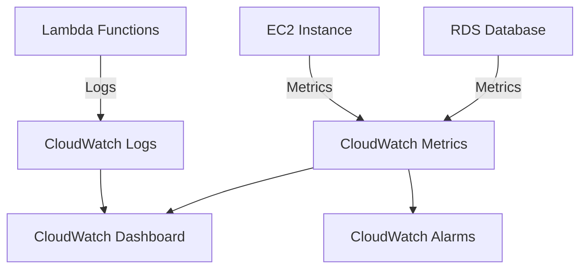
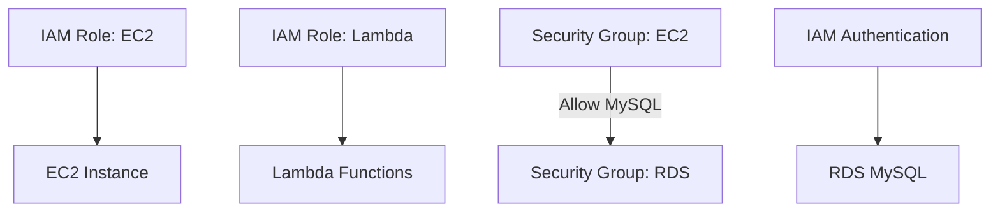

## Oppgave 5: Implementer logging og overvåking med CloudWatch

I denne oppgaven skal vi implementere logging og overvåking for oppgavestyringssystemet vårt ved hjelp av Amazon CloudWatch. Dette vil gi oss bedre innsikt i systemets ytelse og hjelpe oss med å identifisere potensielle problemer.

### Oppgavebeskrivelse

1. Konfigurer CloudWatch Logs for Lambda-funksjonene.
2. Opprett en CloudWatch Dashboard for å visualisere nøkkelmetrikker.
3. Sett opp CloudWatch Alarms for kritiske hendelser.
4. Implementer custom metrics for å spore antall oppgaver som blir lagt til og fullført.

### Eksempel på Custom Metrics

For å legge til custom metrics i Lambda-funksjonen, kan du bruke følgende kode:

```python
import boto3

def lambda_handler(event, context):
     # Eksisterende kode for å legge til oppgave

     # Legg til custom metric
     cloudwatch = boto3.client('cloudwatch')
     cloudwatch.put_metric_data(
          Namespace='TaskManagementSystem',
          MetricData=[
               {
                    'MetricName': 'TasksAdded',
                    'Value': 1,
                    'Unit': 'Count'
               },
          ]
     )

     # Resten av den eksisterende koden
```

### Arkitekturdiagram



<details>
<summary>Løsning</summary>

### 1. Konfigurer CloudWatch Logs for Lambda-funksjonene

CloudWatch Logs er vanligvis aktivert automatisk for Lambda-funksjoner, men det er viktig å verifisere:

1. Gå til Lambda-konsollet
2. Velg hver Lambda-funksjon
3. Under "Configuration" -> "Monitoring and operations tools"
4. Verifiser at "CloudWatch Logs" er aktivert

### 2. Opprett en CloudWatch Dashboard

1. Gå til CloudWatch-konsollet
2. Velg "Dashboards" -> "Create dashboard"
3. Gi dashboardet navnet "TaskManagementDashboard"
4. Legg til følgende widgets:

#### Widget 1: EC2 CPU-bruk
- Type: Line widget
- Metrics: EC2 -> Per-Instance Metrics
- Velg din instance ID -> CPUUtilization
- Period: 1 minute

#### Widget 2: RDS Database-tilkoblinger
- Type: Line widget
- Metrics: RDS -> Per-Database Metrics
- Velg din database -> DatabaseConnections
- Period: 1 minute

#### Widget 3: Lambda-tellere
- Type: Number widget
- Metrics: Lambda -> By Function Name
- Velg dine funksjoner
- Vis: Invocations, Errors
- Period: 5 minutes
- Statistic: Sum

#### Widget 4: Lambda-responstid
- Type: Line widget
- Metrics: Lambda -> By Function Name
- Velg dine funksjoner -> Duration
- Period: 5 minutes
- Statistic: Average

### 3. Sett opp CloudWatch Alarms

1. I CloudWatch, velg "Alarms" -> "Create alarm"
2. Konfigurer alarmen:
  - Velg metric: Lambda -> By Function Name -> [Din funksjon] -> Errors
  - Betingelse: Greater than 5 (eller ønsket verdi)
  - Opprett eller velg SNS-topic for varsling
  - Gi alarmen navn og beskrivelse

### 4. Implementer custom metrics

Modifiser Lambda-funksjonen som håndterer oppgaver for å inkludere egendefinerte metrikker:

```python
import json
import pymysql
import boto3
import time

def get_db_connection():
     return pymysql.connect(
          host='<RDS_ENDPOINT_FROM_AWS_CONSOLE>',  # Get from RDS console
          user='admin',  # The username you set when creating RDS
          password='YOUR_PASSWORD_HERE',  # The password you set when creating RDS  
          db='taskmanager',  # The database name you created
          charset='utf8mb4',
          cursorclass=pymysql.cursors.DictCursor
     )

def put_metric(metric_name):
     cloudwatch = boto3.client('cloudwatch')
     cloudwatch.put_metric_data(
          Namespace='TaskManagementSystem',
          MetricData=[{
               'MetricName': metric_name,
               'Value': 1,
               'Unit': 'Count'
          }]
     )

def lambda_handler(event, context):
     print("Processing task event:", event)  # Debug logging
     
     conn = get_db_connection()
     try:
          for record in event['Records']:
               # Parse meldingen fra SQS
               message = json.loads(record['body'])
               task_data = json.loads(message['Message'])
               task_id = task_data['task_id']
               
               # Record task started metric
               put_metric('TasksStarted')
               
               # Oppdater status til "In Progress"
               with conn.cursor() as cursor:
                    sql = "UPDATE tasks SET status = %s WHERE id = %s"
                    cursor.execute(sql, ('In Progress', task_id))
               conn.commit()
               
               # Simuler prosessering med 5 sekunders ventetid 
               time.sleep(5)

               # Oppdater status til "Completed"
               with conn.cursor() as cursor:
                    sql = "UPDATE tasks SET status = %s WHERE id = %s"
                    cursor.execute(sql, ('Completed', task_id))
               conn.commit()
               
               # Record task completed metric
               put_metric('TasksCompleted')
               
               print(f"Task {task_id} completed successfully")
               
          return {
               'statusCode': 200,
               'body': json.dumps('Tasks processed successfully')
          }
     except Exception as e:
          print(f"Error processing task: {str(e)}")
          # Record task failed metric
          put_metric('TasksFailed')
          return {
               'statusCode': 500,
               'body': json.dumps({'error': str(e)})
          }
     finally:
          conn.close()
```

La oss legge til en ny helper-funksjon for å publisere metrikkene, og registrere metrics for når oppgaver starter, fullfører eller feiler. Dette gir oss bedre innsikt i oppgaveflyten.


5. Modifiser Lambda-funksjonen som behandler oppgaver på samme måte, men bruk 'TasksCompleted' som MetricName.

6. Legg til de nye custom metrics til dashboardet:
   - Gå tilbake til CloudWatch Dashboard
   - Klikk på \"Add widget\
   - Velg \"Number\" som widget type
   - Søk etter \"TaskManagementSystem\" namespace
   - Velg \"TasksAdded\" og \"TasksCompleted\" metrics
   - Konfigurer widgeten til å vise sum over siste time
   - Legg til widgeten til dashboardet

Med denne konfigurasjonen har du nå implementert omfattende logging og overvåking for oppgavestyringssystemet ditt. Du kan enkelt overvåke systemets ytelse, spore antall oppgaver som blir lagt til og fullført, og motta varsler om eventuelle problemer.


</details>

## Oppgave 6: Implementer sikker tilgang med IAM og Security Groups

I denne oppgaven skal vi fokusere på å sikre oppgavestyringssystemet vårt ved å implementere riktig IAM-konfigurasjon og finjustere security groups.

### Oppgavebeskrivelse

1. Opprett en IAM-rolle for EC2-instansen med minste nødvendige tillatelser
2. Konfigurer en IAM-policy for Lambda-funksjonene med prinsippet om minste privilegium
3. Oppdater security groups for å begrense nettverkstilgang:
    - EC2: Tillat innkommende HTTP/HTTPS-trafikk på port 80/443
    - RDS: Tillat bare innkommende MySQL-trafikk fra EC2 security group
4. Implementer IAM-basert autentisering for RDS MySQL

### Arkitekturdiagram



<details>
<summary>Løsning</summary>

### 1. Opprett IAM-rolle for EC2:

1. Gå til IAM-konsollet (Services → IAM)
2. Klikk på "Roles" i venstre meny
3. Klikk "Create role"
4. Under "Use case", velg "EC2"
5. Klikk "Next"
6. Søk etter og velg følgende policies:
    - AmazonSSMManagedInstanceCore
    - CloudWatchAgentServerPolicy
7. Klikk "Next"
8. Gi rollen navnet "TaskManagementEC2Role"
9. Under "Role description" skriv: "Role for EC2 instances in the task management system"
10. Klikk "Create role"

### 2. Konfigurer IAM for Lambda:

1. I IAM-konsollet, klikk "Policies"
2. Klikk "Create policy"
3. Velg "JSON"-fanen
4. Kopier og lim inn følgende policy:

```json
{
     "Version": "2012-10-17",
     "Statement": [
          {
                "Effect": "Allow",
                "Action": [
                     "logs:CreateLogGroup",
                     "logs:CreateLogStream",
                     "logs:PutLogEvents"
                ],
                "Resource": "arn:aws:logs:*:*:*"
          },
          {
                "Effect": "Allow",
                "Action": [
                     "sns:Publish"
                ],
                "Resource": "arn:aws:sns:*:*:new-task-notification"
          },
          {
                "Effect": "Allow",
                "Action": [
                     "sqs:ReceiveMessage",
                     "sqs:DeleteMessage",
                     "sqs:GetQueueAttributes"
                ],
                "Resource": "arn:aws:sqs:*:*:task-processing-queue"
          },
          {
                "Effect": "Allow",
                "Action": [
                     "rds-db:connect"
                ],
                "Resource": "arn:aws:rds-db:*:*:dbuser:*/lambda_user"
          }
     ]
}
```

5. Klikk "Next"
6. Navn: "TaskManagementLambdaPolicy"
7. Description: "Policy for Lambda functions in the task management system"
8. Klikk "Create policy"

### 3. Security Groups konfigurering:

1. Gå til EC2-konsollet
2. Klikk på "Security Groups" i venstre meny
3. For EC2 security group:
    - Klikk "Create security group"
    - Navn: "task-management-ec2-sg"
    - Description: "Security group for task management EC2 instances"
    - VPC: Velg din VPC
    - Inbound rules:
      - Type: HTTP, Port: 80, Source: 0.0.0.0/0
      - Type: HTTPS, Port: 443, Source: 0.0.0.0/0
    - Klikk "Create security group"

4. For RDS security group:
    - Klikk "Create security group"
    - Navn: "task-management-rds-sg"
    - Description: "Security group for task management RDS instance"
    - VPC: Velg samme VPC
    - Inbound rules:
      - Type: MySQL/Aurora, Port: 3306, Source: task-management-ec2-sg
    - Klikk "Create security group"

### 4. Konfigurer Lambda med miljøvariabler:

1. Gå til Lambda-konsollet
2. Velg din Lambda-funksjon
3. Scroll ned til "Configuration" fanen
4. Velg "Environment variables" i venstre meny
5. Klikk "Edit"
6. Legg til følgende variabler:
    - Key: DB_HOST, Value: [Din RDS endpoint]
    - Key: DB_NAME, Value: [Ditt databasenavn] -> taskmanager
    - Key: DB_PORT, Value: 3306
7. Klikk "Save"

### 5. Implementer IAM-autentisering for RDS:

1. Gå til RDS-konsollet
2. Velg din database
3. Klikk "Modify"
4. Under "Database authentication" velg "Password and IAM database authentication"
5. Klikk "Continue"
6. Velg "Apply immediately"
7. Klikk "Modify DB instance"

8. Koble til RDS via MySQL klient og kjør:

```sql
CREATE USER 'lambda_user'@'%' IDENTIFIED WITH AWSAuthenticationPlugin AS 'RDS';
GRANT ALL PRIVILEGES ON taskmanager.* TO 'lambda_user'@'%';
FLUSH PRIVILEGES;
```

### 6. Oppdater Lambda-koden:

Oppdater `get_db_connection` i begge lambdaene til å bruke IAM-autentisering:

```python
import pymysql
import boto3
import os

def get_db_connection():
     rds = boto3.client('rds')
     token = rds.generate_db_auth_token(
          DBHostname=os.environ['DB_HOST'],
          Port=int(os.environ['DB_PORT']),
          DBUsername='lambda_user'
     )
     
     conn = pymysql.connect(
          host=os.environ['DB_HOST'],
          user='lambda_user',
          password=token,
          db=os.environ['DB_NAME'],
          port=int(os.environ['DB_PORT']),
          charset='utf8mb4',
          cursorclass=pymysql.cursors.DictCursor,
          ssl={'ssl': True}
     )
     return conn

def lambda_handler(event, context):
     # din kode..
```

Husk å teste grundig hver endring før du går videre til neste steg. Verifiser at:
- Lambda kan koble til RDS
- EC2 kan motta HTTP/HTTPS trafikk
- Alle nødvendige miljøvariabler er satt korrekt
- IAM-rollene har de nødvendige tillatelsene

</details>
