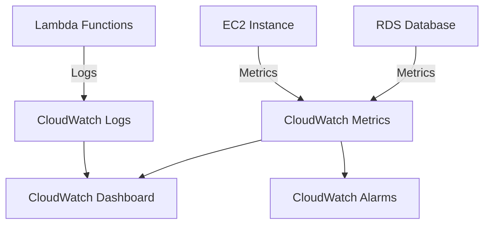

## Oppgave 5: Implementer logging og overvåking med CloudWatch

I denne oppgaven skal vi implementere logging og overvåking for oppgavestyringssystemet vårt ved hjelp av Amazon CloudWatch. Dette vil gi oss bedre innsikt i systemets ytelse og hjelpe oss med å identifisere potensielle problemer.

### Oppgavebeskrivelse

1. Konfigurer CloudWatch Logs for Lambda-funksjonene.
2. Opprett en CloudWatch Dashboard for å visualisere nøkkelmetrikker.
3. Sett opp CloudWatch Alarms for kritiske hendelser.
4. Implementer custom metrics for å spore antall oppgaver som blir lagt til og fullført.
5. Gi Lambda-funksjonen nødvendige rettigheter for CloudWatch Metrics.

### Eksempel på Custom Metrics

For å legge til custom metrics i Lambda-funksjonen, kan du bruke følgende kode:

```python
import boto3

def lambda_handler(event, context):
     # Eksisterende kode for å legge til oppgave

     # Legg til custom metric
     cloudwatch = boto3.client('cloudwatch', region_name='eu-west-1')
     cloudwatch.put_metric_data(
          Namespace='TaskManagementSystem',
          MetricData=[
               {
                    'MetricName': 'TasksAdded',
                    'Value': 1,
                    'Unit': 'Count'
               },
          ]
     )

     # Resten av den eksisterende koden
```

### Arkitekturdiagram



<details>
<summary>Løsning</summary>

### 1. Konfigurer CloudWatch Logs for Lambda-funksjonene

CloudWatch Logs er vanligvis aktivert automatisk for Lambda-funksjoner, men det er viktig å verifisere:

1. Gå til Lambda-konsollet
2. Velg hver Lambda-funksjon
3. Under "Configuration" -> "Monitoring and operations tools"
4. Verifiser at "CloudWatch Logs" er aktivert

### 2. Opprett en CloudWatch Dashboard

1. Gå til CloudWatch-konsollet
2. Velg "Dashboards" -> "Create dashboard"
3. Gi dashboardet navnet "TaskManagementDashboard"
4. Legg til følgende widgets:

#### Widget 1: EC2 CPU-bruk
- Type: Line widget
- Metrics: EC2 -> Per-Instance Metrics
- Velg din instance ID -> CPUUtilization
- Period: 1 minute

#### Widget 2: RDS Database-tilkoblinger
- Type: Line widget
- Metrics: RDS -> Per-Database Metrics
- Velg din database -> DatabaseConnections
- Period: 1 minute

#### Widget 3: Lambda-tellere
- Type: Number widget
- Metrics: Lambda -> By Function Name
- Velg dine funksjoner
- Vis: Invocations, Errors
- Period: 5 minutes
- Statistic: Sum

#### Widget 4: Lambda-responstid
- Type: Line widget
- Metrics: Lambda -> By Function Name
- Velg dine funksjoner -> Duration
- Period: 5 minutes
- Statistic: Average

### 3. Sett opp CloudWatch Alarms

1. I CloudWatch, velg "Alarms" -> "Create alarm"
2. Konfigurer alarmen:
  - Velg metric: Lambda -> By Function Name -> [Din funksjon] -> Errors
  - Betingelse: Greater than 5 (eller ønsket verdi)
  - Opprett eller velg SNS-topic for varsling
  - Gi alarmen navn og beskrivelse

### 4. Legg til IAM-rettigheter for CloudWatch Metrics

1. Gå til IAM-konsollet
2. Velg "Policies" -> "Create policy"
3. Velg JSON og lim inn følgende policy:
```json
{
    "Version": "2012-10-17",
    "Statement": [
        {
            "Effect": "Allow",
            "Action": "cloudwatch:PutMetricData",
            "Resource": "*"
        }
    ]
}
```
4. Gi policyen navnet "LambdaCloudWatchMetrics"
5. Gå til Lambda-funksjonen
6. Under "Configuration" -> "Permissions"
7. Klikk på execution role
8. Velg "Attach policies"
9. Søk etter og velg "LambdaCloudWatchMetrics"
10. Klikk "Attach policy"

### 5. Implementer custom metrics

Modifiser Lambda-funksjonen som håndterer oppgaver for å inkludere egendefinerte metrikker:

```python
import json
import pymysql
import boto3
import time

def get_db_connection():
    return pymysql.connect(
        host='taskmanager.c7g8yamuicvd.eu-west-1.rds.amazonaws.com',
        user='admin',
        password='passordd',
        db='taskmanager',
        charset='utf8mb4',
        cursorclass=pymysql.cursors.DictCursor
    )

def put_metric(metric_name):
     cloudwatch = boto3.client('cloudwatch', region_name='eu-west-1')
     cloudwatch.put_metric_data(
          Namespace='TaskManagementSystem',
          MetricData=[{
               'MetricName': metric_name,
               'Value': 1,
               'Unit': 'Count'
          }]
     )

def lambda_handler(event, context):
    print("Processing task event:", event)
    
    try:
        conn = get_db_connection()  # Move inside try block
        
        for record in event['Records']:
            message = json.loads(record['body'])
            task_data = json.loads(message['Message'])
            task_id = task_data['task_id']

          # Record task started metric
            put_metric('TasksStarted')
            
            with conn.cursor() as cursor:
                sql = "UPDATE tasks SET status = %s WHERE id = %s"
                cursor.execute(sql, ('In Progress', task_id))
            conn.commit()
            
            time.sleep(5)
            
            with conn.cursor() as cursor:
                sql = "UPDATE tasks SET status = %s WHERE id = %s"
                cursor.execute(sql, ('Completed', task_id))
            conn.commit()

            # Record task completed metric
            put_metric('TasksCompleted')
            
            print(f"Task {task_id} completed successfully")
          
        # print all tasks completed
        print("All tasks finished processing")
        
        return {
            'statusCode': 200,
            'body': json.dumps('Tasks processed successfully')
        }
    except Exception as e:
        print(f"Error processing task: {str(e)}")
        # Record task failed metric
        put_metric('TasksFailed')
        return {
            'statusCode': 500,
            'body': json.dumps({'error': str(e)})
        }
    finally:
        if 'conn' in locals():  # Only close if connection was established
            conn.close()
```

La oss legge til en ny helper-funksjon for å publisere metrikkene, og registrere metrics for når oppgaver starter, fullfører eller feiler. Dette gir oss bedre innsikt i oppgaveflyten.

5. Legg til de nye custom metrics til dashboardet:
   - Gå tilbake til CloudWatch Dashboard
   - Klikk på \"Add widget\
   - Velg \"Number\" som widget type
   - Søk etter \"TaskManagementSystem\" namespace
   - Velg \"TasksAdded\" og \"TasksCompleted\" metrics
   - Konfigurer widgeten til å vise sum over siste time
   - Legg til widgeten til dashboardet

Med denne konfigurasjonen har du nå implementert omfattende logging og overvåking for oppgavestyringssystemet ditt. Du kan enkelt overvåke systemets ytelse, spore antall oppgaver som blir lagt til og fullført, og motta varsler om eventuelle problemer.


</details>