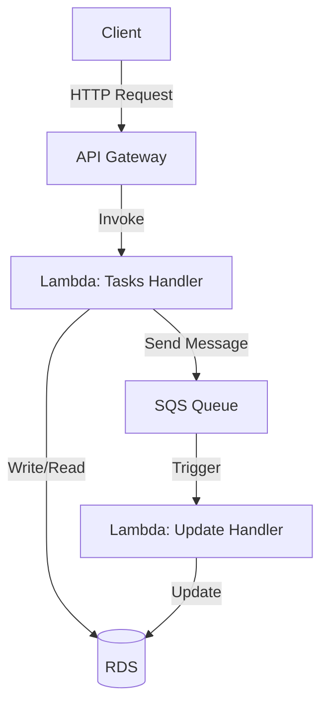

## Oppgave 7 (ekstra-oppgave for de som vil teste): Implementer serverløs arkitektur med API Gateway

I denne oppgaven skal vi utvide oppgavestyringssystemet vårt ved å implementere en serverløs arkitektur ved hjelp av Amazon API Gateway. Dette vil gi oss et RESTful API-grensesnitt for våre Lambda-funksjoner.

### Hvorfor API Gateway fremfor Lambda Function URLs?

API Gateway tilbyr flere fordeler sammenlignet med Lambda Function URLs:
- Innebygget API-nøkkel autentisering og bruksplaner
- Request/response transformering og validering
- Bedre muligheter for API-versjonering
- Omfattende logging og overvåking
- Innebygget throttling og rate limiting
- CORS-håndtering på API-nivå
- Mulighet for å kombinere flere Lambda-funksjoner under ett API

### Oppgavebeskrivelse

1. Opprett en ny API i Amazon API Gateway.
2. Definer ressurser og metoder for å håndtere oppgaver (create, get og update).
3. Integrer API-et med eksisterende Lambda-funksjoner.
4. Implementer enkel autentisering ved hjelp av API-nøkler.
5. Test API-et ved hjelp av Postman eller curl.

### Arkitekturdiagram



<details>
<summary>Løsning</summary>

1. Opprett en ny API i Amazon API Gateway:
    - Gå til API Gateway-konsollet
    - Klikk på "Create API"
    - Velg "REST API" og klikk "Build"
    - Gi API-et et navn, f.eks. "TaskManagementAPI"
    - Klikk på "Create API"

2. Definer ressurser og metoder:
    - Klikk på "Actions" og velg "Create Resource"
    - Gi ressursen navnet "tasks"
    - Opprett følgende metoder under /tasks ressursen:
    - POST (for å opprette en ny oppgave)
    - GET (for å hente alle oppgaver)
    - Opprett en ny ressurs under /tasks med {taskId} som path parameter
    - Under /tasks/{taskId}, opprett følgende metode:
    - GET (for å hente en spesifikk oppgave)

3. Integrer API-et med Lambda-funksjoner:
    - For POST og GET metodene, integrer med Tasks Handler Lambda
    - Updates håndteres via SQS-køen og Update Handler Lambda

4. Implementer autentisering med API-nøkler:
    - Gå til "API Keys" i venstremenyen
    - Klikk på "Actions" og velg "Create API Key"
    - Gi nøkkelen et navn og klikk på "Save"
    - Gå tilbake til API-et ditt og velg "Resources"
    - For hver metode, klikk på "Method Request"
    - Under "API Key Required", velg "true"
    - Gå til "Usage Plans" i venstremenyen
    - Klikk på "Create" og gi planen et navn
    - Legg til API-et og API-nøkkelen til bruksplanen

5. Deploy API-et:
    - Klikk på "Actions" og velg "Deploy API"
    - Velg en ny deployment stage, gi den et navn (f.eks. "prod")
    - Klikk på "Deploy"

6. Test API-et:
    - Noter ned API-ets Invoke URL og din API-nøkkel
    - Bruk Postman eller curl for å teste API-et. Her er et eksempel med curl:

```bash
# Opprett en ny oppgave
curl -X POST \
   https://your-api-id.execute-api.your-region.amazonaws.com/prod/tasks \
   -H 'Content-Type: application/json' \
   -H 'x-api-key: YOUR_API_KEY' \
   -d '{"title": "Ny oppgave", "description": "Dette er en test-oppgave"}'

# Hent alle oppgaver
curl -X GET \
   https://your-api-id.execute-api.your-region.amazonaws.com/prod/tasks \
   -H 'x-api-key: YOUR_API_KEY'

# Hent en spesifikk oppgave (erstatt {taskId} med en faktisk ID)
curl -X GET \
   https://your-api-id.execute-api.your-region.amazonaws.com/prod/tasks/{taskId} \
   -H 'x-api-key: YOUR_API_KEY'
```

Med denne implementasjonen har du nå et fungerende RESTful API for oppgavestyringssystemet ditt. API-et er sikret med API-nøkler og integrert med Lambda-funksjonene dine for å utføre operasjoner på oppgavene. Updates håndteres asynkront via SQS-køen.

> **Viktig:** Husk å oppdatere CORS-innstillingene hvis du planlegger å kalle API-et fra en webbrowser. Du kan gjøre dette ved å gå til "Actions" > "Enable CORS" i API Gateway-konsollet.

</details>
