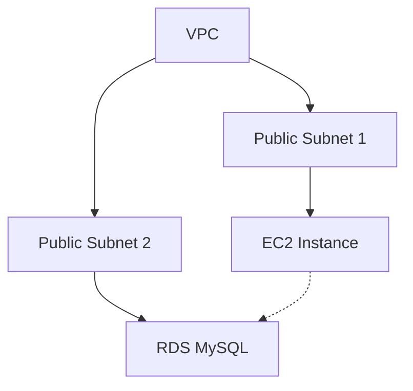
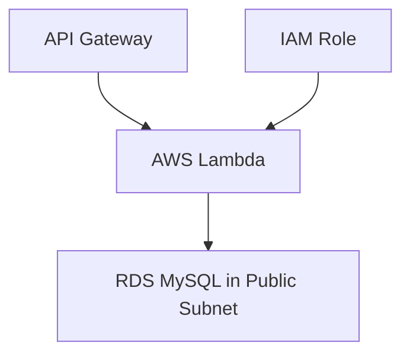
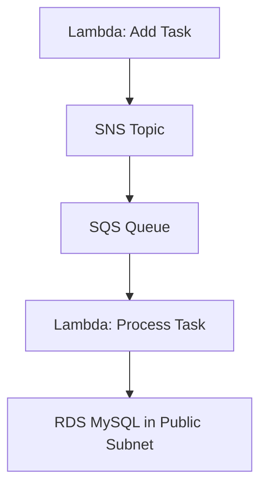
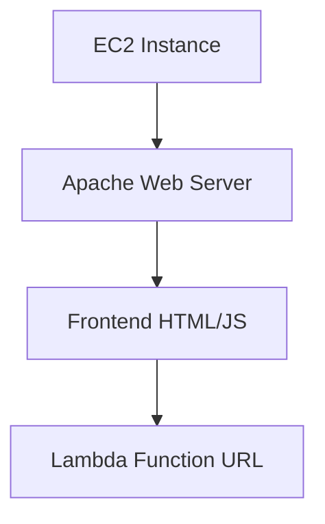
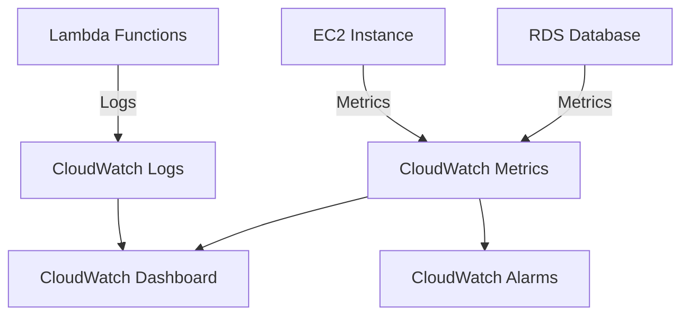

# Oppgavesett: AWS - Lambda, SQS og SNS
# Innholdsfortegnelse

1. [Oppsett av grunnleggende infrastruktur](#oppgave-1-oppsett-av-grunnleggende-infrastruktur)
2. [Implementer backend-logikk med AWS Lambda](#oppgave-2-implementer-backend-logikk-med-aws-lambda)
3. [Implementer meldingskø med SQS og SNS](#oppgave-3-implementer-meldingskø-med-sqs-og-sns)
4. [Implementer en enkel frontend på EC2](#oppgave-4-implementer-en-enkel-frontend-på-ec2)
5. [Implementer logging og overvåking med CloudWatch](#oppgave-5-implementer-logging-og-overvåking-med-cloudwatch)
6. [Sletting av ressurser i etterkant](#sletting-av-ressurser-i-etterkant)

# Introduksjon til skyteknologi med AWS: Oppgavestyringssystem

I dette kurset skal vi bygge et enkelt oppgavestyringssystem ved hjelp av AWS-tjenester. Vi vil starte med grunnleggende oppsett og gradvis bygge ut funksjonaliteten. Kurset vil fokusere på infrastruktur og AWS-tjenester, med minimal vekt på applikasjonskode.

> [!NOTE]
> **Før du begynner er det viktig at du setter deg inn i AWS Free Tier, se artikkel [her](../aws.md).**

> [!NOTE]
> **Hvis du bruker Windows er det lurt å laste ned Git Bash og bruke det som terminal for oppgavene, fremfor f.eks. PowerShell som er typisk på Windows. Du vil da kunne kjøre samme kommandoer som vist i ukesoppgavene Se video for hvordan Git Bash installeres [her](https://www.youtube.com/watch?v=qdwWe9COT9k).**

# Introduksjon til skyteknologi med AWS: Oppgavestyringssystem

I dette kurset skal vi bygge et enkelt oppgavestyringssystem ved hjelp av ulike AWS-tjenester. Vi vil fokusere på å bruke AWS Lambda, SNS og SQS, samt integrere med tjenester du allerede har lært om som EC2, S3 og RDS.

## Oppgave 1: Oppsett av grunnleggende infrastruktur

I denne oppgaven skal du sette opp den grunnleggende infrastrukturen for oppgavestyringssystemet vårt.

### Oppgavebeskrivelse

1. Opprett en VPC med to offentlige subnett i forskjellige availability zones.
2. Lag en EC2-instans (t2.micro) i ett av subnettene. Denne vil senere brukes som en webserver.
3. Opprett en RDS MySQL-database i det andre offentlige subnettet.
4. Opprett en tasks-tabell i databasen.

### Arkitekturdiagram



<details>
<summary>Løsning</summary>

### 1a. Opprett en VPC

1. Gå til VPC-konsollet i AWS.
2. Klikk på "Create VPC".
3. Velg "VPC and more" for å opprette VPC med tilhørende ressurser.
4. Fyll inn følgende detaljer:
   - VPC navn: OppgavestyringVPC
   - IPv4 CIDR block: 10.0.0.0/16
   - Number of Availability Zones: 2
   - Number of public subnets: 2
   - Number of private subnets: 0
   - NAT gateways: None
   - VPC endpoints: None
   - DNS options (Enable DNS hostnames): Aktivert
   - DNS options (Enable DNS resolution): Aktivert
5. Klikk på "Create VPC".

### 1b. Opprett en EC2-instans

- Gå til EC2 Dashboard
  - Klikk "Launch Instance"
  - Gi den et navn
  - Velg Amazon Linux 2 AMI
  - Velg t2.micro instance type
  - Ved "Key pair (login)":
    * Velg "Create new key pair"
    * Gi key pair et navn (f.eks. "taskmanager-key")
    * Velg RSA og .pem format
    * Last ned key pair-filen og lagre den sikkert
    * Endre tillatelser på key pair: `chmod 400 taskmanager-key.pem`
  - Konfigurer "Network Settings" -> Trykk på Edit
    - Konfigurer instance details: Velg ditt VPC og public subnettet i sone `eu-west-1a`
    - `Auto-assign public IP`: Enable
    - `Firewall`: Create Security Group
      - Gi den et navn
      - Inbound Security Group Rules: 
        - Type: ssh, Protocol: TCP, Port range: 22, Source Type: anywhere
        - `Add security group rule` -> Type: http, Protocol TCP, port: 80, Source Type: 0.0.0.0/0 (anywhere)
  - Launch instance

### 1c. Opprette RDS database

> [!NOTE]
> RDS krever en `subnet group` som definerer hvilke subnett den kan plasseres i. For denne øvelsen plasserer vi RDS i et offentlig subnet slik at vi kan nå den fra utviklermaskinen vår. I produksjon ville vi typisk plassert RDS i private subnett for bedre sikkerhet.

1. Opprett subnet group:
  - Gå til RDS-konsollet
  - Velg "Subnet groups" i venstre meny
  - Klikk "Create DB Subnet Group"
  - Name: taskmanager-subnet-group
  - Description: Subnet group for taskmanager database
  - VPC: Velg din VPC
  - Availability Zones: Velg begge AZ-ene
  - Subnets: Velg begge public subnets
  - Klikk "Create"


2. Gå til RDS-konsollet i AWS.
3. Klikk på "Create database".
4. Velg "Standard Create" og MySQL som engine type.

5. Fyll inn følgende detaljer:
  - DB instance identifier: taskmanager
  - Master username: admin
  - Master password: Velg et passord
6. Bekreft at DB instance type er satt til Free tier (db.t4g.micro) -> se bilde. De andre typene er ikke under free tier og koster penger.
7. Under `Connectivity`:
  - Compute Resource: Kryss av for `Don't connect to an EC2 compute resource`
  - VPC: Velg din VPC
  - DB Subnet group: Velg taskmanager-subnet-group
  - Public access: Yes
  - VPC security group (firewall): -> `Create new` -> gi den ett navn, f.eks. `rds-sg`, ellers alt på default.
8. Under "Additional configuration":
  - Sett initial database name til "taskmanager"
  - Skru av `Enable automated backups`
9. La alle andre innstillinger være som standard.
10. Bekreft kostnadene under "Estimated monthly costs"
11. Klikk på "Create database". Det tar noen minutter før den er klar.

**Se bilde i steg 6. Default selektert RDS Database Instance size koster penger. Selekter `Free Tier` med `tb.t4g.micro`**

Trykk `Close` hvis du får følgende popup:


### 1d. Opprett tasks-tabell

1. SSH inn i EC2-instansen:
```bash
# Erstatt din-key.pem med navnet på din private key og EC2_PUBLIC_IP med public IP til din EC2 instans
ssh -i din-key.pem ec2-user@EC2_PUBLIC_IP
```

2. Installer MySQL client på EC2-instansen:
```bash
sudo dnf update -y
sudo dnf install mariadb105 -y
```

3. Koble til RDS-databasen fra EC2-instansen:
```bash
mysql -h <RDS_ENDPOINT> -u admin -p
```

4. Opprett tasks-tabellen:

```sql
USE taskmanager;
```

```sql
CREATE TABLE tasks (
  id INT AUTO_INCREMENT PRIMARY KEY,
  title VARCHAR(255) NOT NULL,
  description TEXT,
  status VARCHAR(50) DEFAULT 'Pending'
);
```

Du kan nå kjøre `SHOW TABLES` for å verifisere at den nye tabellen er laget.

Med denne konfigurasjonen har du nå satt opp grunnleggende infrastruktur for oppgavestyringssystemet. EC2-instansen kan nå kommunisere med RDS-databasen, og vi har opprettet tasks-tabellen som vil brukes for å lagre oppgaver.

</details>

## Oppgave 2: Implementer backend-logikk med AWS Lambda

I denne oppgaven skal du implementere backend-logikk for oppgavestyringssystemet ved hjelp av AWS Lambda.

> [!NOTE]
> I motsetning til EC2 hvor vi måtte legge inn oppdateringer av kode via SSH, kan vi med Lambda enkelt kopiere og lime inn kode direkte i AWS-konsollet. Dette gjør det mye enklere å oppdatere og teste koden vår.

### Forhåndskrav: Oppsett av Lambda Layer

Lambda Layers er funksjonalitet i AWS Lambda som lar deg inkludere eksterne biblioteker og andre avhengigheter som funksjonen din trenger. Dette er spesielt viktig fordi:

- Lambda-funksjoner kommer med begrenset standardbibliotek
- Eksterne biblioteker som PyMySQL må legges til separat
- Layers lar deg dele biblioteker mellom flere funksjoner
- Det sparer plass og gjør det enklere å vedlikeholde kodebasen

Følg disse stegene for å sette opp et Lambda Layer med PyMySQL:

1. På din lokale maskin:
```bash
mkdir pymysql-layer
cd pymysql-layer
mkdir python
pip3 install pymysql -t python/
zip -r pymysql-layer.zip python/
```

2. I AWS Console:
- Gå til Lambda
- Velg "Layers" i venstre meny
- Klikk "Create layer"
- Gi laget navnet "pymysql-layer"
- Last opp zip-filen du nettopp opprettet
- Huk av på `x86_64` under `Compatible Architectures`
- Velg "Compatible runtimes": Python 3.13
- Klikk "Create"

3. Legg til laget i Lambda-funksjonen:
- Åpne Lambda-funksjonen
- Gå til "Layers"
- Klikk "Add a layer"
- Velg "Custom layers"
- Velg "pymysql-layer" og versjon 1
- Klikk "Add"

### Oppgavebeskrivelse

1. Opprett en Lambda-funksjon som håndterer både å legge til og hente oppgaver.
2. Implementer routing basert på HTTP-metode og path.
3. Konfigurer nødvendige IAM-roller og tillatelser for Lambda-funksjonen.
4. Test endepunktene ved å legge til noen oppgaver og hente dem ut igjen.

### Arkitekturdiagram



<details>
<summary>Løsning</summary>

### 1. Opprett Lambda-funksjon

1. Oppdater RDS security group:
  - Gå til RDS instance
  - Under "Security", klikk på security group
  - Legg til inbound rule:
    - Type: MySQL/Aurora
    - Source: 0.0.0.0/0 (anywhere)

2. Gå til AWS Lambda i AWS Console
3. Klikk "Create function"
4. Velg "Author from scratch"
5. Under "Basic information":
  - Function name: "task-management"
  - Runtime: Python 3.13
  - Architecture: x86_64
6. Klikk "Create function"
7. Vent til lambdaen har provisjonert seg ferdig
8. Legg til Lambda Layer:
  - Gå til "Layers" i venstre meny i Lambda-funksjonen
  - Klikk "Add a layer"
  - Velg "Custom layers"
  - Velg "pymysql-layer" som du opprettet tidligere
  - Klikk "Add"
9. Under "Code source", lim inn følgende kode:

```python
import json
import pymysql

def get_db_connection():
  return pymysql.connect(
    host='taskmanager.c7g8yamuicvd.eu-west-1.rds.amazonaws.com',  # Get from RDS console
    user='admin',  # The username you set when creating RDS
    password='passordd',  # The password you set when creating RDS  
    db='taskmanager',  # The database name you created
    charset='utf8mb4',
    cursorclass=pymysql.cursors.DictCursor
  )

def add_task(event):
  print(f"Adding new task with event: {event}")  # Log incoming event
  conn = get_db_connection()
  try:
    body = json.loads(event['body'])
    print(f"Parsed request body: {body}")  # Log parsed body
    
    with conn.cursor() as cursor:
      sql = "INSERT INTO tasks (title, description, status) VALUES (%s, %s, %s)"
      cursor.execute(sql, (body['title'], body['description'], 'Pending'))
      task_id = cursor.lastrowid  # Get ID of inserted task
      print(f"Successfully inserted task with ID: {task_id}")  # Log success
    
    conn.commit()
    return {
      'statusCode': 200,
      'body': json.dumps({'message': 'Oppgave lagt til', 'task_id': task_id})
    }
  except Exception as e:
    print(f"Error adding task: {str(e)}")  # Log any errors
    raise  # Re-raise the exception for proper error handling
  finally:
    conn.close()


def get_tasks():
  conn = get_db_connection()
  try:
    with conn.cursor() as cursor:
      cursor.execute("SELECT * FROM tasks")
      result = cursor.fetchall()
    return {
      'statusCode': 200,
      'body': json.dumps(result)
    }
  finally:
    conn.close()

def lambda_handler(event, context):
  try:
    method = event['httpMethod']
    path = event['path']
    
    if method == 'POST' and path == '/tasks':
      return add_task(event)
    elif method == 'GET' and path == '/tasks':
      return get_tasks()
    else:
      return {
        'statusCode': 404,
        'body': json.dumps({'error': 'Not found'})
      }
  except Exception as e:
    return {
      'statusCode': 500,
      'body': json.dumps({'error': str(e)})
    }
```

og trykk på `Deploy`. 

TODO TRENGS DENNE?
11. Under `Configuration` -> "Function URL":
  - Klikk "Create function URL"
  - Auth type: NONE
  - Under `Additional Settings`: Configure cross-origin resource sharing (CORS): Enable
  - Klikk "Save"

12. Test Lambda-funksjonen:

  a. Gå til "Test" fanen i Lambda-editoren
  
  b. Klikk på "Create new event" knappen
  
  c. I dialogboksen som åpnes:
    - Gi testen et navn (f.eks. "GetTasksTest")
    - Velg "hello-world" som template
    - Erstatt hele JSON-innholdet i `Event JSON` med:
  ```json
  {
    "httpMethod": "GET",
    "path": "/tasks"
  }
  ```
    - Klikk "Save"

  d. Opprett en ny test for å legge til en task:
    - Klikk "Create new event" igjen
    - Gi testen navn "AddTaskTest"
    - Erstatt JSON-innholdet med:
  ```json
  {
    "httpMethod": "POST",
    "path": "/tasks",
    "body": "{\"title\":\"Test Task\",\"description\":\"This is a test task\"}"
  }
  ```
    - Klikk "Save"

  e. Kjør begge testene:
    - Kjør "AddTaskTest" først
    - Verifiser at responsen viser "Oppgave lagt til"
    - Kjør deretter "GetTasksTest"
    - Verifiser at den nye oppgaven vises i listen
  
  f. I resultatvinduet som vises:
    - Verifiser at "Status" viser 200
    - Sjekk at "Function Logs" ikke viser noen feil
    - Se at responsen inneholder forventet data
  
  g. Hvis du får feil:
    - Sjekk at database-tilkoblingen er konfigurert riktig
    - Verifiser at security groups tillater tilkobling
    - Se på CloudWatch Logs for mer detaljert feilinformasjon

// TODO trengs denne?
13. Noter ned Function URL - du trenger denne senere for frontend-integrasjon.

</details>


## Oppgave 3: Implementer meldingskø med SQS og SNS

I denne oppgaven skal du implementere en meldingskø ved hjelp av Amazon SQS og Amazon SNS for å håndtere asynkron behandling av oppgaver. Dette er nyttig når du har oppgaver som kan ta tid å behandle eller krever flere steg.

### Oppgavebeskrivelse

1. Opprett en SQS-kø for å lagre oppgaver som skal behandles.
2. Opprett et SNS-topic for å varsle om nye oppgaver.
3. Modifiser Lambda-funksjonen for å legge til oppgaver slik at den sender en melding til SNS-topicen når en ny oppgave legges til.
4. Opprett en ny Lambda-funksjon som lytter på SQS-køen og behandler oppgaver.
5. Konfigurer SNS til å sende meldinger til SQS-køen.

### Arkitekturdiagram



<details>
<summary>Løsning</summary>

### Steg 1: Opprette SQS kø

1. Gå til AWS Console og søk etter "SQS" i søkefeltet
2. Klikk på "Create queue" knappen øverst til høyre
3. Velg "Standard Queue" (ikke FIFO)
4. Under "Details":
   - Skriv inn et beskrivende navn, f.eks. "task-processing-queue"
   - La andre innstillinger være som standard
5. Under "Access policy", behold standardinnstillingene
6. Klikk "Create queue"
7. Noter deg queue URL-en som vises - du trenger denne senere

### Steg 2: Opprette SNS Topic

1. Åpne ny fane i AWS Console og søk etter "SNS"
2. Klikk på "Topics" i venstre meny
3. Klikk "Create topic"
4. Under "Details":
   - Type: Standard
   - Name: "new-task-notification"
   - Display name: "New Task"
5. Klikk "Create topic"
6. Noter deg Topic ARN - du trenger dette senere

### Steg 3: Modifisere Lambda Add Task

1. Gå til Lambda i AWS Console
2. Finn din eksisterende Lambda-funksjon for å sende en melding til SNS når det legges til oppgaver
3. Under "Code source", oppdater koden:

```python
import json
import pymysql
import boto3

def get_db_connection():
  return pymysql.connect(
    host='taskmanager.c7g8yamuicvd.eu-west-1.rds.amazonaws.com',  # Get from RDS console
    user='admin',  # The username you set when creating RDS
    password='passordd',  # The password you set when creating RDS  
    db='taskmanager',  # The database name you created
    charset='utf8mb4',
    cursorclass=pymysql.cursors.DictCursor
  )

def add_task(event):
  print(f"Adding new task with event: {event}")  # Log incoming event
  
  # Opprett database-tilkobling
  conn = get_db_connection()
  try:
    # Parse innkommende data
    body = json.loads(event['body'])
    print(f"Parsed request body: {body}")  # Log parsed body
    
    # Lagre oppgave i public subnet database
    with conn.cursor() as cursor:
      sql = """INSERT INTO tasks 
          (title, description, status) 
          VALUES (%s, %s, %s)"""
      cursor.execute(sql, (
        body['title'], 
        body['description'], 
        'Pending'
      ))
      # Hent ID til ny oppgave
      task_id = cursor.lastrowid
      print(f"Successfully inserted task with ID: {task_id}")  # Log success
    conn.commit()
    
    # Send melding til SNS
    sns = boto3.client('sns', region_name='eu-west-1')
    message_body = {
      'task_id': task_id,
      'title': body['title'],
      'description': body['description']
    }
    print(f"Preparing to send SNS message: {message_body}")  # Log SNS message
    
    sns.publish(
      TopicArn='arn:aws:sns:eu-west-1:043309361433:new-task-notification',  # Replace with your SNS Topic ARN from AWS Console
      Message=json.dumps(message_body),
      Subject='New Task Added'
    )
    print("Successfully published to SNS")  # Log SNS success
    
    return {
      'statusCode': 200,
      'body': json.dumps({
        'message': 'Oppgave lagt til og sendt til behandling',
        'task_id': task_id
      })
    }
  except Exception as e:
    print(f"Error in add_task: {str(e)}")  # Enhanced error logging
    return {
      'statusCode': 500,
      'body': json.dumps({'error': str(e)})
    }
  finally:
    conn.close()

def get_tasks():
  print("Fetching all tasks")  # Log start of get_tasks
  conn = get_db_connection()
  try:
    with conn.cursor() as cursor:
      cursor.execute("SELECT * FROM tasks")
      result = cursor.fetchall()
      print(f"Retrieved {len(result)} tasks")  # Log number of tasks
    return {
      'statusCode': 200,
      'body': json.dumps(result)
    }
  except Exception as e:
    print(f"Error in get_tasks: {str(e)}")  # Log any errors
    raise  # Re-raise the exception for proper error handling
  finally:
    conn.close()

def lambda_handler(event, context):
  try:
    event['httpMethod'] = event['requestContext']['http']['method']
    event['path'] = event['requestContext']['http']['path']
    event['queryStringParameters'] = event.get('queryStringParameters', {})

    method = event['httpMethod']
    path = event['path']
    
    if method == 'POST' and path == '/tasks':
      return add_task(event)
    elif method == 'GET' and path == '/tasks':
      return get_tasks()
    else:
      return {
      'statusCode': 404,
      'body': json.dumps({'error': 'Not found'})
      }
  except Exception as e:
    return {
      'statusCode': 500,
      'body': json.dumps({'error': str(e)})
    }
```

4. Under "Configuration" -> "Permissions", klikk på IAM role
5. I IAM Console, legg til policy for SNS publishing:
  - Gå til AWS IAM Console
  - I venstre meny, klikk på "Roles"
  - Søk etter og klikk på din Lambda-funksjons rolle (starter vanligvis med "task-management-role-")
  - Klikk på "Add permissions" -> "Create inline policy"
  - Velg "JSON" fanen
  - Lim inn følgende policy (erstatt `<REPLACE_WITH_YOUR_SNS_TOPIC_ARN>` med din faktiske SNS Topic ARN fra SNS Console):
```json
{
  "Version": "2012-10-17",
  "Statement": [
   {
    "Effect": "Allow",
    "Action": "sns:Publish",
    "Resource": "<REPLACE_WITH_YOUR_SNS_TOPIC_ARN>"
   }
  ]
}
```
  - Klikk på "Review policy"
  - Gi policyen et navn (f.eks. "SNSPublishPolicy")
  - Klikk på "Create policy"
  - Verifiser at den nye policyen vises under "Permissions policies" for rollen

### Steg 4: Opprette Process Task Lambda

1. Gå til Lambda i AWS Console
2. Klikk "Create function"
3. Velg "Author from scratch"
4. Under "Basic information":
  - Function name: "process-task"
  - Runtime: Python 3.13
  - Architecture: x86_64
5. Klikk "Create function"
6. Under "Configuration" -> "General configuration":
  - Klikk "Edit"
  - Sett "Timeout" til 15 seconds
  - Klikk "Save"
7. Vent til lambdaen har provisjonert seg ferdig
8. Legg til Lambda Layer:
  - Gå til "Layers" i venstre meny i Lambda-funksjonen
  - Klikk "Add a layer"
  - Velg "Custom layers"
  - Velg "pymysql-layer" som du opprettet tidligere
  - Klikk "Add"
9. Kopier inn følgende kode:

```python
import json
import pymysql
import boto3
import time

def get_db_connection():
    return pymysql.connect(
        host='taskmanager.c7g8yamuicvd.eu-west-1.rds.amazonaws.com',
        user='admin',
        password='passordd',
        db='taskmanager',
        charset='utf8mb4',
        cursorclass=pymysql.cursors.DictCursor
    )

def lambda_handler(event, context):
    print("Processing task event:", event)
    
    try:
        conn = get_db_connection()  # Move inside try block
        
        for record in event['Records']:
            message = json.loads(record['body'])
            task_data = json.loads(message['Message'])
            task_id = task_data['task_id']
            
            with conn.cursor() as cursor:
                sql = "UPDATE tasks SET status = %s WHERE id = %s"
                cursor.execute(sql, ('In Progress', task_id))
            conn.commit()
            
            time.sleep(5)
            
            with conn.cursor() as cursor:
                sql = "UPDATE tasks SET status = %s WHERE id = %s"
                cursor.execute(sql, ('Completed', task_id))
            conn.commit()
            
            print(f"Task {task_id} completed successfully")
          
        # print all tasks completed
        print("All tasks finished processing")
        
        return {
            'statusCode': 200,
            'body': json.dumps('Tasks processed successfully')
        }
    except Exception as e:
        print(f"Error processing task: {str(e)}")
        return {
            'statusCode': 500,
            'body': json.dumps({'error': str(e)})
        }
    finally:
        if 'conn' in locals():  # Only close if connection was established
            conn.close()
```

### Steg 5: Opprette SQS trigger og IAM-rolle for Process Task Lambda

Før vi kan bruke SQS som trigger må Lambda-funksjonen ha tillatelse til å lese fra SQS-køen.

1. Gå til Lambda-funksjonen i AWS Console
2. Under "Configuration" -> "Permissions", klikk på IAM role
3. I IAM Console:
  - Klikk "Add permissions" -> "Create inline policy"
  - Velg "JSON" fanen
  - Lim inn følgende policy:
```json
{
   "Version": "2012-10-17",
   "Statement": [
      {
        "Effect": "Allow",
        "Action": [
           "sqs:ReceiveMessage",
           "sqs:DeleteMessage",
           "sqs:GetQueueAttributes"
        ],
        "Resource": "arn:aws:sqs:eu-west-1:YOUR_ACCOUNT_ID:task-processing-queue"
      }
   ]
}
```
4. Erstatt `YOUR_ACCOUNT_ID` med ditt AWS account ID
5. Klikk "Review policy"
6. Gi policyen et navn (f.eks. "SQSReceivePolicy")
7. Klikk "Create policy"
8. Legg til SQS trigger i Lambda Funksjonen:
  - Gå til "Function overview"
  - Klikk "Add trigger"
  - Velg "SQS" fra listen
  - Velg din SQS kø fra dropdown
  - Batch size: 1
  - La andre innstillinger være som standard
  - Klikk "Add"

### Steg 5: Konfigurere SNS til SQS

1. Gå tilbake til SNS Topic
2. Klikk "Create subscription"
3. Under "Details":
  - Protocol: Amazon SQS
  - Endpoint: Velg din SQS kø fra dropdown
4. Klikk "Create subscription"

### Testing av løsningen

1. Test add_task Lambda:
  ```json
  {
    "Records": [
        {
            "messageId": "29ce3c25-141d-4675-8d38-b6d0ac7ed42a",
            "receiptHandle": "AQEBlJe7QjuukDhJk0uzJTNRn0yIkTzpoxNbOL+ibEntuixJt24z9nPcRajeZPjIgrP6fskHNfPaoALv7snkS15hNQyXHkAbIVubZ4KToUzXYmFkcHDkWV28aof3h/kcN+a++R3vKEIU+U7unJVU9BTjVxpgiBG8y15TAXduMzyiG6xY+bV56NYcnqzVLfh0/38/LbbyqMRePutTG68jUG1qHhc7tGjWm0MxUlSkYCagTuzW4FbNBmdgqxbbgvjVUai2DFqFS+C4p7w5QQneTzMdqNXuEivi24PhOcIuz5dnLqAXL+Wfal9Qplzqe9Uw5zGf5SKBrmcV/tOV4fhGijHDXgUuthLmQDUK+eeSdb646mffHyrty5N+6Tco29ekdXAN",
            "body": "{\n  \"Type\" : \"Notification\",\n  \"MessageId\" : \"fad20310-9642-5c51-9eac-6301ac3fc58c\",\n  \"TopicArn\" : \"arn:aws:sns:eu-west-1:043309361433:new-task-notification\",\n  \"Subject\" : \"New Task Added\",\n  \"Message\" : \"{\\\"task_id\\\": 7, \\\"title\\\": \\\"Test Task\\\", \\\"description\\\": \\\"This is a test task\\\"}\",\n  \"Timestamp\" : \"2025-01-27T07:39:41.387Z\",\n  \"SignatureVersion\" : \"1\"}",
            "attributes": {
                "ApproximateReceiveCount": "889",
                "AWSTraceHeader": "Root=1-6797383c-04bb76331b7f67185f53c060;Parent=5d84e81c2ab91f37;Sampled=0;Lineage=1:890bcd31:0",
                "SentTimestamp": "1737963581406",
                "SenderId": "AIDAISMY7JYY5F7RTT6AO",
                "ApproximateFirstReceiveTimestamp": "1737963581417"
            },
            "messageAttributes": {},
            "md5OfBody": "aec37728699accb4f0d795b8703fef00",
            "eventSource": "aws:sqs",
            "eventSourceARN": "arn:aws:sqs:eu-west-1:043309361433:tasks",
            "awsRegion": "eu-west-1"
        }
    ]
}
  ```

2. Sjekk CloudWatch Logs:
  - Gå til CloudWatch
  - Klikk på "Log groups"
  - Find loggruppen for hver Lambda-funksjon
  - Se etter nye loggoppføringer

3. Sjekk database:
  ```sql
  SELECT * FROM tasks ORDER BY id DESC LIMIT 1;
  ```

4. Verifiser meldingsflyt:
  - Gå til SQS Queue
  - Se på "Monitoring" fanen
  - Sjekk "Messages Available" og "Messages In Flight"

Feilsøking:
- Hvis meldinger ikke kommer frem, sjekk IAM-tillatelser
- Hvis Lambda feiler, sjekk CloudWatch Logs
- Verifiser at VPC-innstillinger er korrekte for database-tilgang

</details>

## Oppgave 4: Implementer en enkel frontend på EC2

I denne oppgaven skal du implementere en enkel webbasert frontend for oppgavestyringssystemet på EC2-instansen du opprettet i oppgave 1. Vi vil lage en brukervennlig webside som lar brukere se og legge til oppgaver.

### Oppgavebeskrivelse

> [!NOTE]
> I denne oppgaven bruker vi Apache istedenfor Nginx fordi:
> - Vi trenger kun en enkel webserver for å serve statiske filer
> - Apache er standard webserver på Amazon Linux og kommer ferdig konfigurert
> - Vi slipper kompleks proxy-konfigurasjon siden API-et kjører på Lambda
> - Apache er enklere å sette opp når vi kun trenger grunnleggende funksjonalitet

1. Installer og konfigurer Apache webserver på EC2-instansen
2. Konfigurer Lambda Function URL med CORS
3. Opprett en enkel HTML-side som viser alle oppgaver fra systemet
4. Implementer et skjema for å legge til nye oppgaver
5. Test løsningen grundig

### Arkitekturdiagram



<details>
<summary>Løsning</summary>

### 1. Installer Apache på EC2

```bash
# Koble til EC2
chmod 400 din-key.pem
ssh -i din-key.pem ec2-user@din-ec2-ip

# Oppdater og installer Apache
sudo yum update -y
sudo yum install httpd -y

# Start Apache
sudo systemctl start httpd
sudo systemctl enable httpd
sudo systemctl status httpd
```

### 2. Konfigurer Lambda Function URL og CORS

For at frontenden skal kunne kommunisere med Lambda-funksjonen, må vi sette opp en Function URL og konfigurere CORS (Cross-Origin Resource Sharing) korrekt:

1. Gå til Lambda-funksjonen i AWS Console
2. Under "Configuration" tab, velg "Function URL" i venstre meny
3. Klikk "Create function URL"
4. I dialogen som åpnes:
   - Auth type: NONE (siden dette er en demo)
   - Under "Additional settings":
     - Configure CORS: Enabled
     - Allow origin: `*` (i produksjon bør dette begrenses til spesifikke domener)
     - Allow methods: `*` (for å tillate alle HTTP-metoder)
     - Allow headers: `content-type, access-control-allow-origin, access-control-allow-methods`
     - Expose headers: `content-type, access-control-allow-origin, access-control-allow-methods`
     - Max age: 0
   - Klikk "Save"

> [!IMPORTANT]
> CORS-konfigurasjonen over er satt veldig åpen for demonstrasjonsformål. I en produksjonssetting bør du:
> - Begrense "Allow origin" til spesifikke domener
> - Spesifisere eksakte HTTP-metoder som trengs (f.eks. GET, POST)
> - Vurdere sikkerhetsbehov for headers og eksponerte headers

5. Kopier Function URL som vises - du trenger denne i frontend-koden
6. Test URL-en ved å åpne en ny fane i nettleseren og lime inn URL-en etterfulgt av `/tasks`

### 3. Opprett frontend-filer

**Husk å editere `LAMBDA_BASE_URL` i scriptet nedenfor for at det skal fungere som tiltenkt. 

```bash
# Opprett index.html
sudo bash -c 'cat > /var/www/html/index.html' << 'EOL'
<!DOCTYPE html>
<html lang="en">
<head>
  <meta charset="UTF-8">
  <meta name="viewport" content="width=device-width, initial-scale=1.0">
  <title>Oppgavestyringssystem</title>
  <link rel="stylesheet" href="style.css">
</head>
<body>
  <div class="container">
    <h1>Oppgavestyringssystem</h1>
    <div class="form-section">
      <h2>Legg til ny oppgave</h2>
      <form id="task-form">
        <div class="form-group">
          <label for="task-title">Tittel:</label>
          <input type="text" id="task-title" required>
        </div>
        <div class="form-group">
          <label for="task-description">Beskrivelse:</label>
          <textarea id="task-description" rows="4"></textarea>
        </div>
        <button type="submit" class="submit-btn">Legg til oppgave</button>
      </form>
    </div>
    <div class="task-section">
      <h2>Eksisterende oppgaver</h2>
      <div id="task-list" class="task-grid"></div>
    </div>
  </div>
  <script src="script.js"></script>
</body>
</html>
EOL

# Opprett script.js
sudo bash -c 'cat > /var/www/html/script.js' << 'EOL'
const LAMBDA_BASE_URL = 'https://kzobijfozlbw6urcajwx3z24wi0leutr.lambda-url.eu-west-1.on.aws';

async function getTasks() {
  try {
    const response = await fetch(`${LAMBDA_BASE_URL}/tasks`, {
      method: 'GET',
      headers: {
        'Content-Type': 'application/json'
      },
    });
    if (!response.ok) {
      throw new Error('Nettverksfeil ved henting av oppgaver');
    }
    const data = await response.json();
    displayTasks(data);
  } catch (error) {
    console.error('Feil ved henting av oppgaver:', error);
    showError('Kunne ikke hente oppgaver. Vennligst prøv igjen senere.');
  }
}

function displayTasks(tasks) {
  const taskList = document.getElementById('task-list');
  taskList.innerHTML = '';
  
  tasks.forEach(task => {
    const taskElement = document.createElement('div');
    taskElement.className = 'task-card';
    taskElement.innerHTML = `
      <h3>${escapeHtml(task.title)}</h3>
      <p>${escapeHtml(task.description)}</p>
      <span class="status ${task.status.toLowerCase().replace(' ', '-')}">${task.status}</span>
    `;
    taskList.appendChild(taskElement);
  });
}

function escapeHtml(unsafe) {
  return unsafe
    .replace(/&/g, "&amp;")
    .replace(/</g, "&lt;")
    .replace(/>/g, "&gt;")
    .replace(/"/g, "&quot;")
    .replace(/'/g, "&#039;");
}

document.getElementById('task-form').addEventListener('submit', async (e) => {
  e.preventDefault();
  const submitButton = e.target.querySelector('button');
  submitButton.disabled = true;
  
  try {
    const taskData = {
      title: document.getElementById('task-title').value.trim(),
      description: document.getElementById('task-description').value.trim()
    };
    
    const response = await fetch(`${LAMBDA_BASE_URL}/tasks`, {
      method: 'POST',
      headers: {
        'Content-Type': 'application/json'
      },
      body: JSON.stringify(taskData)
    });

    if (!response.ok) {
      throw new Error('Feil ved oppretting av oppgave');
    }

    await getTasks();
    e.target.reset();
    alert('Oppgave lagt til!');
  } catch (error) {
    console.error('Feil:', error);
    alert('Kunne ikke legge til oppgave. Prøv igjen senere.');
  } finally {
    submitButton.disabled = false;
  }
});

getTasks();
EOL

# Opprett style.css
sudo bash -c 'cat > /var/www/html/style.css' << 'EOL'
body {
    font-family: Arial, sans-serif;
    line-height: 1.6;
    margin: 0;
    padding: 20px;
    background-color: #f5f5f5;
}

.container {
    max-width: 1200px;
    margin: 0 auto;
    padding: 20px;
}

h1 {
    color: #333;
    text-align: center;
    margin-bottom: 30px;
}

.form-section {
    background: white;
    padding: 20px;
    border-radius: 8px;
    box-shadow: 0 2px 4px rgba(0,0,0,0.1);
    margin-bottom: 30px;
}

.form-group {
    margin-bottom: 15px;
}

label {
    display: block;
    margin-bottom: 5px;
    font-weight: bold;
}

input, textarea {
    width: 100%;
    padding: 8px;
    border: 1px solid #ddd;
    border-radius: 4px;
    box-sizing: border-box;
}

.submit-btn {
    background-color: #4CAF50;
    color: white;
    padding: 10px 20px;
    border: none;
    border-radius: 4px;
    cursor: pointer;
    font-size: 16px;
}

.submit-btn:hover {
    background-color: #45a049;
}

.task-grid {
    display: grid;
    grid-template-columns: repeat(auto-fill, minmax(300px, 1fr));
    gap: 20px;
}

.task-card {
    background: white;
    padding: 15px;
    border-radius: 8px;
    box-shadow: 0 2px 4px rgba(0,0,0,0.1);
}

.status {
    display: inline-block;
    padding: 4px 8px;
    border-radius: 4px;
    font-size: 12px;
    font-weight: bold;
}

.status.pending {
    background-color: #ffd700;
    color: #000;
}

.status.completed {
    background-color: #90EE90;
    color: #000;
}

.status.in-progress {
    background-color: #87CEEB;
    color: #000;
}
EOL

# Sett rettigheter
sudo chown apache:apache /var/www/html/*
sudo chmod 644 /var/www/html/*
```

### 4. Testing av løsningen

1. Åpne en nettleser og gå til din EC2 Public IP:
   ```
   http://din-ec2-ip
   ```

2. Test funksjonalitet:
   - Legg til en ny oppgave via skjemaet
   - Verifiser at oppgaven vises i listen
   - Oppdater siden og sjekk at oppgaven fortsatt er der

3. Feilsøking (når du er koblet til EC2 instansen via SSH):
    ```bash
    sudo tail -f /var/log/httpd/error_log
    sudo tail -f /var/log/httpd/access_log
    ```

</details>


## Oppgave 5: Implementer logging og overvåking med CloudWatch

I denne oppgaven skal vi implementere logging og overvåking for oppgavestyringssystemet vårt ved hjelp av Amazon CloudWatch. Dette vil gi oss bedre innsikt i systemets ytelse og hjelpe oss med å identifisere potensielle problemer.

### Oppgavebeskrivelse

1. Konfigurer CloudWatch Logs for Lambda-funksjonene.
2. Opprett en CloudWatch Dashboard for å visualisere nøkkelmetrikker.
3. Sett opp CloudWatch Alarms for kritiske hendelser.
4. Implementer custom metrics for å spore antall oppgaver som blir lagt til og fullført.
5. Gi Lambda-funksjonen nødvendige rettigheter for CloudWatch Metrics.

### Eksempel på Custom Metrics

For å legge til custom metrics i Lambda-funksjonen, kan du bruke følgende kode:

```python
import boto3

def lambda_handler(event, context):
     # Eksisterende kode for å legge til oppgave

     # Legg til custom metric
     cloudwatch = boto3.client('cloudwatch', region_name='eu-west-1')
     cloudwatch.put_metric_data(
          Namespace='TaskManagementSystem',
          MetricData=[
               {
                    'MetricName': 'TasksAdded',
                    'Value': 1,
                    'Unit': 'Count'
               },
          ]
     )

     # Resten av den eksisterende koden
```

### Arkitekturdiagram



<details>
<summary>Løsning</summary>

### 1. Konfigurer CloudWatch Logs for Lambda-funksjonene

CloudWatch Logs er vanligvis aktivert automatisk for Lambda-funksjoner, men det er viktig å verifisere:

1. Gå til Lambda-konsollet
2. Velg hver Lambda-funksjon
3. Under "Configuration" -> "Monitoring and operations tools"
4. Verifiser at "CloudWatch Logs" er aktivert

### 2. Opprett en CloudWatch Dashboard

1. Gå til CloudWatch-konsollet
2. Velg "Dashboards" -> "Create dashboard"
3. Gi dashboardet navnet "TaskManagementDashboard"
4. Legg til følgende widgets:

#### Widget 1: EC2 CPU-bruk
- Type: Line widget
- Metrics: EC2 -> Per-Instance Metrics
- Velg din instance ID -> CPUUtilization
- Period: 1 minute

#### Widget 2: RDS Database-tilkoblinger
- Type: Line widget
- Metrics: RDS -> Per-Database Metrics
- Velg din database -> DatabaseConnections
- Period: 1 minute

#### Widget 3: Lambda-tellere
- Type: Number widget
- Metrics: Lambda -> By Function Name
- Velg dine funksjoner
- Vis: Invocations, Errors
- Period: 5 minutes
- Statistic: Sum

#### Widget 4: Lambda-responstid
- Type: Line widget
- Metrics: Lambda -> By Function Name
- Velg dine funksjoner -> Duration
- Period: 5 minutes
- Statistic: Average

### 3. Sett opp CloudWatch Alarms

1. I CloudWatch, velg "Alarms" -> "Create alarm"
2. Konfigurer alarmen:
  - Velg metric: Lambda -> By Function Name -> [Din funksjon] -> Errors
  - Betingelse: Greater than 5 (eller ønsket verdi)
  - Opprett eller velg SNS-topic for varsling
  - Gi alarmen navn og beskrivelse

### 4. Legg til IAM-rettigheter for CloudWatch Metrics

1. Gå til IAM-konsollet
2. Velg "Policies" -> "Create policy"
3. Velg JSON og lim inn følgende policy:
```json
{
    "Version": "2012-10-17",
    "Statement": [
        {
            "Effect": "Allow",
            "Action": "cloudwatch:PutMetricData",
            "Resource": "*"
        }
    ]
}
```
4. Gi policyen navnet "LambdaCloudWatchMetrics"
5. Gå til Lambda-funksjonen
6. Under "Configuration" -> "Permissions"
7. Klikk på execution role
8. Velg "Attach policies"
9. Søk etter og velg "LambdaCloudWatchMetrics"
10. Klikk "Attach policy"

### 5. Implementer custom metrics

Modifiser Lambda-funksjonen som håndterer oppgaver for å inkludere egendefinerte metrikker:

```python
import json
import pymysql
import boto3
import time

def get_db_connection():
    return pymysql.connect(
        host='taskmanager.c7g8yamuicvd.eu-west-1.rds.amazonaws.com',
        user='admin',
        password='passordd',
        db='taskmanager',
        charset='utf8mb4',
        cursorclass=pymysql.cursors.DictCursor
    )

def put_metric(metric_name):
     cloudwatch = boto3.client('cloudwatch', region_name='eu-west-1')
     cloudwatch.put_metric_data(
          Namespace='TaskManagementSystem',
          MetricData=[{
               'MetricName': metric_name,
               'Value': 1,
               'Unit': 'Count'
          }]
     )

def lambda_handler(event, context):
    print("Processing task event:", event)
    
    try:
        conn = get_db_connection()  # Move inside try block
        
        for record in event['Records']:
            message = json.loads(record['body'])
            task_data = json.loads(message['Message'])
            task_id = task_data['task_id']

          # Record task started metric
            put_metric('TasksStarted')
            
            with conn.cursor() as cursor:
                sql = "UPDATE tasks SET status = %s WHERE id = %s"
                cursor.execute(sql, ('In Progress', task_id))
            conn.commit()
            
            time.sleep(5)
            
            with conn.cursor() as cursor:
                sql = "UPDATE tasks SET status = %s WHERE id = %s"
                cursor.execute(sql, ('Completed', task_id))
            conn.commit()

            # Record task completed metric
            put_metric('TasksCompleted')
            
            print(f"Task {task_id} completed successfully")
          
        # print all tasks completed
        print("All tasks finished processing")
        
        return {
            'statusCode': 200,
            'body': json.dumps('Tasks processed successfully')
        }
    except Exception as e:
        print(f"Error processing task: {str(e)}")
        # Record task failed metric
        put_metric('TasksFailed')
        return {
            'statusCode': 500,
            'body': json.dumps({'error': str(e)})
        }
    finally:
        if 'conn' in locals():  # Only close if connection was established
            conn.close()
```

La oss legge til en ny helper-funksjon for å publisere metrikkene, og registrere metrics for når oppgaver starter, fullfører eller feiler. Dette gir oss bedre innsikt i oppgaveflyten.

5. Legg til de nye custom metrics til dashboardet:
   - Gå tilbake til CloudWatch Dashboard
   - Klikk på \"Add widget\
   - Velg \"Number\" som widget type
   - Søk etter \"TaskManagementSystem\" namespace
   - Velg \"TasksAdded\" og \"TasksCompleted\" metrics
   - Konfigurer widgeten til å vise sum over siste time
   - Legg til widgeten til dashboardet

Med denne konfigurasjonen har du nå implementert omfattende logging og overvåking for oppgavestyringssystemet ditt. Du kan enkelt overvåke systemets ytelse, spore antall oppgaver som blir lagt til og fullført, og motta varsler om eventuelle problemer.


</details>


# Sletting av ressurser i etterkant:

Resource Explorer klarer ikke alltid å finne RDS databaser, så disse må slettes manuelt. Dette gjøres ved å gå til RDS i konsollen, velge databasen og slette den.

