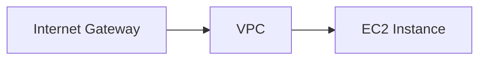
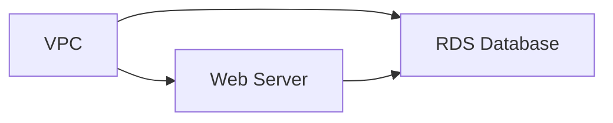

# Introduksjon til AWS CloudFormation

Denne ukens tema er AWS CloudFormation, et kraftig verktøy for å definere og administrere AWS-infrastruktur som kode. Vi skal bygge et oppgavestyringssystem ved hjelp av AWS-tjenester, og CloudFormation vil være vår hovedmetode for å opprette og administrere disse ressursene.

> [!NOTE]
> Det anbefales å bruke CloudFormation Linter for å raskt bli bevisstgjort på eventuelle feil i dine CloudFormation-maler. Dette verktøyet kan integreres i de fleste kodeeditorer og vil hjelpe deg med å identifisere og rette opp feil før du deployer dine ressurser.

La oss begynne med å sette opp grunnleggende infrastruktur for vårt oppgavestyringssystem.

## Oppgave 1: Opprette grunnleggende nettverksinfrastruktur med CloudFormation

I denne oppgaven skal vi opprette en VPC med to offentlige subnets ved hjelp av AWS CloudFormation. Dette vil danne grunnlaget for vårt oppgavestyringssystem.

### Oppgavebeskrivelse

1. Opprett en CloudFormation-mal som definerer følgende ressurser:
   - En VPC
   - To offentlige subnets i forskjellige Availability Zones
   - En Internet Gateway
   - En Route Table med en rute til Internet Gateway
2. Deployer malen ved hjelp av AWS Management Console
3. Verifiser at ressursene er opprettet korrekt

<details>
<summary>Løsning</summary>

1. Opprett en fil med navnet `network-infrastructure.yaml` og legg til følgende innhold:

```yaml
AWSTemplateFormatVersion: '2010-09-09'
Description: 'Network infrastructure for task management system'

Resources:
  TaskManagementVPC:
    Type: AWS::EC2::VPC
    Properties:
      CidrBlock: 10.0.0.0/16
      EnableDnsHostnames: true
      EnableDnsSupport: true
      InstanceTenancy: default
      Tags:
        - Key: Name
          Value: test-project
  PublicSubnet1:
    Type: AWS::EC2::Subnet
    Properties:
      VpcId: !Ref TaskManagementVPC
      AvailabilityZone: eu-west-1a
      CidrBlock: 10.0.1.0/24
      MapPublicIpOnLaunch: true
      Tags:
        - Key: Name
          Value: test-project

  PublicSubnet2:
    Type: AWS::EC2::Subnet
    Properties:
      VpcId: !Ref TaskManagementVPC
      AvailabilityZone: eu-west-1b
      CidrBlock: 10.0.2.0/24
      MapPublicIpOnLaunch: true
      Tags:
        - Key: Name
          Value: test-project

  InternetGateway:
    Type: AWS::EC2::InternetGateway
    Properties:
      Tags:
        - Key: Name
          Value: test-project

  AttachGateway:
    Type: AWS::EC2::VPCGatewayAttachment
    Properties:
      VpcId: !Ref TaskManagementVPC
      InternetGatewayId: !Ref InternetGateway

  PublicRouteTable:
    Type: AWS::EC2::RouteTable
    Properties:
      VpcId: !Ref TaskManagementVPC
      Tags:
        - Key: Name
          Value: test-project

  PublicRoute:
    Type: AWS::EC2::Route
    DependsOn: AttachGateway
    Properties:
      RouteTableId: !Ref PublicRouteTable
      DestinationCidrBlock: 0.0.0.0/0
      GatewayId: !Ref InternetGateway

  PublicSubnet1RouteTableAssociation:
    Type: AWS::EC2::SubnetRouteTableAssociation
    Properties:
      SubnetId: !Ref PublicSubnet1
      RouteTableId: !Ref PublicRouteTable

  PublicSubnet2RouteTableAssociation:
    Type: AWS::EC2::SubnetRouteTableAssociation
    Properties:
      SubnetId: !Ref PublicSubnet2
      RouteTableId: !Ref PublicRouteTable

Outputs:
  VPCId:
    Description: The ID of the VPC
    Value: !Ref TaskManagementVPC
    Export:
      Name: TaskManagementVPCId

  PublicSubnet1Id:
    Description: The ID of the first public subnet
    Value: !Ref PublicSubnet1
    Export:
      Name: TaskManagementPublicSubnet1Id

  PublicSubnet2Id:
    Description: The ID of the second public subnet
    Value: !Ref PublicSubnet2
    Export:
      Name: TaskManagementPublicSubnet2Id
```

2. For å deploye denne malen:
   - Gå til AWS CloudFormation-konsollen
   - Klikk på \"Create stack\" og velg \"With new resources (standard)\
   - Velg \"Upload a template file\" og last opp din `network-infrastructure.yaml` fil
   - Gi stacken et navn, f.eks. "task-management-network"
   - Trykk "Next"
   - La alt under `Configure stack options` stå som default, trykk `Next`
   - Gå gjennom resten av trinnene og klikk på `Submit`

3. For å verifisere at ressursene er opprettet korrekt:
   - Stacken vil nå gå i status `CREATE_IN_PROGRESS`
   - Vent til stacken er i status `CREATE_COMPLETE`
   - Gå til VPC-konsollen og bekreft at VPC, subnets, internet gateway og route table er opprettet med riktige konfigurasjoner
   - Sjekk at subnets er knyttet til route table, og at route table har en rute til internet gateway

Denne CloudFormation-malen oppretter en grunnleggende nettverksinfrastruktur for vårt oppgavestyringssystem. Vi har definert en VPC med to offentlige subnets i forskjellige Availability Zones, en Internet Gateway for internett-tilkobling, og en Route Table som ruter trafikk fra subnets til Internet Gateway.

Malen inkluderer også Outputs-seksjonen som eksporterer VPC og Subnet IDer. Dette gjør det enkelt å referere til disse ressursene i fremtidige CloudFormation-maler, noe som fremmer gjenbruk og modularitet i infrastrukturkoden vår.

</details>

## Oppgave 2: Opprette en EC2-instans med CloudFormation

I denne oppgaven skal vi utvide vår CloudFormation-mal for å inkludere en EC2-instans som vil fungere som vår applikasjonsserver for oppgavestyringssystemet.

### Oppgavebeskrivelse

1. Opprett en SSH key pair i AWS Console
2. Modifiser CloudFormation-malen fra forrige oppgave for å legge til:
  - En EC2-instans i den første offentlige subneten
  - En Security Group som tillater innkommende SSH-trafikk (port 22) og HTTP-trafikk (port 80)
3. Konfigurer EC2-instansen til å kjøre en enkel webserver ved oppstart
4. Oppdater den eksisterende stacken med den nye malen
5. Verifiser at EC2-instansen er opprettet og tilgjengelig

> [!NOTE]
> Det er ikke anbefalt å opprette SSH key pairs i CloudFormation da den private nøkkelen vil være synlig i CloudFormation-loggen. Dette er en sikkerhetsrisiko. I stedet bør key pairs opprettes manuelt i AWS Console før de refereres i CloudFormation-malen.

### Opprette SSH Key Pair

1. Gå til EC2 Dashboard i AWS Console
2. Velg "Key Pairs" under "Network & Security"
3. Klikk på "Create key pair"
4. Gi key pair et navn (f.eks. "taskmanager-key")
5. Velg ".pem" format for Linux/Mac eller ".ppk" for Windows
6. Klikk "Create key pair"
7. Last ned og lagre den private nøkkelen på et sikkert sted
8. For Linux/Mac brukere, kjør følgende kommando for å sette korrekte tillatelser på nøkkelfilen:
   ```bash
   chmod 400 path/to/your-key.pem
   ```

### Arkitekturdiagram



<details>
<summary>Løsning</summary>

1. Modifiser `network-infrastructure.yaml` filen og legg til følgende ressurser (dette til returnere en feilmelding ved forsøk på å legge til oppgave, da vi foreløpig ikke har opprettet APIet den interagerer mot. Det kommer i senere oppgave):

```yaml
  WebServerSecurityGroup:
    Type: AWS::EC2::SecurityGroup
    Properties:
      GroupDescription: Allow SSH and HTTP
      VpcId: !Ref TaskManagementVPC
      SecurityGroupIngress:
        - IpProtocol: tcp
          FromPort: 22
          ToPort: 22
          CidrIp: 0.0.0.0/0
        - IpProtocol: tcp
          FromPort: 80
          ToPort: 80
          CidrIp: 0.0.0.0/0
      Tags:
        - Key: Name
          Value: test-project

  EC2InstanceRole:
    Type: AWS::IAM::Role
    Properties:
      AssumeRolePolicyDocument:
        Version: '2012-10-17'
        Statement:
          - Effect: Allow
            Principal:
              Service: ec2.amazonaws.com
            Action: sts:AssumeRole
      ManagedPolicyArns:
        - arn:aws:iam::aws:policy/AmazonSSMManagedInstanceCore
      Policies:
        - PolicyName: LambdaReadAccess
          PolicyDocument:
            Version: '2012-10-17'
            Statement:
              - Effect: Allow
                Action:
                  - lambda:GetFunctionUrlConfig
                Resource: '*'

  EC2InstanceProfile:
    Type: AWS::IAM::InstanceProfile
    Properties:
      Path: /
      Roles:
        - !Ref EC2InstanceRole

  WebServerInstance:
    Type: AWS::EC2::Instance
    Properties:
      ImageId: ami-05edf2d87fdbd91c1  # Amazon Linux 2023 AMI in eu-west-1
      InstanceType: t2.micro
      KeyName: taskmanager-key  # Name of the key pair you created
      IamInstanceProfile: !Ref EC2InstanceProfile
      NetworkInterfaces:
        - AssociatePublicIpAddress: true
          DeviceIndex: 0
          GroupSet:
            - !Ref WebServerSecurityGroup
          SubnetId: !Ref PublicSubnet1
      UserData:
        Fn::Base64: |
          #!/bin/bash
          yum update -y
          yum install -y httpd
          systemctl start httpd
          systemctl enable httpd
          
          # Create frontend files
          cat > /var/www/html/index.html << 'EOL'
          <!DOCTYPE html>
          <html lang="en">
          <head>
            <meta charset="UTF-8">
            <meta name="viewport" content="width=device-width, initial-scale=1.0">
            <title>Oppgavestyringssystem</title>
            <link rel="stylesheet" href="style.css">
          </head>
          <body>
            <div class="container">
              <h1>Oppgavestyringssystem</h1>
              <div class="form-section">
                <h2>Legg til ny oppgave</h2>
                <form id="task-form">
                  <div class="form-group">
                    <label for="task-title">Tittel:</label>
                    <input type="text" id="task-title" required>
                  </div>
                  <div class="form-group">
                    <label for="task-description">Beskrivelse:</label>
                    <textarea id="task-description" rows="4"></textarea>
                  </div>
                  <button type="submit" class="submit-btn">Legg til oppgave</button>
                </form>
              </div>
              <div class="task-section">
                <h2>Eksisterende oppgaver</h2>
                <div id="task-list" class="task-grid"></div>
              </div>
            </div>
            <script src="script.js"></script>
          </body>
          </html>
          EOL

          cat > /var/www/html/script.js << 'EOL'
          const LAMBDA_BASE_URL = 'https://rsz4gecta74rbeuypqfjadpsde0xkyha.lambda-url.eu-west-1.on.aws';

          async function getTasks() {
            try {
              const response = await fetch(`${LAMBDA_BASE_URL}/tasks`, {
                method: 'GET',
                headers: {
                  'Content-Type': 'application/json'
                },
              });
              if (!response.ok) {
                throw new Error('Nettverksfeil ved henting av oppgaver');
              }
              const data = await response.json();
              displayTasks(data);
            } catch (error) {
              console.error('Feil ved henting av oppgaver:', error);
              showError('Kunne ikke hente oppgaver. Vennligst prøv igjen senere.');
            }
          }

          function displayTasks(tasks) {
            const taskList = document.getElementById('task-list');
            taskList.innerHTML = '';
            
            tasks.forEach(task => {
              const taskElement = document.createElement('div');
              taskElement.className = 'task-card';
              taskElement.innerHTML = `
                <h3>${escapeHtml(task.title)}</h3>
                <p>${escapeHtml(task.description)}</p>
                <span class="status ${task.status.toLowerCase().replace(' ', '-')}">${task.status}</span>
              `;
              taskList.appendChild(taskElement);
            });
          }

          function escapeHtml(unsafe) {
            return unsafe
              .replace(/&/g, "&amp;")
              .replace(/</g, "&lt;")
              .replace(/>/g, "&gt;")
              .replace(/"/g, "&quot;")
              .replace(/'/g, "&#039;");
          }

          document.getElementById('task-form').addEventListener('submit', async (e) => {
            e.preventDefault();
            const submitButton = e.target.querySelector('button');
            submitButton.disabled = true;
            
            try {
              const taskData = {
                title: document.getElementById('task-title').value.trim(),
                description: document.getElementById('task-description').value.trim()
              };
              
              const response = await fetch(`${LAMBDA_BASE_URL}/tasks`, {
                method: 'POST',
                headers: {
                  'Content-Type': 'application/json'
                },
                body: JSON.stringify(taskData)
              });

              if (!response.ok) {
                throw new Error('Feil ved oppretting av oppgave');
              }

              await getTasks();
              e.target.reset();
              alert('Oppgave lagt til!');
            } catch (error) {
              console.error('Feil:', error);
              alert('Kunne ikke legge til oppgave. Prøv igjen senere.');
            } finally {
              submitButton.disabled = false;
            }
          });

          getTasks();
          EOL

          cat > /var/www/html/style.css << 'EOL'
          body {
              font-family: Arial, sans-serif;
              line-height: 1.6;
              margin: 0;
              padding: 20px;
              background-color: #f5f5f5;
          }

          .container {
              max-width: 1200px;
              margin: 0 auto;
              padding: 20px;
          }

          h1 {
              color: #333;
              text-align: center;
              margin-bottom: 30px;
          }

          .form-section {
              background: white;
              padding: 20px;
              border-radius: 8px;
              box-shadow: 0 2px 4px rgba(0,0,0,0.1);
              margin-bottom: 30px;
          }

          .form-group {
              margin-bottom: 15px;
          }

          label {
              display: block;
              margin-bottom: 5px;
              font-weight: bold;
          }

          input, textarea {
              width: 100%;
              padding: 8px;
              border: 1px solid #ddd;
              border-radius: 4px;
              box-sizing: border-box;
          }

          .submit-btn {
              background-color: #4CAF50;
              color: white;
              padding: 10px 20px;
              border: none;
              border-radius: 4px;
              cursor: pointer;
              font-size: 16px;
          }

          .submit-btn:hover {
              background-color: #45a049;
          }

          .task-grid {
              display: grid;
              grid-template-columns: repeat(auto-fill, minmax(300px, 1fr));
              gap: 20px;
          }

          .task-card {
              background: white;
              padding: 15px;
              border-radius: 8px;
              box-shadow: 0 2px 4px rgba(0,0,0,0.1);
          }

          .status {
              display: inline-block;
              padding: 4px 8px;
              border-radius: 4px;
              font-size: 12px;
              font-weight: bold;
          }

          .status.pending {
              background-color: #ffd700;
              color: #000;
          }

          .status.completed {
              background-color: #90EE90;
              color: #000;
          }

          .status.in-progress {
              background-color: #87CEEB;
              color: #000;
          }
          EOL

          chown apache:apache /var/www/html/*
          chmod 644 /var/www/html/*
          systemctl restart httpd

      Tags:
        - Key: Name
          Value: test-project

Outputs:
  WebServerPublicIP:
    Description: Public IP address of the web server
    Value: !GetAtt WebServerInstance.PublicIp
```

2. For å oppdatere den eksisterende stacken:
  - Gå til AWS CloudFormation-konsollen
  - Velg stacken du opprettet i forrige oppgave
  - Klikk på "Update"
  - Velg "Replace existing template"
  - Last opp den oppdaterte YAML-filen
  - På siste side, før du trykker `Submit`, så er det en seksjon som heter `Changeset preview`
  - Gå gjennom endringene som listes under `Changeset preview` og se at det er som forventet. Bekreft endringene med `Submit`

3. For å verifisere at EC2-instansen er opprettet og tilgjengelig:
  - Vent til stacken er i status "UPDATE_COMPLETE"
  - Gå til EC2-konsollen og finn den nyopprettede instansen
  - Se at EC2-instansen viser `2/2 checks passed` og ikke `Initialising` under `Status Check`
  - Kopier den offentlige IP-adressen
  - Åpne en nettleser og lim inn IP-adressen
  - Test webapplikasjonen ved å legge til noen oppgaver
  - Test SSH-tilkobling med din private nøkkel: `ssh -i path/to/key.pem ec2-user@public-ip`

Denne oppdateringen til vår CloudFormation-mal legger til en EC2-instans som kjører en webserver med en fullstendig frontend-løsning. Vi har også lagt til en Security Group som tillater innkommende trafikk på port 22 (SSH) og port 80 (HTTP).

UserData-seksjonen i EC2-instansens konfigurasjon inneholder et bash-skript som installerer og starter Apache webserver, og setter opp alle nødvendige frontend-filer.

> [!IMPORTANT]
> Sørg for at key pair-navnet i CloudFormation-malen matcher nøyaktig med navnet på key pair du opprettet i AWS Console. Oppbevar den private nøkkelen på et sikkert sted, da den ikke kan lastes ned på nytt fra AWS.

Ved å bruke CloudFormation har vi nå automatisert opprettelsen av både nettverksinfrastruktur og en applikasjonsserver med frontend. Dette gjør det enkelt å reprodusere miljøet og holde infrastrukturen som kode.

</details>


## Oppgave 3: Legge til en RDS-database med CloudFormation

I denne oppgaven skal vi utvide vår CloudFormation-mal for å inkludere en MySQL RDS-database som vil fungere som datalagring for vårt oppgavestyringssystem.

### Oppgavebeskrivelse

1. Modifiser CloudFormation-malen for å legge til:
  - En MySQL RDS-instans i offentlig subnet
  - En Database Security Group som tillater innkommende trafikk på port 3306 fra hvor som helst
  - En Database Subnet Group som inkluderer begge de offentlige subnettene
2. Konfigurer RDS-instansen med et standard brukernavn og passord
3. Oppdater den eksisterende stacken med den nye malen
4. Opprett tasks-tabellen i databasen

Vi trenger å gi EC2-instansen tilgang til RDS-databasen fordi:
- Vi skal kjøre initielle SQL-skript for å opprette databaseskjema og tabeller
- Web-applikasjonen som kjører på EC2 trenger å kunne kommunisere med databasen
- Vi skal kunne administrere databasen via MySQL-klienten som installeres på EC2-instansen

Dette oppnås ved å konfigurere Security Groups slik at EC2-instansen kan nå RDS på port 3306.

> [!IMPORTANT] 
> For denne øvelsen bruker vi Free Tier-eligible db.t4g.micro instanstype. Sørg for at du velger denne for å unngå kostnader.

### Arkitekturdiagram



<details>
<summary>Løsning</summary>

1. Modifiser `network-infrastructure.yaml` filen og legg til følgende ressurser:

```yaml
  DatabaseSubnetGroup:
    Type: AWS::RDS::DBSubnetGroup
    Properties:
      DBSubnetGroupDescription: Subnet group for RDS database
      SubnetIds:
        - !Ref PublicSubnet1
        - !Ref PublicSubnet2
      Tags:
        - Key: Name
          Value: test-project

  DatabaseSecurityGroup:
    Type: AWS::EC2::SecurityGroup
    Properties:
      GroupDescription: Allow MySQL access from anywhere
      VpcId: !Ref TaskManagementVPC
      SecurityGroupIngress:
        - IpProtocol: tcp
          FromPort: 3306
          ToPort: 3306
          CidrIp: 0.0.0.0/0
      Tags:
        - Key: Name
          Value: test-project

  TaskManagementDatabase:
    Type: AWS::RDS::DBInstance
    Properties:
      DBName: taskmanager
      Engine: mysql
      MasterUsername: admin
      MasterUserPassword: passordd  # Replace with a secure password
      DBInstanceClass: db.t4g.micro              # Free tier eligible
      AllocatedStorage: 20
      PubliclyAccessible: true
      VPCSecurityGroups:
        - !Ref DatabaseSecurityGroup
      DBSubnetGroupName: !Ref DatabaseSubnetGroup
      BackupRetentionPeriod: 0                   # Disable automated backups
      Tags:
        - Key: Name
          Value: test-project

Outputs:
  DatabaseEndpoint:
    Description: Endpoint of the RDS database
    Value: !GetAtt TaskManagementDatabase.Endpoint.Address
```

2. Oppdater stacken som tidligere beskrevet.

3. Når RDS er tilgjengelig (dette kan ta noen minutter, så vær tålmodig), opprett tasks-tabellen:

```bash
# SSH til EC2-instansen
ssh -i path/to/key.pem ec2-user@your-ec2-ip

# Installer MySQL client
sudo dnf update -y
sudo dnf install mariadb105 -y

# Koble til RDS
mysql -h <RDS_ENDPOINT> -u admin -p

# Opprett tabell
USE taskmanager;

CREATE TABLE tasks (
  id INT AUTO_INCREMENT PRIMARY KEY,
  title VARCHAR(255) NOT NULL,
  description TEXT,
  status VARCHAR(50) DEFAULT 'Pending'
);

# Verifiser
SHOW TABLES;
```

> [!NOTE]
> For produksjonsmiljøer bør du:
> - Bruke private subnets for RDS
> - Aktivere automatisk backup
> - Implementere Multi-AZ deployment
> - Bruke sterkere passord
> - Vurdere større instance class basert på arbeidslast

</details>

