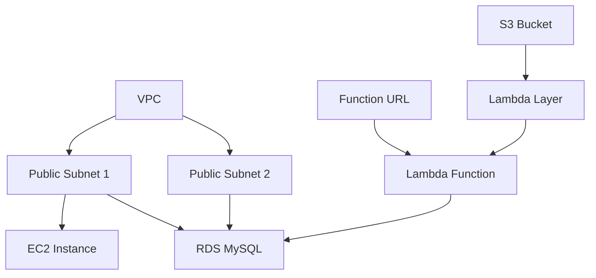
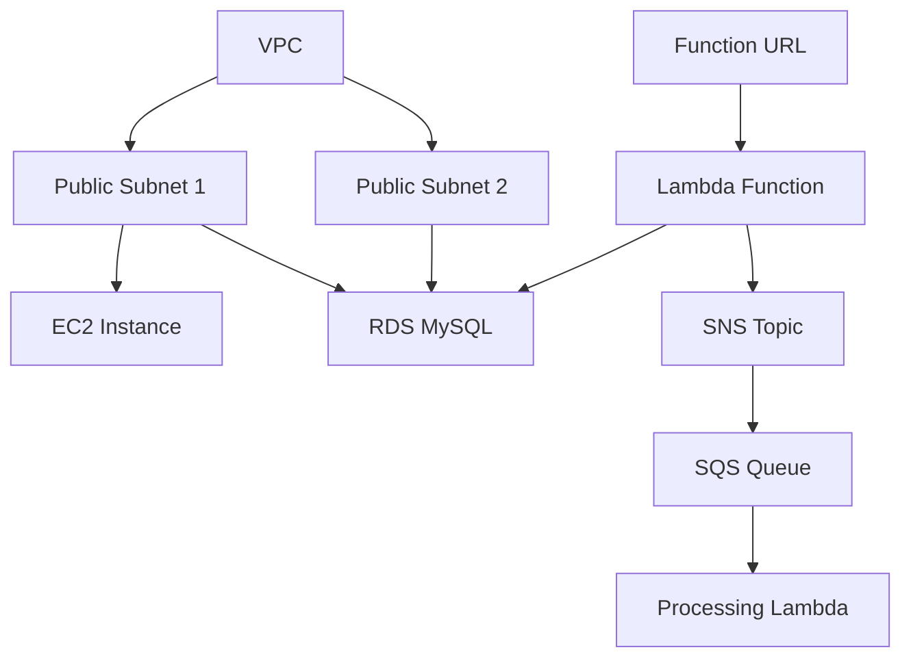

## Oppgave 4: Implementere Lambda-funksjon med CloudFormation

I denne oppgaven skal vi utvide vår CloudFormation-mal for å inkludere en Lambda-funksjon som vil fungere som backend for vårt oppgavestyringssystem. Denne funksjonen vil kommunisere med RDS-databasen for å lagre og hente oppgaver.

### Oppgavebeskrivelse

1. Opprett en S3-bøtte for Lambda Layer:
  - Gå til Amazon S3 i AWS Console
  - Klikk "Create bucket"
  - Velg et unikt navn (f.eks. "pymysql-layer-bucket-[ditt-navn]")
  - Behold standard innstillinger
  - Klikk "Create bucket"

2. Forbered og last opp Lambda Layer:
  - På din lokale maskin, opprett en mappe `python`
  - Inne i `python` mappen, kjør: `pip install pymysql -t .`
  - Zip innholdet av `python` mappen til `pymysql-layer.zip`
  - Gå tilbake til S3-konsollen
  - Velg bøtten du opprettet
  - Klikk "Upload" og velg `pymysql-layer.zip`
  - Verifiser at opplastingen er fullført

3. Modifiser CloudFormation-malen for å legge til:
  - En IAM-rolle for Lambda-funksjonen med nødvendige tillatelser
  - En Lambda-funksjon som kan håndtere CRUD-operasjoner for oppgaver
  - Et Lambda Layer for PyMySQL
  - En Function URL for Lambda-funksjonen

4. Konfigurer Lambda-funksjonen til å kommunisere med RDS-databasen

5. Oppdater den eksisterende stacken med den nye malen

6. Verifiser at Lambda-funksjonen er opprettet og tilgjengelig via Function URL

### Arkitekturdiagram



<details>
<summary>Løsning</summary>

1. Først, la oss legge til S3-bøtten i CloudFormation-malen. Opprett en ny fil `s3-bucket.yaml`:

```yaml
Resources:
  PyMySQLBucket:
    Type: AWS::S3::Bucket
    Properties:
      BucketName: !Sub pymysql-layer-bucket-${AWS::AccountId}
      VersioningConfiguration:
        Status: Suspended
      PublicAccessBlockConfiguration:
        BlockPublicAcls: true
        BlockPublicPolicy: true
        IgnorePublicAcls: true
        RestrictPublicBuckets: true
      Tags:
        - Key: Name
          Value: test-project

Outputs:
  BucketName:
    Description: Name of the created S3 bucket
    Value: !Ref PyMySQLBucket
  BucketArn:
    Description: ARN of the created S3 bucket
    Value: !GetAtt PyMySQLBucket.Arn
```

2. Deploy S3-bøtten:
  - Gå til AWS CloudFormation konsollen
  - Klikk "Create stack"
  - Velg "Upload a template file"
  - Last opp `s3-bucket.yaml`
  - Gi stacken et navn (f.eks. "lambda-layer-bucket")
  - Følg veiviseren og opprett stacken
  - Vent til stacken er i status "CREATE_COMPLETE"
  - Noter bucket-navnet fra Outputs-seksjonen

3. Last opp Lambda Layer til den nye bøtten:
  - Gå til S3-konsollen
  - Finn den nyopprettede bøtten
  - Last opp `pymysql-layer.zip` som beskrevet tidligere

**Vi bruker Python 3.12 i stedet for Python 3.13 ettersom CloudFormation linteren foreløpig kun er fullstendig oppdatert for Python 3.12. Dette sikrer at vi unngår unødvendige feilmeldinger fra linteren under utviklingen.**

4. Modifiser `network-infrastructure.yaml` filen og legg til følgende ressurser:

```yaml
  PyMySQLLayer:
    Type: AWS::Lambda::LayerVersion
    Properties:
      LayerName: pymysql-layer
      Description: Layer containing PyMySQL library
      Content:
        S3Bucket: !Ref PyMySQLBucket
        S3Key: pymysql-layer.zip
      CompatibleRuntimes:
        - python3.12
      CompatibleArchitectures:
        - x86_64

  LambdaExecutionRole:
    Type: AWS::IAM::Role
    Properties:
      AssumeRolePolicyDocument:
        Version: '2012-10-17'
        Statement:
          - Effect: Allow
            Principal:
              Service: lambda.amazonaws.com
            Action: sts:AssumeRole
      ManagedPolicyArns:
        - arn:aws:iam::aws:policy/service-role/AWSLambdaVPCAccessExecutionRole
      Policies:
        - PolicyName: LambdaRDSAccess
          PolicyDocument:
            Version: '2012-10-17'
            Statement:
              - Effect: Allow
                Action:
                  - rds-data:ExecuteStatement
                  - rds-data:BatchExecuteStatement
                Resource: !GetAtt TaskManagementDatabase.DBInstanceArn
        - PolicyName: LambdaS3Access
          PolicyDocument:
            Version: '2012-10-17'
            Statement:
              - Effect: Allow
                Action:
                  - s3:GetObject
                Resource: !Sub "${PyMySQLBucket.Arn}/*"

  TaskManagementFunction:
    Type: AWS::Lambda::Function
    Properties:
      FunctionName: task-management-function
      Handler: index.lambda_handler
      Role: !GetAtt LambdaExecutionRole.Arn
      Layers:
      - !Ref PyMySQLLayer
      Code:
        ZipFile: |
          import json
          import pymysql
          import os

          def get_db_connection():
          return pymysql.connect(
            host=os.environ['DB_HOST'],
            user=os.environ['DB_USER'],
            password=os.environ['DB_PASSWORD'],
            db=os.environ['DB_NAME']
          )

          def lambda_handler(event, context):
          conn = get_db_connection()
          try:
            with conn.cursor() as cursor:
            if event['httpMethod'] == 'GET':
              cursor.execute("SELECT * FROM tasks")
              tasks = cursor.fetchall()
              return {
              'statusCode': 200,
              'body': json.dumps(tasks)
              }
            elif event['httpMethod'] == 'POST':
              body = json.loads(event['body'])
              cursor.execute("INSERT INTO tasks (title, description) VALUES (%s, %s)",
                (body['title'], body['description']))
              conn.commit()
              return {
              'statusCode': 201,
              'body': json.dumps({'message': 'Task created successfully'})
              }
            return {
            'statusCode': 400,
            'body': json.dumps({'message': 'Invalid request method'})
            }
          finally:
            conn.close()

      Runtime: python3.12
      Timeout: 10
      MemorySize: 128
      Environment:
        Variables:
          DB_HOST: !GetAtt TaskManagementDatabase.Endpoint.Address
          DB_USER: admin
          DB_PASSWORD: passordd  # Replace with a secure password
          DB_NAME: taskmanagement
      Tags:
      - Key: Name
        Value: test-project

  TaskManagementFunctionUrl:
    Type: AWS::Lambda::Url
    Properties:
      AuthType: NONE
      TargetFunctionArn: !Ref TaskManagementFunction

Outputs:
  LambdaFunctionUrl:
    Description: URL of the Lambda function
    Value: !GetAtt TaskManagementFunctionUrl.FunctionUrl
```

5. For å oppdatere den eksisterende stacken:
  - Gå til AWS CloudFormation-konsollen
  - Velg stacken du opprettet tidligere
  - Klikk på "Update"
  - Velg "Replace current template"
  - Last opp den oppdaterte YAML-filen
  - Gå gjennom og bekreft endringene

6. For å teste Lambda-funksjonen:
  - Vent til stacken er i status "UPDATE_COMPLETE"
  - Gå til Lambda-konsollen og finn funksjonen
  - Verifiser at PyMySQL-laget er koblet til funksjonen
  - Velg "Test" fanen
  - Klikk "Create new event"
  - For GET request, bruk:
    ```json
    {
     "httpMethod": "GET",
     "path": "/tasks"
    }
    ```
  - For POST request, bruk:
    ```json
    {
     "httpMethod": "POST",
     "path": "/tasks",
     "body": "{\"title\":\"Test Task\",\"description\":\"This is a test task\"}"
    }
    ```
  - Kjør testene og verifiser:
    - Status code 200/201
    - Korrekt respons i result
    - Ingen feil i CloudWatch logs

> [!IMPORTANT]
> Husk å erstatte 'your-database-password' med et sikkert passord og verifiser at S3-bøtten er korrekt konfigurert før du laster opp Lambda Layer.

</details>

## Oppgave 5: Implementere SNS og SQS med CloudFormation

I denne oppgaven skal vi utvide vår CloudFormation-mal for å inkludere Amazon Simple Notification Service (SNS) og Amazon Simple Queue Service (SQS). Dette vil muliggjøre asynkron kommunikasjon i vårt oppgavestyringssystem.

### Oppgavebeskrivelse

1. Modifiser CloudFormation-malen for å legge til:
   - Et SNS-tema for nye oppgavevarsler
   - En SQS-kø som abonnerer på SNS-temaet
   - Nødvendige IAM-tillatelser for Lambda til å publisere til SNS og lese fra SQS
2. Oppdater Lambda-funksjonen til å publisere meldinger til SNS når nye oppgaver opprettes
3. Lag en ny Lambda-funksjon som prosesserer meldinger fra SQS-køen
4. Oppdater den eksisterende stacken med den nye malen
5. Test den nye funksjonaliteten ved å opprette en ny oppgave og verifisere at meldingen går gjennom SNS til SQS og til slutt prosesseres av den nye Lambda-funksjonen

### Arkitekturdiagram



<details>
<summary>Løsning</summary>

1. Modifiser `network-infrastructure.yaml` filen og legg til følgende ressurser:

```yaml
  NewTaskNotificationTopic:
    Type: AWS::SNS::Topic
    Properties:
      TopicName: new-task-notification
      Tags:
        - Key: Name
          Value: test-project

  TaskProcessingQueue:
    Type: AWS::SQS::Queue
    Properties:
      QueueName: task-processing-queue
      Tags:
        - Key: Name
          Value: test-project

  TaskQueuePolicy:
    Type: AWS::SQS::QueuePolicy
    Properties:
      Queues:
        - !Ref TaskProcessingQueue
      PolicyDocument:
        Version: '2012-10-17'
        Statement:
          - Effect: Allow
            Principal:
              Service: sns.amazonaws.com
            Action: sqs:SendMessage
            Resource: !GetAtt TaskProcessingQueue.Arn
            Condition:
              ArnEquals:
                aws:SourceArn: !Ref NewTaskNotificationTopic

  TopicSubscription:
    Type: AWS::SNS::Subscription
    Properties:
      TopicArn: !Ref NewTaskNotificationTopic
      Protocol: sqs
      Endpoint: !GetAtt TaskProcessingQueue.Arn

  LambdaExecutionRole:
    Type: AWS::IAM::Role
    Properties:
      AssumeRolePolicyDocument:
        Version: '2012-10-17'
        Statement:
          - Effect: Allow
            Principal:
              Service: lambda.amazonaws.com
            Action: sts:AssumeRole
      ManagedPolicyArns:
        - arn:aws:iam::aws:policy/service-role/AWSLambdaVPCAccessExecutionRole
      Policies:
        - PolicyName: LambdaRDSAccess
          PolicyDocument:
            Version: '2012-10-17'
            Statement:
              - Effect: Allow
                Action:
                  - rds-data:ExecuteStatement
                  - rds-data:BatchExecuteStatement
                Resource: !GetAtt TaskManagementDatabase.Arn
        - PolicyName: LambdaSNSPublish
          PolicyDocument:
            Version: '2012-10-17'
            Statement:
              - Effect: Allow
                Action: sns:Publish
                Resource: !Ref NewTaskNotificationTopic
        - PolicyName: LambdaSQSReceive
          PolicyDocument:
            Version: '2012-10-17'
            Statement:
              - Effect: Allow
                Action:
                  - sqs:ReceiveMessage
                  - sqs:DeleteMessage
                  - sqs:GetQueueAttributes
                Resource: !GetAtt TaskProcessingQueue.Arn

  TaskManagementFunction:
    Type: AWS::Lambda::Function
    Properties:
      FunctionName: task-management-function
      Handler: index.lambda_handler
      Role: !GetAtt LambdaExecutionRole.Arn
      Code:
        ZipFile: |
          import json
          import pymysql
          import os
          import boto3

          def get_db_connection():
              return pymysql.connect(
                  host=os.environ['DB_HOST'],
                  user=os.environ['DB_USER'],
                  password=os.environ['DB_PASSWORD'],
                  db=os.environ['DB_NAME'],
                  charset='utf8mb4',
                  cursorclass=pymysql.cursors.DictCursor
              )

          def lambda_handler(event, context):
              conn = get_db_connection()
              sns = boto3.client('sns')
              try:
                  with conn.cursor() as cursor:
                      if event['httpMethod'] == 'GET':
                          cursor.execute(\"SELECT * FROM tasks\")
                          tasks = cursor.fetchall()
                          return {
                              'statusCode': 200,
                              'body': json.dumps(tasks)
                          }
                      elif event['httpMethod'] == 'POST':
                          body = json.loads(event['body'])
                          cursor.execute(\"INSERT INTO tasks (title, description) VALUES (%s, %s)\",
                                         (body['title'], body['description']))
                          conn.commit()
                          
                          # Publish to SNS
                          sns.publish(
                              TopicArn=os.environ['SNS_TOPIC_ARN'],
                              Message=json.dumps({'task_id': cursor.lastrowid, 'title': body['title'], 'description': body['description']}),
                              Subject='New Task Added'
                          )
                          
                          return {
                              'statusCode': 201,
                              'body': json.dumps({'message': 'Task created successfully'})
                          }
                  return {
                      'statusCode': 400,
                      'body': json.dumps({'message': 'Invalid request method'})
                  }
              finally:
                  conn.close()

      Runtime: python3.13
      Timeout: 10
      MemorySize: 128
      Environment:
        Variables:
          DB_HOST: !GetAtt TaskManagementDatabase.Endpoint.Address
          DB_USER: admin
          DB_PASSWORD: your-database-password  # Replace with a secure password
          DB_NAME: taskmanagement
          SNS_TOPIC_ARN: !Ref NewTaskNotificationTopic
      VpcConfig:
        SecurityGroupIds:
          - !Ref DatabaseSecurityGroup
        SubnetIds:
          - !Ref PublicSubnet1
          - !Ref PublicSubnet2
      Tags:
        - Key: Name
          Value: test-project

  TaskProcessingFunction:
    Type: AWS::Lambda::Function
    Properties:
      FunctionName: task-processing-function
      Handler: index.lambda_handler
      Role: !GetAtt LambdaExecutionRole.Arn
      Code:
        ZipFile: |
          import json
          import pymysql
          import os

          def get_db_connection():
              return pymysql.connect(
                  host=os.environ['DB_HOST'],
                  user=os.environ['DB_USER'],
                  password=os.environ['DB_PASSWORD'],
                  db=os.environ['DB_NAME'],
                  charset='utf8mb4',
                  cursorclass=pymysql.cursors.DictCursor
              )

          def lambda_handler(event, context):
              for record in event['Records']:
                  message = json.loads(record['body'])
                  task_data = json.loads(message['Message'])
                  
                  conn = get_db_connection()
                  try:
                      with conn.cursor() as cursor:
                          cursor.execute(\"UPDATE tasks SET status = 'Processing' WHERE id = %s\", (task_data['task_id'],))
                          conn.commit()
                          print(f\"Processing task {task_data['task_id']}: {task_data['title']}\")
                  finally:
                      conn.close()

      Runtime: python3.13
      Timeout: 10
      MemorySize: 128
      Environment:
        Variables:
          DB_HOST: !GetAtt TaskManagementDatabase.Endpoint.Address
          DB_USER: admin
          DB_PASSWORD: your-database-password  # Replace with a secure password
          DB_NAME: taskmanagement
      VpcConfig:
        SecurityGroupIds:
          - !Ref DatabaseSecurityGroup
        SubnetIds:
          - !Ref PublicSubnet1
          -
