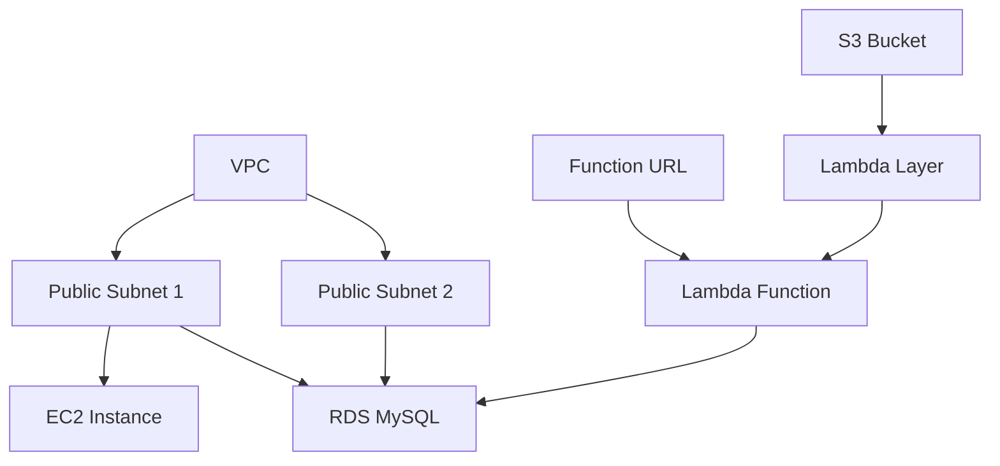
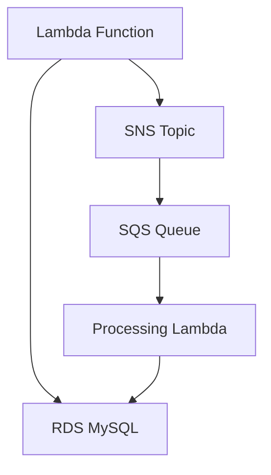

## Oppgave 4: Implementere Lambda-funksjon med CloudFormation

I denne oppgaven skal vi utvide vår CloudFormation-mal for å inkludere en Lambda-funksjon som vil fungere som backend for vårt oppgavestyringssystem. Denne funksjonen vil kommunisere med RDS-databasen for å lagre og hente oppgaver.

### Oppgavebeskrivelse

1. Opprett en S3-bøtte for Lambda Layer:
  - Gå til Amazon S3 i AWS Console
  - Klikk "Create bucket"
  - Velg et unikt navn (f.eks. "pymysql-layer-bucket-[ditt-navn]")
  - Behold standard innstillinger
  - Klikk "Create bucket"

2. Forbered og last opp Lambda Layer:
  - På din lokale maskin, opprett en mappe `python`
  - Inne i `python` mappen, kjør: `pip install pymysql -t .`
  - Zip innholdet av `python` mappen til `pymysql-layer.zip`
  - Gå tilbake til S3-konsollen
  - Velg bøtten du opprettet
  - Klikk "Upload" og velg `pymysql-layer.zip`
  - Verifiser at opplastingen er fullført

3. Modifiser CloudFormation-malen for å legge til:
  - En IAM-rolle for Lambda-funksjonen med nødvendige tillatelser
  - En Lambda-funksjon som kan håndtere CRUD-operasjoner for oppgaver
  - Et Lambda Layer for PyMySQL
  - En Function URL for Lambda-funksjonen

4. Konfigurer Lambda-funksjonen til å kommunisere med RDS-databasen

5. Oppdater den eksisterende stacken med den nye malen

6. Verifiser at Lambda-funksjonen er opprettet og tilgjengelig via Function URL med CORS

### Arkitekturdiagram



<details>
<summary>Løsning</summary>

1. Først, la oss legge til S3-bøtten i CloudFormation-malen. Opprett en ny fil `s3-bucket.yaml`:

```yaml
Resources:
  PyMySQLBucket:
    Type: AWS::S3::Bucket
    Properties:
      BucketName: !Sub pymysql-layer-bucket-${AWS::AccountId}
      VersioningConfiguration:
        Status: Suspended
      PublicAccessBlockConfiguration:
        BlockPublicAcls: true
        BlockPublicPolicy: true
        IgnorePublicAcls: true
        RestrictPublicBuckets: true
      Tags:
        - Key: Name
          Value: test-project

Outputs:
  BucketName:
    Description: Name of the created S3 bucket
    Value: !Ref PyMySQLBucket
  BucketArn:
    Description: ARN of the created S3 bucket
    Value: !GetAtt PyMySQLBucket.Arn
```

2. Deploy S3-bøtten:
  - Gå til AWS CloudFormation konsollen
  - Klikk "Create stack"
  - Velg "Upload a template file"
  - Last opp `s3-bucket.yaml`
  - Gi stacken et navn (f.eks. "lambda-layer-bucket")
  - Følg veiviseren og opprett stacken
  - Vent til stacken er i status "CREATE_COMPLETE"
  - Noter bucket-navnet fra Outputs-seksjonen

3. Last opp Lambda Layer til den nye bøtten:
  - Gå til S3-konsollen
  - Finn den nyopprettede bøtten
  - Last opp `pymysql-layer.zip` som beskrevet tidligere

**Vi bruker Python 3.12 i stedet for Python 3.13 ettersom CloudFormation linteren foreløpig kun er fullstendig oppdatert for Python 3.12. Dette sikrer at vi unngår unødvendige feilmeldinger fra linteren under utviklingen.**

4. Modifiser `network-infrastructure.yaml` filen og legg til følgende ressurser:

```yaml
  PyMySQLLayer:
    Type: AWS::Lambda::LayerVersion
    Properties:
      LayerName: pymysql-layer
      Description: Layer containing PyMySQL library
      Content:
        S3Bucket: !Ref PyMySQLBucket
        S3Key: pymysql-layer.zip
      CompatibleRuntimes:
        - python3.12
      CompatibleArchitectures:
        - x86_64

  LambdaExecutionRole:
    Type: AWS::IAM::Role
    Properties:
      AssumeRolePolicyDocument:
        Version: '2012-10-17'
        Statement:
          - Effect: Allow
            Principal:
              Service: lambda.amazonaws.com
            Action: sts:AssumeRole
      ManagedPolicyArns:
        - arn:aws:iam::aws:policy/service-role/AWSLambdaVPCAccessExecutionRole
      Policies:
        - PolicyName: LambdaRDSAccess
          PolicyDocument:
            Version: '2012-10-17'
            Statement:
              - Effect: Allow
                Action:
                  - rds-data:ExecuteStatement
                  - rds-data:BatchExecuteStatement
                Resource: !GetAtt TaskManagementDatabase.DBInstanceArn
        - PolicyName: LambdaS3Access
          PolicyDocument:
            Version: '2012-10-17'
            Statement:
              - Effect: Allow
                Action:
                  - s3:GetObject
                Resource: !Sub "${PyMySQLBucket.Arn}/*"

  TaskManagementFunctionUrlPermission:
    Type: AWS::Lambda::Permission
    Properties:
      FunctionName: !Ref TaskManagementFunction
      Action: lambda:InvokeFunctionUrl
      Principal: '*'
      FunctionUrlAuthType: NONE

  TaskManagementFunction:
    Type: AWS::Lambda::Function
    Properties:
      FunctionName: task-management-function
      Handler: index.lambda_handler
      Role: !GetAtt LambdaExecutionRole.Arn
      Layers:
      - !Ref PyMySQLLayer
      Code:
        ZipFile: |
          import json
          import pymysql
          import os

          def get_db_connection():
              return pymysql.connect(
                  host=os.environ['DB_HOST'],
                  user=os.environ['DB_USER'],
                  password=os.environ['DB_PASSWORD'],
                  db=os.environ['DB_NAME'],
                  charset='utf8mb4',
                  cursorclass=pymysql.cursors.DictCursor
              )

          def lambda_handler(event, context):
              event['httpMethod'] = event['requestContext']['http']['method']
              event['path'] = event['requestContext']['http']['path']
              event['queryStringParameters'] = event.get('queryStringParameters', {})

              conn = get_db_connection()
              try:
                  with conn.cursor() as cursor:
                      if event['httpMethod'] == 'GET':
                          cursor.execute("SELECT * FROM tasks")
                          tasks = cursor.fetchall()
                          return {
                              'statusCode': 200,
                              'body': json.dumps(tasks)
                          }
                      elif event['httpMethod'] == 'POST':
                          body = json.loads(event['body'])
                          cursor.execute("INSERT INTO tasks (title, description) VALUES (%s, %s)",
                              (body['title'], body['description']))
                          conn.commit()
                          return {
                              'statusCode': 200,
                              'body': json.dumps({'message': 'Task created successfully'})
                          }
                      elif event['httpMethod'] == 'OPTIONS':
                          return {
                              'statusCode': 200,
                              'body': ''
                          }
                      return {
                          'statusCode': 400,
                          'body': json.dumps({'message': 'Invalid request method'})
                      }
              finally:
                  conn.close()

      Runtime: python3.12
      Timeout: 10
      MemorySize: 128
      Environment:
        Variables:
          DB_HOST: !GetAtt TaskManagementDatabase.Endpoint.Address
          DB_USER: admin
          DB_PASSWORD: passordd  # Replace with a secure password
          DB_NAME: taskmanager
      Tags:
      - Key: Name
        Value: test-project

  TaskManagementFunctionUrl:
    Type: AWS::Lambda::Url
    Properties:
      AuthType: NONE
      Cors:
        AllowCredentials: false
        AllowHeaders:
          - "content-type"
          - "access-control-allow-origin"
          - "access-control-allow-methods"
        AllowMethods:
          - "*"
        AllowOrigins:
          - "*"
        ExposeHeaders:
          - "content-type"
          - "access-control-allow-origin"
          - "access-control-allow-methods"
        MaxAge: 0
      TargetFunctionArn: !Ref TaskManagementFunction

Outputs:
  LambdaFunctionUrl:
    Description: URL of the Lambda function
    Value: !GetAtt TaskManagementFunctionUrl.FunctionUrl
```

5. For å oppdatere den eksisterende stacken:
  - Gå til AWS CloudFormation-konsollen
  - Velg stacken du opprettet tidligere
  - Klikk på "Update"
  - Velg "Replace current template"
  - Last opp den oppdaterte YAML-filen
  - Gå gjennom og bekreft endringene

6. For å teste Lambda-funksjonen:
  - Vent til stacken er i status "UPDATE_COMPLETE"
  - Gå til Lambda-konsollen og finn funksjonen
  - Verifiser at PyMySQL-laget er koblet til funksjonen
  - Velg "Test" fanen
  - Klikk "Create new event"
  - For GET request, bruk:
    ```json
    {
     "httpMethod": "GET",
     "path": "/tasks"
    }
    ```
  - For POST request, bruk:
    ```json
    {
     "httpMethod": "POST",
     "path": "/tasks",
     "body": "{\"title\":\"Test Task\",\"description\":\"This is a test task\"}"
    }
    ```
  - Kjør testene og verifiser:
    - Status code 200/201
    - Korrekt respons i result
    - Ingen feil i CloudWatch logs

> [!IMPORTANT]
> Husk å erstatte 'passordd' med et sikkert passord og verifiser at S3-bøtten er korrekt konfigurert før du laster opp Lambda Layer.

</details>

## Oppgave 5: Implementere SNS og SQS med CloudFormation

I denne oppgaven skal vi utvide vår CloudFormation-mal for å inkludere Amazon Simple Notification Service (SNS) og Amazon Simple Queue Service (SQS). Dette vil muliggjøre asynkron kommunikasjon i vårt oppgavestyringssystem.

### Oppgavebeskrivelse

I forrige oppgave implementerte vi en Lambda-funksjon som håndterer CRUD-operasjoner mot RDS-databasen. Nå skal vi legge til asynkron meldingshåndtering ved hjelp av SNS og SQS.

1. Modifiser CloudFormation-malen for å legge til:
  - En SNS-topic for nye oppgavevarsler
  - En SQS-kø som abonnerer på SNS-topicen
  - Nødvendige IAM-tillatelser for Lambda til å publisere til SNS og lese fra SQS

2. Oppdater Lambda-funksjonen til å publisere meldinger til SNS når nye oppgaver opprettes
  - Dette gjøres ved å legge til SNS-integrasjon i eksisterende kode
  - Sørg for at riktige miljøvariabler er tilgjengelige
  - Legg til SNS_TOPIC_ARN som miljøvariabel i Lambda-funksjonen

3. Lag en ny Lambda-funksjon som prosesserer meldinger fra SQS-køen
  - Denne funksjonen vil motta meldinger automatisk
  - Implementer feilhåndtering og logging
  - Konfigurer event source mapping mellom SQS og Lambda
  - Sørg for at funksjonen har tilgang til RDS for statusoppdateringer

4. Oppdater den eksisterende stacken med den nye malen
  - Verifiser at alle ressurser opprettes korrekt
  - Sjekk at tillatelser er korrekt konfigurert
  - Kontroller at både SNS og SQS er koblet sammen riktig

5. Test den nye funksjonaliteten ved å opprette en ny oppgave og verifiser at:
  - Meldingen publiseres til SNS
  - Meldingen mottas av SQS
  - Processing Lambda trigges og behandler meldingen
  - Statusoppdateringer reflekteres i RDS-databasen

### Arkitekturdiagram



<details>
<summary>Løsning</summary>

1. Først, la oss legge til SNS og SQS ressursene i CloudFormation-malen:

```yaml
  TaskNotificationTopic:
    Type: AWS::SNS::Topic
    Properties:
      TopicName: new-task-notification
      Tags:
        - Key: Name
          Value: test-project

  TaskQueue:
    Type: AWS::SQS::Queue
    Properties:
      QueueName: task-processing-queue
      VisibilityTimeout: 300
      Tags:
        - Key: Name
          Value: test-project

  QueuePolicy:
    Type: AWS::SQS::QueuePolicy
    Properties:
      Queues:
        - !Ref TaskQueue
      PolicyDocument:
        Version: '2012-10-17'
        Statement:
          - Effect: Allow
            Principal:
              Service: sns.amazonaws.com
            Action: sqs:SendMessage
            Resource: !GetAtt TaskQueue.Arn
            Condition:
              ArnEquals:
                aws:SourceArn: !Ref TaskNotificationTopic

  SNSSubscription:
    Type: AWS::SNS::Subscription
    Properties:
      Protocol: sqs
      TopicArn: !Ref TaskNotificationTopic
      Endpoint: !GetAtt TaskQueue.Arn
```

2. Oppdater den eksisterende Lambda-funksjonen med SNS-publisering:

```yaml
  TaskManagementFunction:
    Type: AWS::Lambda::Function
    Properties:
      FunctionName: task-management-function
      Handler: index.lambda_handler
      Role: !GetAtt LambdaExecutionRole.Arn
      Layers:
      - !Ref PyMySQLLayer
      Code:
        ZipFile: |
          import json
          import pymysql
          import os
          import boto3

          def get_db_connection():
              return pymysql.connect(
                  host=os.environ['DB_HOST'],
                  user=os.environ['DB_USER'],
                  password=os.environ['DB_PASSWORD'],
                  db=os.environ['DB_NAME'],
                  charset='utf8mb4',
                  cursorclass=pymysql.cursors.DictCursor
              )

          def lambda_handler(event, context):
              event['httpMethod'] = event['requestContext']['http']['method']
              event['path'] = event['requestContext']['http']['path']
              event['queryStringParameters'] = event.get('queryStringParameters', {})

              conn = get_db_connection()
              sns = boto3.client('sns', region_name='eu-west-1')
              try:
                  with conn.cursor() as cursor:
                      if event['httpMethod'] == 'GET':
                          cursor.execute("SELECT * FROM tasks")
                          tasks = cursor.fetchall()
                          return {
                              'statusCode': 200,
                              'body': json.dumps(tasks)
                          }
                      elif event['httpMethod'] == 'POST':
                          body = json.loads(event['body'])
                          cursor.execute("INSERT INTO tasks (title, description, status) VALUES (%s, %s, %s)",
                              (body['title'], body['description'], 'New'))
                          conn.commit()
                          
                          task_id = cursor.lastrowid
                          
                          message = {
                              'task_id': task_id,
                              'title': body['title'],
                              'description': body['description'],
                              'status': 'New'
                          }
                          
                          sns.publish(
                              TopicArn=os.environ['SNS_TOPIC_ARN'],
                              Message=json.dumps(message),
                              Subject='New Task Created'
                          )
                          
                          return {
                              'statusCode': 200,
                              'body': json.dumps({
                                  'message': 'Task created successfully',
                                  'task_id': task_id
                              })
                          }
              finally:
                  conn.close()

      Runtime: python3.12
      Timeout: 30
      Environment:
        Variables:
          DB_HOST: !GetAtt TaskManagementDatabase.Endpoint.Address
          DB_USER: admin
          DB_PASSWORD: passordd
          DB_NAME: taskmanager
          SNS_TOPIC_ARN: !Ref TaskNotificationTopic
      Tags:
        - Key: Name
          Value: test-project
```

3. Lag den nye Processing Lambda-funksjonen:

```yaml
  ProcessingLambdaRole:
    Type: AWS::IAM::Role
    Properties:
      AssumeRolePolicyDocument:
        Version: '2012-10-17'
        Statement:
          - Effect: Allow
            Principal:
              Service: lambda.amazonaws.com
            Action: sts:AssumeRole
      ManagedPolicyArns:
        - arn:aws:iam::aws:policy/service-role/AWSLambdaBasicExecutionRole
      Policies:
        - PolicyName: SQSAccess
          PolicyDocument:
            Version: '2012-10-17'
            Statement:
              - Effect: Allow
                Action:
                  - sqs:ReceiveMessage
                  - sqs:DeleteMessage
                  - sqs:GetQueueAttributes
                Resource: !GetAtt TaskQueue.Arn

  TaskProcessingFunction:
    Type: AWS::Lambda::Function
    Properties:
      FunctionName: process-task
      Handler: index.lambda_handler
      Role: !GetAtt ProcessingLambdaRole.Arn
      Code:
        ZipFile: |
          import json
          import pymysql
          import time
          import os

          def get_db_connection():
              print("Attempting database connection...")
              conn = pymysql.connect(
                  host=os.environ['DB_HOST'],
                  user=os.environ['DB_USER'],
                  password=os.environ['DB_PASSWORD'],
                  db=os.environ['DB_NAME'],
                  charset='utf8mb4',
                  cursorclass=pymysql.cursors.DictCursor
              )
              print("Database connection successful")
              return conn

          def lambda_handler(event, context):
              print("Starting task processing...")
              print(f"Received event: {json.dumps(event)}")
              try:
                  conn = get_db_connection()
                  
                  for record in event['Records']:
                      message = json.loads(record['body'])
                      task_data = json.loads(message['Message'])
                      task_id = task_data['task_id']
                      
                      with conn.cursor() as cursor:
                          sql = "UPDATE tasks SET status = %s WHERE id = %s"
                          cursor.execute(sql, ('In Progress', task_id))
                      conn.commit()
                      
                      time.sleep(5)
                      
                      with conn.cursor() as cursor:
                          sql = "UPDATE tasks SET status = %s WHERE id = %s"
                          cursor.execute(sql, ('Completed', task_id))
                      conn.commit()
                      
                  print("Task processing completed successfully")
                  return {
                      'statusCode': 200,
                      'body': json.dumps('Processing complete')
                  }
              except Exception as e:
                  print(f"Error occurred during processing: {str(e)}")
                  raise
              finally:
                  if 'conn' in locals():
                      print("Closing database connection")
                      conn.close()

      Runtime: python3.12
      Timeout: 30
      MemorySize: 128
      Environment:
        Variables:
          DB_HOST: !GetAtt TaskManagementDatabase.Endpoint.Address
          DB_USER: admin
          DB_PASSWORD: passordd
          DB_NAME: taskmanager
      Layers:
        - !Ref PyMySQLLayer

  SQSEventSourceMapping:
    Type: AWS::Lambda::EventSourceMapping
    Properties:
      BatchSize: 1
      Enabled: true
      EventSourceArn: !GetAtt TaskQueue.Arn
      FunctionName: !GetAtt TaskProcessingFunction.Arn

  SNSPublishPolicy:
    Type: AWS::IAM::Policy
    Properties:
      PolicyName: SNSPublishPolicy
      PolicyDocument:
        Version: '2012-10-17'
        Statement:
          - Effect: Allow
            Action: sns:Publish
            Resource: !Ref TaskNotificationTopic
      Roles:
        - !Ref LambdaExecutionRole
```

4. For å oppdatere stacken:
- Gå til AWS CloudFormation konsollen (https://console.aws.amazon.com/cloudformation)
- Finn og velg din eksisterende stack i listen
- Klikk på "Update" knappen øverst til høyre
- I "Update stack" vinduet, velg "Replace current template"
- Velg "Upload a template file"
- Klikk "Choose file" og velg din oppdaterte template fil
- Klikk "Next"
- Gjennomgå parameterne og bekreft/oppdater hvis nødvendig
- Klikk "Next"
- Under "Stack options", behold standardinnstillingene
- Klikk "Next"
- Gjennomgå endringene som vil bli gjort ("Change set preview")
- Klikk "Update stack"
- Vent til stacken er oppdatert (status endres til UPDATE_COMPLETE)

5. Test funksjonaliteten:
- Gå til Lambda-konsollen (https://console.aws.amazon.com/lambda)
- Finn og klikk på din "task-management-function"
- I "Test" fanen, klikk "Create new event"
- Gi testen et navn (f.eks. "TestPost")
- Lim inn følgende JSON:

```json
{
  "httpMethod": "POST",
  "body": "{\"title\": \"Test Task\", \"description\": \"Testing SNS/SQS integration\"}"
}
```

- Klikk "Save" og deretter "Test"

For å verifisere at alt fungerer:
1. Sjekk Lambda-funksjonens CloudWatch logs:
   - I Lambda-konsollen, velg "Monitor" fanen
   - Klikk "View CloudWatch logs"
   - Se etter bekreftelse på at oppgaven ble opprettet

2. Sjekk SNS Topic:
   - Gå til SNS-konsollen (https://console.aws.amazon.com/sns)
   - Velg din "new-task-notification" topic
   - Under "Monitoring", verifiser at meldingen ble sendt

3. Sjekk SQS Queue:
   - Gå til SQS-konsollen (https://console.aws.amazon.com/sqs)
   - Velg din "task-processing-queue"
   - Under "Monitoring", verifiser at meldingen ble mottatt

4. Sjekk Processing Lambda:
   - Gå tilbake til Lambda-konsollen
   - Velg "process-task" funksjonen
   - Se i CloudWatch logs at oppgaven ble prosessert
   - Verifiser at status endret seg fra "New" til "In Progress" til "Completed"

> [!TIP]
> Hold CloudWatch Logs åpne i en egen fane mens du tester - da er det lettere å følge med på hele prosessen i sanntid.

> [!NOTE]
> Det kan ta noen sekunder før meldingen går gjennom hele kjeden. Vær tålmodig og refresh loggene hvis nødvendig.

</details>