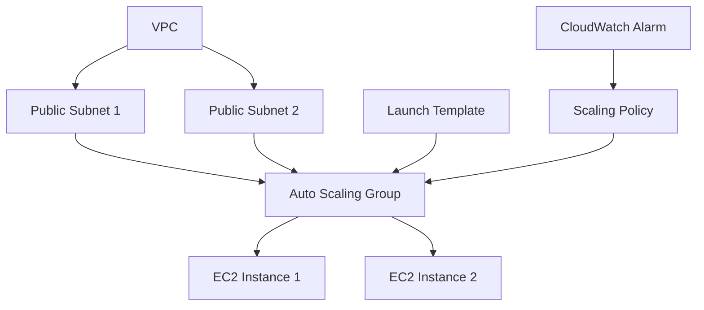
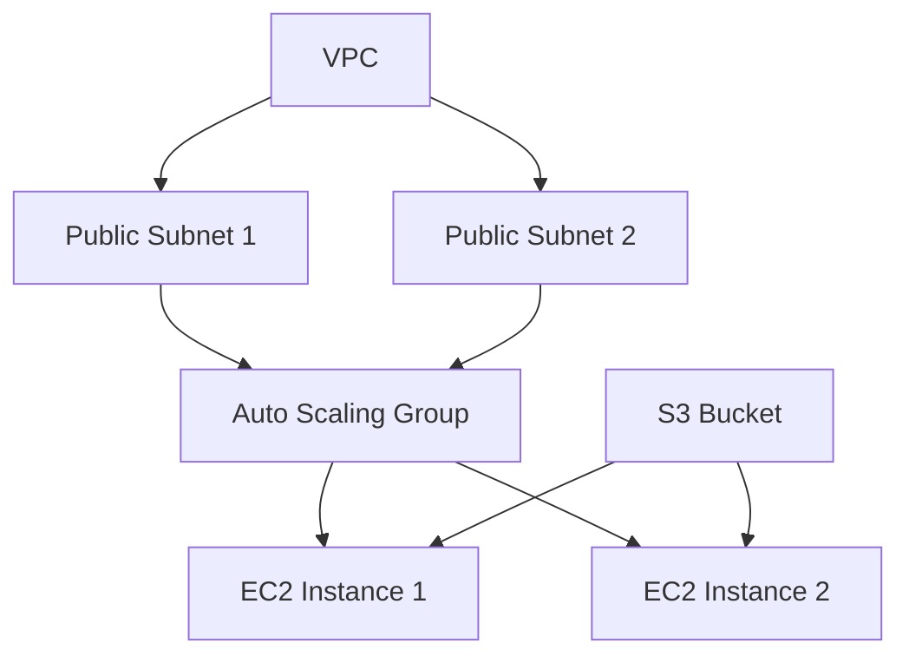

## Oppgave 6: Implementere Auto Scaling Group for EC2-instanser

I denne oppgaven skal vi utvide vår CloudFormation-mal for å inkludere en Auto Scaling Group (ASG) for EC2-instansene. Dette vil gi oss muligheten til å automatisk skalere antall webservere basert på belastning.

### Oppgavebeskrivelse

1. Modifiser CloudFormation-malen for å legge til:
   - En Launch Template for EC2-instansene
   - En Auto Scaling Group som bruker Launch Template
   - En CloudWatch Alarm for å overvåke CPU-bruk
   - En Scaling Policy som justerer antall instanser basert på CloudWatch Alarm
2. Oppdater Security Group for å tillate trafikk mellom instansene i ASG
3. Konfigurer EC2-instansene til å kjøre en enkel webserver ved oppstart
4. Oppdater den eksisterende stacken med den nye malen
5. Verifiser at Auto Scaling Group er opprettet og fungerer som forventet

### Arkitekturdiagram



<details>
<summary>Løsning</summary>

1. Modifiser `network-infrastructure.yaml` filen og legg til følgende ressurser:

```yaml
  WebServerLaunchTemplate:
    Type: AWS::EC2::LaunchTemplate
    Properties:
      LaunchTemplateName: WebServerTemplate
      LaunchTemplateData:
        ImageId: ami-0694d931cee176e7d  # Amazon Linux 2 AMI in eu-west-1
        InstanceType: t2.micro
        SecurityGroupIds: 
          - !Ref WebServerSecurityGroup
        UserData: 
          Fn::Base64: !Sub |
            #!/bin/bash
            yum update -y
            yum install -y httpd
            systemctl start httpd
            systemctl enable httpd
            echo \"<h1>Welcome to Task Management System</h1>\" > /var/www/html/index.html
      Tags:
        - Key: Name
          Value: test-project

  WebServerAutoScalingGroup:
    Type: AWS::AutoScaling::AutoScalingGroup
    Properties:
      VPCZoneIdentifier: 
        - !Ref PublicSubnet1
        - !Ref PublicSubnet2
      LaunchTemplate:
        LaunchTemplateId: !Ref WebServerLaunchTemplate
        Version: !GetAtt WebServerLaunchTemplate.LatestVersionNumber
      MinSize: 1
      MaxSize: 3
      DesiredCapacity: 2
      Tags:
        - Key: Name
          Value: test-project
          PropagateAtLaunch: true

  CPUAlarmHigh:
    Type: AWS::CloudWatch::Alarm
    Properties:
      AlarmDescription: Scale-up if CPU > 70% for 2 minutes
      MetricName: CPUUtilization
      Namespace: AWS/EC2
      Statistic: Average
      Period: 60
      EvaluationPeriods: 2
      Threshold: 70
      AlarmActions: [!Ref WebServerScalingPolicy]
      Dimensions:
        - Name: AutoScalingGroupName
          Value: !Ref WebServerAutoScalingGroup
      ComparisonOperator: GreaterThanThreshold

  WebServerScalingPolicy:
    Type: AWS::AutoScaling::ScalingPolicy
    Properties:
      AutoScalingGroupName: !Ref WebServerAutoScalingGroup
      PolicyType: TargetTrackingScaling
      TargetTrackingConfiguration:
        PredefinedMetricSpecification:
          PredefinedMetricType: ASGAverageCPUUtilization
        TargetValue: 50.0

  WebServerSecurityGroup:
    Type: AWS::EC2::SecurityGroup
    Properties:
      GroupDescription: Allow HTTP and SSH
      VpcId: !Ref TaskManagementVPC
      SecurityGroupIngress:
        - IpProtocol: tcp
          FromPort: 80
          ToPort: 80
          CidrIp: 0.0.0.0/0
        - IpProtocol: tcp
          FromPort: 22
          ToPort: 22
          CidrIp: 0.0.0.0/0
        - IpProtocol: tcp
          FromPort: 80
          ToPort: 80
          SourceSecurityGroupId: !Ref WebServerSecurityGroup
      Tags:
        - Key: Name
          Value: test-project
```

2. For å oppdatere den eksisterende stacken:
   - Gå til AWS CloudFormation-konsollen
   - Velg stacken du opprettet tidligere
   - Klikk på \"Update\
   - Velg \"Replace current template\
   - Last opp den oppdaterte YAML-filen
   - Gå gjennom og bekreft endringene

3. For å verifisere at Auto Scaling Group er opprettet og fungerer:
   - Vent til stacken er i status \"UPDATE_COMPLETE\
   - Gå til EC2-konsollen og velg \"Auto Scaling Groups\
   - Finn den nyopprettede Auto Scaling Group
   - Sjekk at den har ønsket antall instanser (DesiredCapacity)
   - Gå til instanser og verifiser at de kjører og har riktige tagger

Denne oppdateringen til vår CloudFormation-mal legger til en Auto Scaling Group for EC2-instansene. Vi har definert en Launch Template som beskriver hvordan nye instanser skal opprettes, inkludert hvilket AMI som skal brukes, instanstype, og et oppstartsskript for å installere og starte en enkel webserver.

Auto Scaling Group er konfigurert til å ha minimum 1 instans, maksimum 3 instanser, og en ønsket kapasitet på 2 instanser. Vi har også lagt til en CloudWatch Alarm som overvåker CPU-bruk, og en Scaling Policy som justerer antall instanser basert på denne alarmen.

> [!NOTE]
> Auto Scaling Group gir oss muligheten til å automatisk justere antall EC2-instanser basert på belastning. Dette er nyttig for å håndtere varierende trafikk til applikasjonen vår, og kan hjelpe med både kostnadsoptimalisering og høy tilgjengelighet.

Ved å bruke CloudFormation for å sette opp Auto Scaling, sikrer vi at vår infrastruktur er konsistent og reproduserbar. Dette er en viktig del av \"Infrastructure as Code\" prinsippet, som gjør det enklere å administrere og vedlikeholde komplekse systemer over tid.

</details>

## Oppgave 7: Implementere S3 Bucket for statisk innhold

I denne oppgaven skal vi utvide vår CloudFormation-mal for å inkludere en S3 Bucket. Denne bucketen vil bli brukt til å lagre statisk innhold for vår webapplikasjon, som for eksempel bilder, CSS-filer og JavaScript-filer.

### Oppgavebeskrivelse

1. Modifiser CloudFormation-malen for å legge til:
   - En S3 Bucket for statisk innhold
   - En Bucket Policy som tillater offentlig lesing av objekter
2. Oppdater EC2-instansenes IAM-rolle for å gi tilgang til S3-bucketen
3. Modifiser oppstartsskriptet for EC2-instansene for å laste ned statisk innhold fra S3-bucketen
4. Oppdater den eksisterende stacken med den nye malen
5. Last opp noen eksempelfiler til S3-bucketen og verifiser at de er tilgjengelige via EC2-instansene

### Arkitekturdiagram



<details>
<summary>Løsning</summary>

1. Modifiser `network-infrastructure.yaml` filen og legg til følgende ressurser:

```yaml
  StaticContentBucket:
    Type: AWS::S3::Bucket
    Properties:
      BucketName: !Sub ${AWS::StackName}-static-content
      PublicAccessBlockConfiguration:
        BlockPublicAcls: false
        BlockPublicPolicy: false
        IgnorePublicAcls: false
        RestrictPublicBuckets: false
      Tags:
        - Key: Name
          Value: test-project

  StaticContentBucketPolicy:
    Type: AWS::S3::BucketPolicy
    Properties:
      Bucket: !Ref StaticContentBucket
      PolicyDocument:
        Version: 2012-10-17
        Statement:
          - Sid: PublicReadGetObject
            Effect: Allow
            Principal: '*'
            Action: s3:GetObject
            Resource: !Sub arn:aws:s3:::${StaticContentBucket}/*

  WebServerRole:
    Type: AWS::IAM::Role
    Properties:
      AssumeRolePolicyDocument:
        Version: 2012-10-17
        Statement:
          - Effect: Allow
            Principal:
              Service: ec2.amazonaws.com
            Action: sts:AssumeRole
      ManagedPolicyArns:
        - arn:aws:iam::aws:policy/AmazonS3ReadOnlyAccess
      Tags:
        - Key: Name
          Value: test-project

  WebServerInstanceProfile:
    Type: AWS::IAM::InstanceProfile
    Properties:
      Path: /
      Roles:
        - !Ref WebServerRole

  WebServerLaunchTemplate:
    Type: AWS::EC2::LaunchTemplate
    Properties:
      LaunchTemplateName: WebServerTemplate
      LaunchTemplateData:
        ImageId: ami-0694d931cee176e7d  # Amazon Linux 2 AMI in eu-west-1
        InstanceType: t2.micro
        SecurityGroupIds: 
          - !Ref WebServerSecurityGroup
        IamInstanceProfile: 
          Name: !Ref WebServerInstanceProfile
        UserData: 
          Fn::Base64: !Sub |
            #!/bin/bash
            yum update -y
            yum install -y httpd
            systemctl start httpd
            systemctl enable httpd
            aws s3 sync s3://${StaticContentBucket} /var/www/html/
      Tags:
        - Key: Name
          Value: test-project

```

2. For å oppdatere den eksisterende stacken:
   - Gå til AWS CloudFormation-konsollen
   - Velg stacken du opprettet tidligere
   - Klikk på \"Update\
   - Velg \"Replace current template\
   - Last opp den oppdaterte YAML-filen
   - Gå gjennom og bekreft endringene

3. For å laste opp eksempelfiler til S3-bucketen:
   - Gå til S3-konsollen
   - Finn den nyopprettede bucketen
   - Last opp noen eksempelfiler (f.eks. en index.html, style.css, og script.js)

4. For å verifisere at filene er tilgjengelige via EC2-instansene:
   - Gå til EC2-konsollen
   - Finn en av de kjørende instansene fra Auto Scaling Group
   - Kopier den offentlige IP-adressen
   - Åpne en nettleser og lim inn IP-adressen
   - Du skal nå se innholdet av index.html-filen du lastet opp til S3

Denne oppdateringen til vår CloudFormation-mal legger til en S3 Bucket for statisk innhold og konfigurerer EC2-instansene til å hente dette innholdet ved oppstart. Vi har også lagt til en IAM-rolle og et Instance Profile for å gi EC2-instansene tilgang til S3-bucketen.

> [!NOTE]
> Ved å bruke S3 for statisk innhold kan vi redusere belastningen på våre EC2-instanser og potensielt forbedre ytelsen til vår webapplikasjon. Dette er en vanlig arkitekturmønster for skalerbare webapplikasjoner i AWS.

> [!IMPORTANT]
> I en produksjonssetting bør du vurdere å bruke AWS CloudFront sammen med S3 for å levere statisk innhold. CloudFront er en Content Delivery Network (CDN) tjeneste som kan forbedre ytelsen og redusere latens for brukere over hele verden.

Ved å bruke CloudFormation for å sette opp S3 og konfigurere EC2-instansene, sikrer vi at vår infrastruktur er konsistent og reproduserbar. Dette er en viktig del av \"Infrastructure as Code\" prinsippet, som gjør det enklere å administrere og vedlikeholde komplekse systemer over tid.

</details>
