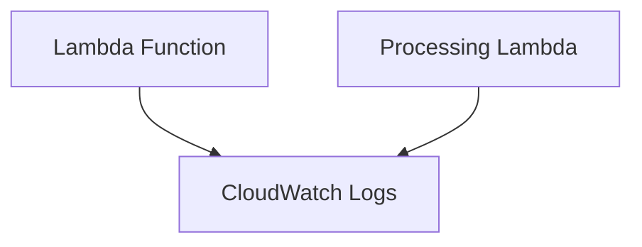

## Oppgave 6: Implementere CloudWatch Logs for Lambda-funksjoner

I denne oppgaven skal vi utvide vår CloudFormation-mal for å inkludere CloudWatch Logs for våre Lambda-funksjoner. Dette vil gi oss muligheten til å overvåke og feilsøke våre Lambda-funksjoner mer effektivt.

### Oppgavebeskrivelse

1. Modifiser CloudFormation-malen for å legge til nødvendige IAM-tillatelser for Lambda-funksjonene til å skrive til CloudWatch Logs
2. Oppdater Lambda-funksjonene til å logge viktige hendelser og feil
3. Oppdater den eksisterende stacken med den nye malen
4. Utfør noen operasjoner som trigger Lambda-funksjonene
5. Verifiser at loggene blir skrevet til CloudWatch Logs

### Arkitekturdiagram



<details>
<summary>Løsning</summary>

1. Modifiser `network-infrastructure.yaml` filen og legg til følgende ressurser:

```yaml
  LambdaExecutionRole:
    Type: AWS::IAM::Role
    Properties:
      AssumeRolePolicyDocument:
        Version: '2012-10-17'
        Statement:
          - Effect: Allow
            Principal:
              Service: lambda.amazonaws.com
            Action: sts:AssumeRole
      ManagedPolicyArns:
        - arn:aws:iam::aws:policy/service-role/AWSLambdaVPCAccessExecutionRole
      Policies:
        - PolicyName: LambdaRDSAccess
          PolicyDocument:
            Version: '2012-10-17'
            Statement:
              - Effect: Allow
                Action:
                  - rds-data:ExecuteStatement
                  - rds-data:BatchExecuteStatement
                Resource: !GetAtt TaskManagementDatabase.DBInstanceArn
        - PolicyName: LambdaS3Access
          PolicyDocument:
            Version: '2012-10-17'
            Statement:
              - Effect: Allow
                Action:
                  - s3:GetObject
                Resource: !Sub "${PyMySQLBucket.Arn}/*"
        # Add missing policies
        - PolicyName: LambdaSNSPublish
          PolicyDocument:
            Version: '2012-10-17'
            Statement:
              - Effect: Allow
                Action: sns:Publish
                Resource: !Ref TaskNotificationTopic
        - PolicyName: LambdaSQSReceive
          PolicyDocument:
            Version: '2012-10-17'
            Statement:
              - Effect: Allow
                Action:
                  - sqs:ReceiveMessage
                  - sqs:DeleteMessage
                  - sqs:GetQueueAttributes
                Resource: !GetAtt TaskQueue.Arn
        - PolicyName: LambdaCloudWatchLogs
          PolicyDocument:
            Version: '2012-10-17'
            Statement:
              - Effect: Allow
                Action:
                  - logs:CreateLogStream
                  - logs:PutLogEvents
                Resource: 
                  - "*"

  TaskManagementFunction:
    Type: AWS::Lambda::Function
    Properties:
      FunctionName: task-management-function
      Handler: index.lambda_handler
      Role: !GetAtt LambdaExecutionRole.Arn
      Code:
        ZipFile: |
          import json
          import pymysql
          import os
          import boto3
          import logging  # Add logging
          
          logger = logging.getLogger()
          logger.setLevel(logging.INFO)
          
          def get_db_connection():
              return pymysql.connect(
                  host=os.environ['DB_HOST'],
                  user=os.environ['DB_USER'],
                  password=os.environ['DB_PASSWORD'],
                  db=os.environ['DB_NAME'],
                  charset='utf8mb4',
                  cursorclass=pymysql.cursors.DictCursor
              )
          
          def lambda_handler(event, context):
              logger.info('Event: %s', event)  # Add logging

              event['httpMethod'] = event['requestContext']['http']['method']
              event['path'] = event['requestContext']['http']['path']
              event['queryStringParameters'] = event.get('queryStringParameters', {})

              method = event['httpMethod']
              path = event['path']

              conn = get_db_connection()
              sns = boto3.client('sns', region_name='eu-west-1')
              try:
                  with conn.cursor() as cursor:
                      if event['httpMethod'] == 'GET':
                          cursor.execute("SELECT * FROM tasks")
                          tasks = cursor.fetchall()
                          logger.info('Retrieved %d tasks', len(tasks))  # Add logging
                          return {
                              'statusCode': 200,
                              'body': json.dumps(tasks)
                          }
                      elif event['httpMethod'] == 'POST':
                          body = json.loads(event['body'])
                          cursor.execute("INSERT INTO tasks (title, description, status) VALUES (%s, %s, %s)",
                              (body['title'], body['description'], 'New'))
                          conn.commit()
                          
                          task_id = cursor.lastrowid
                          logger.info('Created new task: %s', body['title'])  # Add logging
                          
                          message = {
                              'task_id': task_id,
                              'title': body['title'],
                              'description': body['description'],
                              'status': 'New'
                          }
                          
                          sns.publish(
                              TopicArn=os.environ['SNS_TOPIC_ARN'],
                              Message=json.dumps(message),
                              Subject='New Task Created'
                          )
                          
                          return {
                              'statusCode': 200,
                              'body': json.dumps({
                                  'message': 'Task created successfully',
                                  'task_id': task_id
                              })
                          }
                      # Add invalid method handling
                      logger.warning('Invalid request method: %s', event['httpMethod'])
                      return {
                          'statusCode': 400,
                          'body': json.dumps({'message': 'Invalid request method'})
                      }
              except Exception as e:
                  logger.error('Error: %s', str(e))  # Add error logging
                  return {
                      'statusCode': 500,
                      'body': json.dumps({'message': 'Internal server error'})
                  }
              finally:
                  conn.close()

      Runtime: python3.12
      Timeout: 30
      Environment:
        Variables:
          DB_HOST: !GetAtt TaskManagementDatabase.Endpoint.Address
          DB_USER: admin
          DB_PASSWORD: passordd  # Replace with a secure password
          DB_NAME: taskmanager
          SNS_TOPIC_ARN: !Ref TaskNotificationTopic
      Layers:
        - !Ref PyMySQLLayer
      Tags:
        - Key: Name
          Value: test-project

  TaskProcessingFunction:
    Type: AWS::Lambda::Function
    Properties:
      FunctionName: task-processing-function
      Handler: index.lambda_handler
      Role: !GetAtt LambdaExecutionRole.Arn
      Code:
        ZipFile: |
          import json
          import pymysql
          import time
          import os
          import logging  # Add logging
          
          logger = logging.getLogger()
          logger.setLevel(logging.INFO)
          
          def get_db_connection():
              logger.info("Attempting database connection...")
              conn = pymysql.connect(
                  host=os.environ['DB_HOST'],
                  user=os.environ['DB_USER'],
                  password=os.environ['DB_PASSWORD'],
                  db=os.environ['DB_NAME'],
                  charset='utf8mb4',
                  cursorclass=pymysql.cursors.DictCursor
              )
              logger.info("Database connection successful")
              return conn
          
          def lambda_handler(event, context):
              logger.info('Starting task processing...')
              logger.info('Event: %s', event)
              try:
                  conn = get_db_connection()
                  
                  for record in event['Records']:
                      logger.info('Processing record: %s', record)
                      message = json.loads(record['body'])
                      task_data = json.loads(message['Message'])
                      task_id = task_data['task_id']
                      logger.info('Processing task %s: %s', task_id, task_data['title'])
                      
                      with conn.cursor() as cursor:
                          sql = "UPDATE tasks SET status = %s WHERE id = %s"
                          logger.info("Updating task %s to 'In Progress'", task_id)
                          cursor.execute(sql, ('In Progress', task_id))
                      conn.commit()
                      
                      logger.info("Simulating task processing...")
                      time.sleep(5)
                      
                      with conn.cursor() as cursor:
                          sql = "UPDATE tasks SET status = %s WHERE id = %s"
                          logger.info("Updating task %s to 'Completed'", task_id)
                          cursor.execute(sql, ('Completed', task_id))
                      conn.commit()
                      
                  logger.info("Task processing completed successfully")
                  return {
                      'statusCode': 200,
                      'body': json.dumps('Processing complete')
                  }
              except Exception as e:
                  logger.error('Error processing task: %s', str(e))
                  raise
              finally:
                  if 'conn' in locals():
                      logger.info("Closing database connection")
                      conn.close()

      Runtime: python3.12
      Timeout: 30
      Environment:
        Variables:
          DB_HOST: !GetAtt TaskManagementDatabase.Endpoint.Address
          DB_USER: admin
          DB_PASSWORD: passordd  # Replace with a secure password
          DB_NAME: taskmanager
      Layers:
        - !Ref PyMySQLLayer
      Tags:
        - Key: Name
          Value: test-project
```

2. For å oppdatere den eksisterende stacken:
   - Gå til AWS CloudFormation-konsollen
   - Velg stacken du opprettet tidligere
   - Klikk på "Update"
   - Velg "Replace current template"
   - Last opp den oppdaterte YAML-filen
   - Gå gjennom og bekreft endringene

3. For å verifisere at loggene blir skrevet til CloudWatch Logs:
   - Gå til AWS Lambda-konsollen
   - Velg en av funksjonene (f.eks. task-management-function)
   - Klikk på "Monitor" fanen
   - Klikk på "View logs in CloudWatch"
   - Du skal nå se loggstrømmer for funksjonen

4. For å teste funksjonene:
   - Bruk Function URL for task-management-function til å opprette en ny oppgave (POST-forespørsel)
   - Bruk Function URL for task-management-function til å hente alle oppgaver (GET-forespørsel)
   - Sjekk CloudWatch Logs for begge funksjonene for å se loggene

Denne oppdateringen til vår CloudFormation-mal legger til CloudWatch Logs for våre Lambda-funksjoner. Lambda har opprettet Log Groups for hver funksjon og vi har gitt Lambda-funksjonene tillatelse til å skrive til disse loggene. Vi har også oppdatert Lambda-funksjonene til å bruke Python's innebygde logging-modul for å logge viktige hendelser og feil.

> [!NOTE]
> CloudWatch Logs er et kraftig verktøy for overvåking og feilsøking av serverløse applikasjoner. Ved å logge viktige hendelser og feil, kan du lettere identifisere og løse problemer i produksjon.

> [!IMPORTANT]
> Husk å erstatte 'passordd' med et sikkert passord i både RDS- og Lambda-konfigurasjonen. I en produksjonssetting bør du bruke AWS Secrets Manager eller Parameter Store for å håndtere sensitive verdier.

Ved å bruke CloudFormation for å sette opp CloudWatch Logs, sikrer vi at vår logginginfrastruktur er konsistent og reproduserbar. Dette er en viktig del av `Infrastructure as Code` prinsippet, som gjør det enklere å administrere og vedlikeholde komplekse systemer over tid.

</details>
