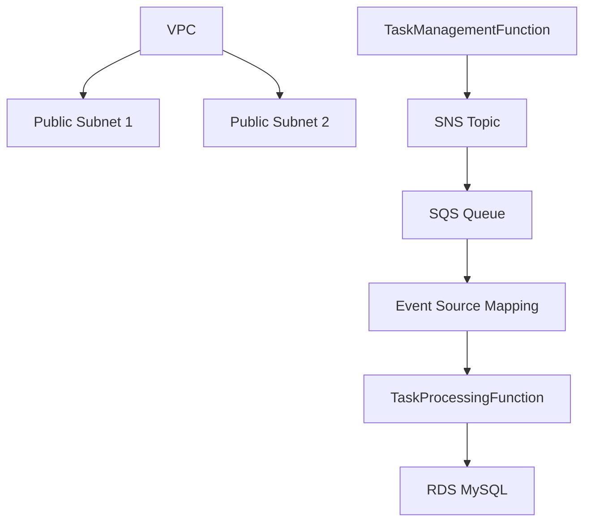
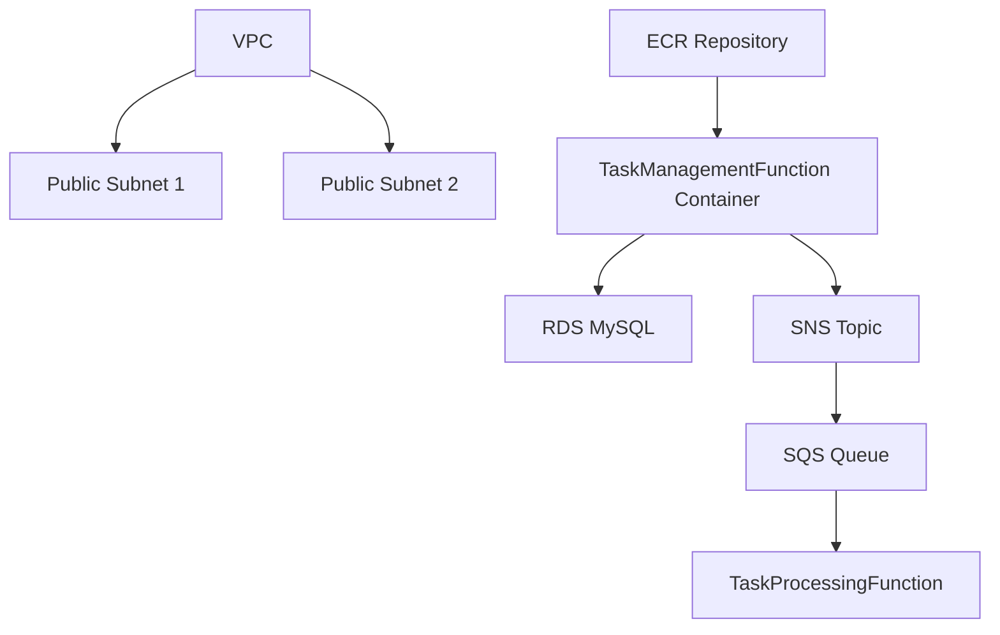

## Oppgave 9: Implementere AWS Lambda Event Source Mapping for SQS

I denne oppgaven skal vi utvide vår CloudFormation-mal for å inkludere en AWS Lambda Event Source Mapping for SQS. Dette vil automatisk trigge vår Lambda-funksjon når nye meldinger legges til i SQS-køen, og eliminere behovet for manuell polling.

### Oppgavebeskrivelse

1. Modifiser CloudFormation-malen for å legge til:
   - En Lambda Event Source Mapping som kobler SQS-køen til TaskProcessingFunction
2. Oppdater IAM-rollen for TaskProcessingFunction med nødvendige tillatelser
3. Oppdater den eksisterende stacken med den nye malen
4. Test funksjonaliteten ved å legge til en ny oppgave og verifisere at den blir prosessert automatisk

### Arkitekturdiagram



<details>
<summary>Løsning</summary>

1. Modifiser `network-infrastructure.yaml` filen og legg til følgende ressurser:

```yaml
  TaskProcessingEventSourceMapping:
    Type: AWS::Lambda::EventSourceMapping
    Properties:
      EventSourceArn: !GetAtt TaskProcessingQueue.Arn
      FunctionName: !Ref TaskProcessingFunction
      BatchSize: 1

  LambdaExecutionRole:
    Type: AWS::IAM::Role
    Properties:
      AssumeRolePolicyDocument:
        Version: '2012-10-17'
        Statement:
          - Effect: Allow
            Principal:
              Service: lambda.amazonaws.com
            Action: sts:AssumeRole
      ManagedPolicyArns:
        - arn:aws:iam::aws:policy/service-role/AWSLambdaVPCAccessExecutionRole
      Policies:
        - PolicyName: LambdaRDSAccess
          PolicyDocument:
            Version: '2012-10-17'
            Statement:
              - Effect: Allow
                Action:
                  - rds-data:ExecuteStatement
                  - rds-data:BatchExecuteStatement
                Resource: !GetAtt TaskManagementDatabase.Arn
        - PolicyName: LambdaSNSPublish
          PolicyDocument:
            Version: '2012-10-17'
            Statement:
              - Effect: Allow
                Action: sns:Publish
                Resource: !Ref NewTaskNotificationTopic
        - PolicyName: LambdaSQSReceive
          PolicyDocument:
            Version: '2012-10-17'
            Statement:
              - Effect: Allow
                Action:
                  - sqs:ReceiveMessage
                  - sqs:DeleteMessage
                  - sqs:GetQueueAttributes
                Resource: !GetAtt TaskProcessingQueue.Arn
        - PolicyName: LambdaCloudWatchLogs
          PolicyDocument:
            Version: '2012-10-17'
            Statement:
              - Effect: Allow
                Action:
                  - logs:CreateLogStream
                  - logs:PutLogEvents
                Resource: 
                  - !GetAtt TaskManagementFunctionLogGroup.Arn
                  - !GetAtt TaskProcessingFunctionLogGroup.Arn
```

2. Oppdater den eksisterende stacken:
   - Gå til AWS CloudFormation-konsollen
   - Velg stacken du opprettet tidligere
   - Klikk på \"Update\
   - Velg \"Replace current template\
   - Last opp den oppdaterte YAML-filen
   - Gå gjennom og bekreft endringene

3. For å teste funksjonaliteten:
   - Bruk Function URL for TaskManagementFunction til å opprette en ny oppgave (POST-forespørsel)
   - Sjekk CloudWatch Logs for TaskProcessingFunction for å se at den blir trigget automatisk

Denne oppdateringen til vår CloudFormation-mal legger til en Lambda Event Source Mapping som automatisk trigger TaskProcessingFunction når nye meldinger legges til i SQS-køen. Dette eliminerer behovet for manuell polling og gjør systemet mer effektivt og responsivt.

> [!NOTE]
> Lambda Event Source Mapping er en kraftig funksjon som lar deg koble sammen ulike AWS-tjenester på en serverløs måte. Dette er et godt eksempel på hvordan man kan bygge asynkrone, hendelsesdrevne arkitekturer i AWS.

> [!IMPORTANT]
> Når du bruker Lambda Event Source Mapping med SQS, er det viktig å være oppmerksom på at Lambda vil fortsette å polle køen selv om den er tom. Dette kan føre til økte kostnader hvis ikke håndtert riktig. I en produksjonssetting bør du vurdere å implementere en mekanisme for å deaktivere mappingen når det ikke er behov for den.

Ved å bruke CloudFormation for å sette opp Event Source Mapping, sikrer vi at vår infrastruktur er konsistent og reproduserbar. Dette er en viktig del av \"Infrastructure as Code\" prinsippet, som gjør det enklere å administrere og vedlikeholde komplekse systemer over tid.

</details>

## Oppgave 10: Implementere Docker-containerisering av TaskManagementFunction

I denne oppgaven skal vi utvide vår CloudFormation-mal for å containerisere TaskManagementFunction ved hjelp av Docker. Dette vil gi oss mer kontroll over kjøremiljøet og gjøre det enklere å reprodusere og skalere applikasjonen.

### Oppgavebeskrivelse

1. Lag en Dockerfile for TaskManagementFunction
2. Modifiser CloudFormation-malen for å:
   - Opprette et Amazon Elastic Container Registry (ECR) repository
   - Oppdatere TaskManagementFunction til å bruke Docker-containeren
3. Skriv et skript for å bygge Docker-image og laste det opp til ECR
4. Oppdater den eksisterende stacken med den nye malen
5. Test den containeriserte funksjonen for å sikre at den fungerer som forventet

### Arkitekturdiagram



<details>
<summary>Løsning</summary>

1. Lag en Dockerfile for TaskManagementFunction:

Opprett en ny fil kalt `Dockerfile` i samme mappe som Lambda-funksjonen:

```dockerfile
FROM public.ecr.aws/lambda/python:3.13

COPY requirements.txt .
RUN pip install -r requirements.txt

COPY index.py ${LAMBDA_TASK_ROOT}

CMD [ \"index.lambda_handler\" ]
```

Opprett en `requirements.txt` fil med følgende innhold:

```
pymysql
boto3
```

2. Modifiser `network-infrastructure.yaml` filen og legg til følgende ressurser:

```yaml
  TaskManagementFunctionRepository:
    Type: AWS::ECR::Repository
    Properties:
      RepositoryName: task-management-function
      Tags:
        - Key: Name
          Value: test-project

  TaskManagementFunction:
    Type: AWS::Lambda::Function
    Properties:
      FunctionName: task-management-function
      PackageType: Image
      Code:
        ImageUri: !Sub ${AWS::AccountId}.dkr.ecr.${AWS::Region}.amazonaws.com/${TaskManagementFunctionRepository}:latest
      Role: !GetAtt LambdaExecutionRole.Arn
      Timeout: 10
      MemorySize: 128
      Environment:
        Variables:
          DB_HOST: !GetAtt TaskManagementDatabase.Endpoint.Address
          DB_USER: admin
          DB_PASSWORD: your-database-password  # Replace with a secure password
          DB_NAME: taskmanagement
          SNS_TOPIC_ARN: !Ref NewTaskNotificationTopic
      VpcConfig:
        SecurityGroupIds:
          - !Ref DatabaseSecurityGroup
        SubnetIds:
          - !Ref PublicSubnet1
          - !Ref PublicSubnet2
      Tags:
        - Key: Name
          Value: test-project
```

3. Skriv et skript for å bygge Docker-image og laste det opp til ECR:

Opprett en ny fil kalt `build_and_push.sh`:

```bash
#!/bin/bash

# Sett variabler
AWS_ACCOUNT_ID=$(aws sts get-caller-identity --query Account --output text)
AWS_REGION=eu-west-1
ECR_REPOSITORY=task-management-function

# Logg inn til ECR
aws ecr get-login-password --region $AWS_REGION | docker login --username AWS --password-stdin $AWS_ACCOUNT_ID.dkr.ecr.$AWS_REGION.amazonaws.com

# Bygg Docker image
docker build -t $ECR_REPOSITORY .

# Tagg image
docker tag $ECR_REPOSITORY:latest $AWS_ACCOUNT_ID.dkr.ecr.$AWS_REGION.amazonaws.com/$ECR_REPOSITORY:latest

# Push image til ECR
docker push $AWS_ACCOUNT_ID.dkr.ecr.$AWS_REGION.amazonaws.com/$ECR_REPOSITORY:latest
```

Gjør skriptet kjørbart:

```bash
chmod +x build_and_push.sh
```

4. Kjør skriptet for å bygge og laste opp Docker-imagen:

```bash
./build_and_push.sh
```

5. Oppdater den eksisterende stacken:
   - Gå til AWS CloudFormation-konsollen
   - Velg stacken du opprettet tidligere
   - Klikk på \"Update\
   - Velg \"Replace current template\
   - Last opp den oppdaterte YAML-filen
   - Gå gjennom og bekreft endringene

6. For å teste den containeriserte funksjonen:
   - Bruk Function URL for TaskManagementFunction til å opprette en ny oppgave (POST-forespørsel)
   - Bruk Function URL for TaskManagementFunction til å hente alle oppgaver (GET-forespørsel)
   - Sjekk CloudWatch Logs for TaskManagementFunction for å se at den fungerer som forventet

Denne oppdateringen til vår CloudFormation-mal containeriserer TaskManagementFunction ved hjelp av Docker. Vi har opprettet et ECR-repository for å lagre Docker-imagen, og oppdatert Lambda-funksjonen til å bruke denne imagen.

> [!NOTE]
> Containerisering av Lambda-funksjoner gir deg mer kontroll over kjøremiljøet og gjør det enklere å inkludere egendefinerte biblioteker og avhengigheter. Dette er spesielt nyttig for mer komplekse applikasjoner eller når du trenger spesifikke versjoner av biblioteker.

> [!IMPORTANT]
> Når du bruker containeriserte Lambda-funksjoner, er det viktig å være oppmerksom på kaldstartytelse. Containeriserte funksjoner kan ha lengre kaldstarttider sammenlignet med tradisjonelle ZIP-baserte funksjoner. I en produksjonssetting bør du vurdere å implementere strategier for å redusere kaldstarttider, som for eksempel å holde funksjonen varm.

Ved å bruke CloudFormation for å sette opp ECR og den containeriserte Lambda-funksjonen, sikrer vi at vår infrastruktur er konsistent og reproduserbar. Dette er en viktig del av \"Infrastructure as Code\" prinsippet, som gjør det enklere å administrere og vedlikeholde komplekse systemer over tid.

</details>
