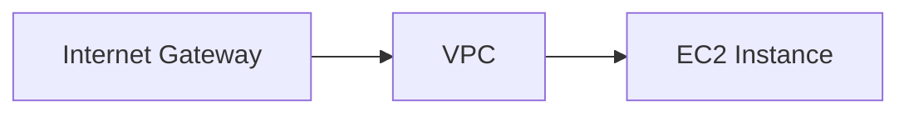
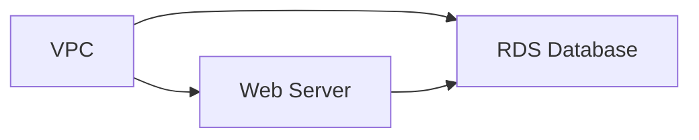
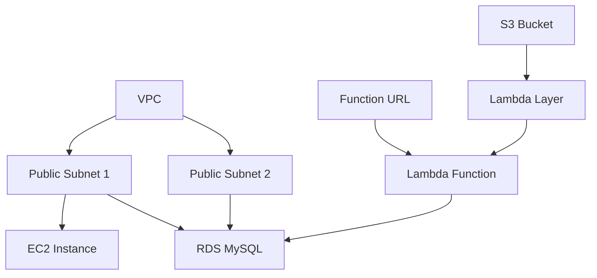
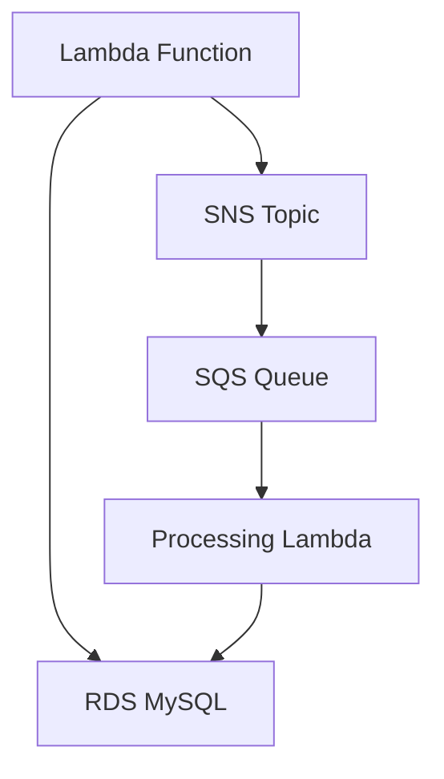
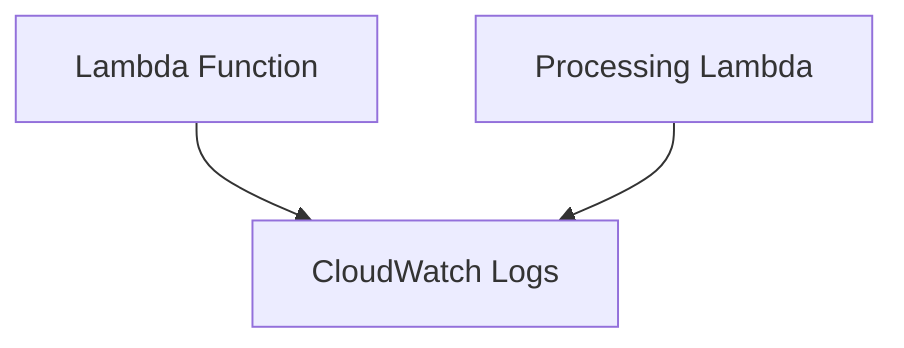

# Oppgavesett: AWS - Cloudformation
# Innholdsfortegnelse

1. [Opprette grunnleggende nettverksinfrastruktur med CloudFormation](#oppgave-1-opprette-grunnleggende-nettverksinfrastruktur-med-cloudformation)
2. [Opprette en EC2-instans med CloudFormation](#oppgave-2-opprette-en-ec2-instans-med-cloudformation)
3. [Legge til en RDS-database med CloudFormation](#oppgave-3-legge-til-en-rds-database-med-cloudformation)
4. [Implementere Lambda-funksjon med CloudFormation](#oppgave-4-implementere-lambda-funksjon-med-cloudformation)
5. [Implementere SNS og SQS med CloudFormation](#oppgave-5-implementere-sns-og-sqs-med-cloudformation)
6. [Implementere CloudWatch Logs for Lambda-funksjoner](#oppgave-6-implementere-cloudwatch-logs-for-lambda-funksjoner)

# Introduksjon til skyteknologi med AWS: Oppgavestyringssystem

I dette kurset skal vi bygge et enkelt oppgavestyringssystem ved hjelp av AWS-tjenester. Vi vil starte med grunnleggende oppsett og gradvis bygge ut funksjonaliteten. Kurset vil fokusere på infrastruktur og AWS-tjenester, med minimal vekt på applikasjonskode.

> [!NOTE]
> **Før du begynner er det viktig at du setter deg inn i AWS Free Tier, se artikkel [her](../aws.md).**

> [!NOTE]
> **Hvis du bruker Windows er det lurt å laste ned Git Bash og bruke det som terminal for oppgavene, fremfor f.eks. PowerShell som er typisk på Windows. Du vil da kunne kjøre samme kommandoer som vist i ukesoppgavene Se video for hvordan Git Bash installeres [her](https://www.youtube.com/watch?v=qdwWe9COT9k).**

# Introduksjon til AWS CloudFormation

Denne ukens tema er AWS CloudFormation, et kraftig verktøy for å definere og administrere AWS-infrastruktur som kode. Vi skal bygge et oppgavestyringssystem ved hjelp av AWS-tjenester, og CloudFormation vil være vår hovedmetode for å opprette og administrere disse ressursene.

> [!NOTE]
> Det anbefales å bruke CloudFormation Linter for å raskt bli bevisstgjort på eventuelle feil i dine CloudFormation-maler. Dette verktøyet kan integreres i de fleste kodeeditorer og vil hjelpe deg med å identifisere og rette opp feil før du deployer dine ressurser.

La oss begynne med å sette opp grunnleggende infrastruktur for vårt oppgavestyringssystem.

## Oppgave 1: Opprette grunnleggende nettverksinfrastruktur med CloudFormation

I denne oppgaven skal vi opprette en VPC med to offentlige subnets ved hjelp av AWS CloudFormation. Dette vil danne grunnlaget for vårt oppgavestyringssystem.

### Oppgavebeskrivelse

1. Opprett en CloudFormation-mal som definerer følgende ressurser:
   - En VPC
   - To offentlige subnets i forskjellige Availability Zones
   - En Internet Gateway
   - En Route Table med en rute til Internet Gateway
2. Deployer malen ved hjelp av AWS Management Console
3. Verifiser at ressursene er opprettet korrekt

<details>
<summary>Løsning</summary>

1. Opprett en fil med navnet `network-infrastructure.yaml` og legg til følgende innhold:

```yaml
AWSTemplateFormatVersion: '2010-09-09'
Description: 'Network infrastructure for task management system'

Resources:
  TaskManagementVPC:
    Type: AWS::EC2::VPC
    Properties:
      CidrBlock: 10.0.0.0/16
      EnableDnsHostnames: true
      EnableDnsSupport: true
      InstanceTenancy: default
      Tags:
        - Key: Name
          Value: test-project
  PublicSubnet1:
    Type: AWS::EC2::Subnet
    Properties:
      VpcId: !Ref TaskManagementVPC
      AvailabilityZone: eu-west-1a
      CidrBlock: 10.0.1.0/24
      MapPublicIpOnLaunch: true
      Tags:
        - Key: Name
          Value: test-project

  PublicSubnet2:
    Type: AWS::EC2::Subnet
    Properties:
      VpcId: !Ref TaskManagementVPC
      AvailabilityZone: eu-west-1b
      CidrBlock: 10.0.2.0/24
      MapPublicIpOnLaunch: true
      Tags:
        - Key: Name
          Value: test-project

  InternetGateway:
    Type: AWS::EC2::InternetGateway
    Properties:
      Tags:
        - Key: Name
          Value: test-project

  AttachGateway:
    Type: AWS::EC2::VPCGatewayAttachment
    Properties:
      VpcId: !Ref TaskManagementVPC
      InternetGatewayId: !Ref InternetGateway

  PublicRouteTable:
    Type: AWS::EC2::RouteTable
    Properties:
      VpcId: !Ref TaskManagementVPC
      Tags:
        - Key: Name
          Value: test-project

  PublicRoute:
    Type: AWS::EC2::Route
    DependsOn: AttachGateway
    Properties:
      RouteTableId: !Ref PublicRouteTable
      DestinationCidrBlock: 0.0.0.0/0
      GatewayId: !Ref InternetGateway

  PublicSubnet1RouteTableAssociation:
    Type: AWS::EC2::SubnetRouteTableAssociation
    Properties:
      SubnetId: !Ref PublicSubnet1
      RouteTableId: !Ref PublicRouteTable

  PublicSubnet2RouteTableAssociation:
    Type: AWS::EC2::SubnetRouteTableAssociation
    Properties:
      SubnetId: !Ref PublicSubnet2
      RouteTableId: !Ref PublicRouteTable

Outputs:
  VPCId:
    Description: The ID of the VPC
    Value: !Ref TaskManagementVPC
    Export:
      Name: TaskManagementVPCId

  PublicSubnet1Id:
    Description: The ID of the first public subnet
    Value: !Ref PublicSubnet1
    Export:
      Name: TaskManagementPublicSubnet1Id

  PublicSubnet2Id:
    Description: The ID of the second public subnet
    Value: !Ref PublicSubnet2
    Export:
      Name: TaskManagementPublicSubnet2Id
```

2. For å deploye denne malen:
   - Gå til AWS CloudFormation-konsollen
   - Klikk på \"Create stack\" og velg \"With new resources (standard)\
   - Velg \"Upload a template file\" og last opp din `network-infrastructure.yaml` fil
   - Gi stacken et navn, f.eks. "task-management-network"
   - Trykk "Next"
   - La alt under `Configure stack options` stå som default, trykk `Next`
   - Gå gjennom resten av trinnene og klikk på `Submit`

3. For å verifisere at ressursene er opprettet korrekt:
   - Stacken vil nå gå i status `CREATE_IN_PROGRESS`
   - Vent til stacken er i status `CREATE_COMPLETE`
   - Gå til VPC-konsollen og bekreft at VPC, subnets, internet gateway og route table er opprettet med riktige konfigurasjoner
   - Sjekk at subnets er knyttet til route table, og at route table har en rute til internet gateway

Denne CloudFormation-malen oppretter en grunnleggende nettverksinfrastruktur for vårt oppgavestyringssystem. Vi har definert en VPC med to offentlige subnets i forskjellige Availability Zones, en Internet Gateway for internett-tilkobling, og en Route Table som ruter trafikk fra subnets til Internet Gateway.

Malen inkluderer også Outputs-seksjonen som eksporterer VPC og Subnet IDer. Dette gjør det enkelt å referere til disse ressursene i fremtidige CloudFormation-maler, noe som fremmer gjenbruk og modularitet i infrastrukturkoden vår.

</details>

## Oppgave 2: Opprette en EC2-instans med CloudFormation

I denne oppgaven skal vi utvide vår CloudFormation-mal for å inkludere en EC2-instans som vil fungere som vår applikasjonsserver for oppgavestyringssystemet.

### Oppgavebeskrivelse

1. Opprett en SSH key pair i AWS Console
2. Modifiser CloudFormation-malen fra forrige oppgave for å legge til:
  - En EC2-instans i den første offentlige subneten
  - En Security Group som tillater innkommende SSH-trafikk (port 22) og HTTP-trafikk (port 80)
3. Konfigurer EC2-instansen til å kjøre en enkel webserver ved oppstart
4. Oppdater den eksisterende stacken med den nye malen
5. Verifiser at EC2-instansen er opprettet og tilgjengelig

> [!NOTE]
> Det er ikke anbefalt å opprette SSH key pairs i CloudFormation da den private nøkkelen vil være synlig i CloudFormation-loggen. Dette er en sikkerhetsrisiko. I stedet bør key pairs opprettes manuelt i AWS Console før de refereres i CloudFormation-malen.

### Opprette SSH Key Pair

1. Gå til EC2 Dashboard i AWS Console
2. Velg "Key Pairs" under "Network & Security"
3. Klikk på "Create key pair"
4. Gi key pair et navn (f.eks. "taskmanager-key")
5. Velg ".pem" format for Linux/Mac eller ".ppk" for Windows
6. Klikk "Create key pair"
7. Last ned og lagre den private nøkkelen på et sikkert sted
8. For Linux/Mac brukere, kjør følgende kommando for å sette korrekte tillatelser på nøkkelfilen:
   ```bash
   chmod 400 path/to/your-key.pem
   ```

### Arkitekturdiagram



<details>
<summary>Løsning</summary>

1. Modifiser `network-infrastructure.yaml` filen og legg til følgende ressurser (husk å endre `LAMBDA_BASE_URL` til din function URL):

```yaml
  WebServerSecurityGroup:
    Type: AWS::EC2::SecurityGroup
    Properties:
      GroupDescription: Allow SSH and HTTP
      VpcId: !Ref TaskManagementVPC
      SecurityGroupIngress:
        - IpProtocol: tcp
          FromPort: 22
          ToPort: 22
          CidrIp: 0.0.0.0/0
        - IpProtocol: tcp
          FromPort: 80
          ToPort: 80
          CidrIp: 0.0.0.0/0
      Tags:
        - Key: Name
          Value: test-project

  WebServerInstance:
    Type: AWS::EC2::Instance
    Properties:
      ImageId: ami-05edf2d87fdbd91c1  # Amazon Linux 2023 AMI in eu-west-1
      InstanceType: t2.micro
      KeyName: taskmanager-key  # Name of the key pair you created
      NetworkInterfaces:
        - AssociatePublicIpAddress: true
          DeviceIndex: 0
          GroupSet:
            - !Ref WebServerSecurityGroup
          SubnetId: !Ref PublicSubnet1
      UserData:
        Fn::Base64: |
          #!/bin/bash
          yum update -y
          yum install -y httpd
          systemctl start httpd
          systemctl enable httpd
          
          # Create frontend files
          cat > /var/www/html/index.html << 'EOL'
          <!DOCTYPE html>
          <html lang="en">
          <head>
            <meta charset="UTF-8">
            <meta name="viewport" content="width=device-width, initial-scale=1.0">
            <title>Oppgavestyringssystem</title>
            <link rel="stylesheet" href="style.css">
          </head>
          <body>
            <div class="container">
              <h1>Oppgavestyringssystem</h1>
              <div class="form-section">
                <h2>Legg til ny oppgave</h2>
                <form id="task-form">
                  <div class="form-group">
                    <label for="task-title">Tittel:</label>
                    <input type="text" id="task-title" required>
                  </div>
                  <div class="form-group">
                    <label for="task-description">Beskrivelse:</label>
                    <textarea id="task-description" rows="4"></textarea>
                  </div>
                  <button type="submit" class="submit-btn">Legg til oppgave</button>
                </form>
              </div>
              <div class="task-section">
                <h2>Eksisterende oppgaver</h2>
                <div id="task-list" class="task-grid"></div>
              </div>
            </div>
            <script src="script.js"></script>
          </body>
          </html>
          EOL

          cat > /var/www/html/script.js << 'EOL'
          const LAMBDA_BASE_URL = 'https://rsz4gecta74rbeuypqfjadpsde0xkyha.lambda-url.eu-west-1.on.aws';

          async function getTasks() {
            try {
              const response = await fetch(`${LAMBDA_BASE_URL}/tasks`, {
                method: 'GET',
                headers: {
                  'Content-Type': 'application/json'
                },
              });
              if (!response.ok) {
                throw new Error('Nettverksfeil ved henting av oppgaver');
              }
              const data = await response.json();
              displayTasks(data);
            } catch (error) {
              console.error('Feil ved henting av oppgaver:', error);
              showError('Kunne ikke hente oppgaver. Vennligst prøv igjen senere.');
            }
          }

          function displayTasks(tasks) {
            const taskList = document.getElementById('task-list');
            taskList.innerHTML = '';
            
            tasks.forEach(task => {
              const taskElement = document.createElement('div');
              taskElement.className = 'task-card';
              taskElement.innerHTML = `
                <h3>${escapeHtml(task.title)}</h3>
                <p>${escapeHtml(task.description)}</p>
                <span class="status ${task.status.toLowerCase().replace(' ', '-')}">${task.status}</span>
              `;
              taskList.appendChild(taskElement);
            });
          }

          function escapeHtml(unsafe) {
            return unsafe
              .replace(/&/g, "&amp;")
              .replace(/</g, "&lt;")
              .replace(/>/g, "&gt;")
              .replace(/"/g, "&quot;")
              .replace(/'/g, "&#039;");
          }

          document.getElementById('task-form').addEventListener('submit', async (e) => {
            e.preventDefault();
            const submitButton = e.target.querySelector('button');
            submitButton.disabled = true;
            
            try {
              const taskData = {
                title: document.getElementById('task-title').value.trim(),
                description: document.getElementById('task-description').value.trim()
              };
              
              const response = await fetch(`${LAMBDA_BASE_URL}/tasks`, {
                method: 'POST',
                headers: {
                  'Content-Type': 'application/json'
                },
                body: JSON.stringify(taskData)
              });

              if (!response.ok) {
                throw new Error('Feil ved oppretting av oppgave');
              }

              await getTasks();
              e.target.reset();
              alert('Oppgave lagt til!');
            } catch (error) {
              console.error('Feil:', error);
              alert('Kunne ikke legge til oppgave. Prøv igjen senere.');
            } finally {
              submitButton.disabled = false;
            }
          });

          getTasks();
          EOL

          cat > /var/www/html/style.css << 'EOL'
          body {
              font-family: Arial, sans-serif;
              line-height: 1.6;
              margin: 0;
              padding: 20px;
              background-color: #f5f5f5;
          }

          .container {
              max-width: 1200px;
              margin: 0 auto;
              padding: 20px;
          }

          h1 {
              color: #333;
              text-align: center;
              margin-bottom: 30px;
          }

          .form-section {
              background: white;
              padding: 20px;
              border-radius: 8px;
              box-shadow: 0 2px 4px rgba(0,0,0,0.1);
              margin-bottom: 30px;
          }

          .form-group {
              margin-bottom: 15px;
          }

          label {
              display: block;
              margin-bottom: 5px;
              font-weight: bold;
          }

          input, textarea {
              width: 100%;
              padding: 8px;
              border: 1px solid #ddd;
              border-radius: 4px;
              box-sizing: border-box;
          }

          .submit-btn {
              background-color: #4CAF50;
              color: white;
              padding: 10px 20px;
              border: none;
              border-radius: 4px;
              cursor: pointer;
              font-size: 16px;
          }

          .submit-btn:hover {
              background-color: #45a049;
          }

          .task-grid {
              display: grid;
              grid-template-columns: repeat(auto-fill, minmax(300px, 1fr));
              gap: 20px;
          }

          .task-card {
              background: white;
              padding: 15px;
              border-radius: 8px;
              box-shadow: 0 2px 4px rgba(0,0,0,0.1);
          }

          .status {
              display: inline-block;
              padding: 4px 8px;
              border-radius: 4px;
              font-size: 12px;
              font-weight: bold;
          }

          .status.pending {
              background-color: #ffd700;
              color: #000;
          }

          .status.completed {
              background-color: #90EE90;
              color: #000;
          }

          .status.in-progress {
              background-color: #87CEEB;
              color: #000;
          }
          EOL

          chown apache:apache /var/www/html/*
          chmod 644 /var/www/html/*
          systemctl restart httpd

      Tags:
        - Key: Name
          Value: test-project

Outputs:
  WebServerPublicIP:
    Description: Public IP address of the web server
    Value: !GetAtt WebServerInstance.PublicIp
```

2. For å oppdatere den eksisterende stacken:
  - Gå til AWS CloudFormation-konsollen
  - Velg stacken du opprettet i forrige oppgave
  - Klikk på "Update"
  - Velg "Replace existing template"
  - Last opp den oppdaterte YAML-filen
  - På siste side, før du trykker `Submit`, så er det en seksjon som heter `Changeset preview`
  - Gå gjennom endringene som listes under `Changeset preview` og se at det er som forventet. Bekreft endringene med `Submit`

3. For å verifisere at EC2-instansen er opprettet og tilgjengelig:
  - Vent til stacken er i status "UPDATE_COMPLETE"
  - Gå til EC2-konsollen og finn den nyopprettede instansen
  - Se at EC2-instansen viser `2/2 checks passed` og ikke `Initialising` under `Status Check`
  - Kopier den offentlige IP-adressen
  - Åpne en nettleser og lim inn IP-adressen
  - Test webapplikasjonen ved å legge til noen oppgaver
  - Test SSH-tilkobling med din private nøkkel: `ssh -i path/to/key.pem ec2-user@public-ip`

Denne oppdateringen til vår CloudFormation-mal legger til en EC2-instans som kjører en webserver med en fullstendig frontend-løsning. Vi har også lagt til en Security Group som tillater innkommende trafikk på port 22 (SSH) og port 80 (HTTP).

UserData-seksjonen i EC2-instansens konfigurasjon inneholder et bash-skript som installerer og starter Apache webserver, og setter opp alle nødvendige frontend-filer.

> [!IMPORTANT]
> Sørg for at key pair-navnet i CloudFormation-malen matcher nøyaktig med navnet på key pair du opprettet i AWS Console. Oppbevar den private nøkkelen på et sikkert sted, da den ikke kan lastes ned på nytt fra AWS.

Ved å bruke CloudFormation har vi nå automatisert opprettelsen av både nettverksinfrastruktur og en applikasjonsserver med frontend. Dette gjør det enkelt å reprodusere miljøet og holde infrastrukturen som kode.

</details>


## Oppgave 3: Legge til en RDS-database med CloudFormation

I denne oppgaven skal vi utvide vår CloudFormation-mal for å inkludere en MySQL RDS-database som vil fungere som datalagring for vårt oppgavestyringssystem.

### Oppgavebeskrivelse

1. Modifiser CloudFormation-malen for å legge til:
  - En MySQL RDS-instans i offentlig subnet
  - En Database Security Group som tillater innkommende trafikk på port 3306 fra hvor som helst
  - En Database Subnet Group som inkluderer begge de offentlige subnettene
2. Konfigurer RDS-instansen med et standard brukernavn og passord
3. Oppdater den eksisterende stacken med den nye malen
4. Opprett tasks-tabellen i databasen

Vi trenger å gi EC2-instansen tilgang til RDS-databasen fordi:
- Vi skal kjøre initielle SQL-skript for å opprette databaseskjema og tabeller
- Web-applikasjonen som kjører på EC2 trenger å kunne kommunisere med databasen
- Vi skal kunne administrere databasen via MySQL-klienten som installeres på EC2-instansen

Dette oppnås ved å konfigurere Security Groups slik at EC2-instansen kan nå RDS på port 3306.

> [!IMPORTANT] 
> For denne øvelsen bruker vi Free Tier-eligible db.t4g.micro instanstype. Sørg for at du velger denne for å unngå kostnader.

### Arkitekturdiagram



<details>
<summary>Løsning</summary>

1. Modifiser `network-infrastructure.yaml` filen og legg til følgende ressurser:

```yaml
  DatabaseSubnetGroup:
    Type: AWS::RDS::DBSubnetGroup
    Properties:
      DBSubnetGroupDescription: Subnet group for RDS database
      SubnetIds:
        - !Ref PublicSubnet1
        - !Ref PublicSubnet2
      Tags:
        - Key: Name
          Value: test-project

  DatabaseSecurityGroup:
    Type: AWS::EC2::SecurityGroup
    Properties:
      GroupDescription: Allow MySQL access from anywhere
      VpcId: !Ref TaskManagementVPC
      SecurityGroupIngress:
        - IpProtocol: tcp
          FromPort: 3306
          ToPort: 3306
          CidrIp: 0.0.0.0/0
      Tags:
        - Key: Name
          Value: test-project

  TaskManagementDatabase:
    Type: AWS::RDS::DBInstance
    Properties:
      DBName: taskmanager
      Engine: mysql
      MasterUsername: admin
      MasterUserPassword: passordd  # Replace with a secure password
      DBInstanceClass: db.t4g.micro              # Free tier eligible
      AllocatedStorage: 20
      PubliclyAccessible: true
      VPCSecurityGroups:
        - !Ref DatabaseSecurityGroup
      DBSubnetGroupName: !Ref DatabaseSubnetGroup
      BackupRetentionPeriod: 0                   # Disable automated backups
      Tags:
        - Key: Name
          Value: test-project

Outputs:
  DatabaseEndpoint:
    Description: Endpoint of the RDS database
    Value: !GetAtt TaskManagementDatabase.Endpoint.Address
```

2. Oppdater stacken som tidligere beskrevet.

3. Når RDS er tilgjengelig (dette kan ta noen minutter, så vær tålmodig), opprett tasks-tabellen:

```bash
# SSH til EC2-instansen
ssh -i path/to/key.pem ec2-user@your-ec2-ip

# Installer MySQL client
sudo dnf update -y
sudo dnf install mariadb105 -y

# Koble til RDS
mysql -h <RDS_ENDPOINT> -u admin -p

# Opprett tabell
USE taskmanager;

CREATE TABLE tasks (
  id INT AUTO_INCREMENT PRIMARY KEY,
  title VARCHAR(255) NOT NULL,
  description TEXT,
  status VARCHAR(50) DEFAULT 'Pending'
);

# Verifiser
SHOW TABLES;
```

> [!NOTE]
> For produksjonsmiljøer bør du:
> - Bruke private subnets for RDS
> - Aktivere automatisk backup
> - Implementere Multi-AZ deployment
> - Bruke sterkere passord
> - Vurdere større instance class basert på arbeidslast

</details>


## Oppgave 4: Implementere Lambda-funksjon med CloudFormation

I denne oppgaven skal vi utvide vår CloudFormation-mal for å inkludere en Lambda-funksjon som vil fungere som backend for vårt oppgavestyringssystem. Denne funksjonen vil kommunisere med RDS-databasen for å lagre og hente oppgaver.

### Oppgavebeskrivelse

1. Opprett en S3-bøtte for Lambda Layer:
  - Gå til Amazon S3 i AWS Console
  - Klikk "Create bucket"
  - Velg et unikt navn (f.eks. "pymysql-layer-bucket-[ditt-navn]")
  - Behold standard innstillinger
  - Klikk "Create bucket"

2. Forbered og last opp Lambda Layer:
  - På din lokale maskin, opprett en mappe `python`
  - Inne i `python` mappen, kjør: `pip install pymysql -t .`
  - Zip innholdet av `python` mappen med kommandoen:
    ```bash
    zip -r pymysql-layer.zip python/
    ```
  - Gå tilbake til S3-konsollen
  - Velg bøtten du opprettet
  - Klikk "Upload" og velg `pymysql-layer.zip`
  - Verifiser at opplastingen er fullført

3. Modifiser CloudFormation-malen for å legge til:
  - En IAM-rolle for Lambda-funksjonen med nødvendige tillatelser
  - En Lambda-funksjon som kan håndtere CRUD-operasjoner for oppgaver
  - Et Lambda Layer for PyMySQL
  - En Function URL for Lambda-funksjonen

4. Konfigurer Lambda-funksjonen til å kommunisere med RDS-databasen

5. Oppdater den eksisterende stacken med den nye malen

6. Verifiser at Lambda-funksjonen er opprettet og tilgjengelig via Function URL med CORS

### Arkitekturdiagram



<details>
<summary>Løsning</summary>

1. Først, la oss legge til S3-bøtten i CloudFormation-malen. Opprett en ny fil `s3-bucket.yaml`:

```yaml
Resources:
  PyMySQLBucket:
    Type: AWS::S3::Bucket
    Properties:
      BucketName: !Sub pymysql-layer-bucket-${AWS::AccountId}
      VersioningConfiguration:
        Status: Suspended
      PublicAccessBlockConfiguration:
        BlockPublicAcls: true
        BlockPublicPolicy: true
        IgnorePublicAcls: true
        RestrictPublicBuckets: true
      Tags:
        - Key: Name
          Value: test-project

Outputs:
  BucketName:
    Description: Name of the created S3 bucket
    Value: !Ref PyMySQLBucket
  BucketArn:
    Description: ARN of the created S3 bucket
    Value: !GetAtt PyMySQLBucket.Arn
```

2. Deploy S3-bøtten:
  - Gå til AWS CloudFormation konsollen
  - Klikk "Create stack"
  - Velg "Upload a template file"
  - Last opp `s3-bucket.yaml`
  - Gi stacken et navn (f.eks. "lambda-layer-bucket")
  - Følg veiviseren og opprett stacken
  - Vent til stacken er i status "CREATE_COMPLETE"
  - Noter bucket-navnet fra Outputs-seksjonen

3. Last opp Lambda Layer til den nye bøtten:
  - Gå til S3-konsollen
  - Finn den nyopprettede bøtten
  - Last opp `pymysql-layer.zip` som beskrevet tidligere

**Vi bruker Python 3.12 i stedet for Python 3.13 ettersom CloudFormation linteren foreløpig kun er fullstendig oppdatert for Python 3.12. Dette sikrer at vi unngår unødvendige feilmeldinger fra linteren under utviklingen.**

4. Modifiser `network-infrastructure.yaml` filen og legg til følgende ressurser:

```yaml
  PyMySQLLayer:
    Type: AWS::Lambda::LayerVersion
    Properties:
      LayerName: pymysql-layer
      Description: Layer containing PyMySQL library
      Content:
        S3Bucket: !Ref PyMySQLBucket
        S3Key: pymysql-layer.zip
      CompatibleRuntimes:
        - python3.12
      CompatibleArchitectures:
        - x86_64

  LambdaExecutionRole:
    Type: AWS::IAM::Role
    Properties:
      AssumeRolePolicyDocument:
        Version: '2012-10-17'
        Statement:
          - Effect: Allow
            Principal:
              Service: lambda.amazonaws.com
            Action: sts:AssumeRole
      ManagedPolicyArns:
        - arn:aws:iam::aws:policy/service-role/AWSLambdaVPCAccessExecutionRole
      Policies:
        - PolicyName: LambdaRDSAccess
          PolicyDocument:
            Version: '2012-10-17'
            Statement:
              - Effect: Allow
                Action:
                  - rds-data:ExecuteStatement
                  - rds-data:BatchExecuteStatement
                Resource: !GetAtt TaskManagementDatabase.DBInstanceArn
        - PolicyName: LambdaS3Access
          PolicyDocument:
            Version: '2012-10-17'
            Statement:
              - Effect: Allow
                Action:
                  - s3:GetObject
                Resource: !Sub "${PyMySQLBucket.Arn}/*"

  TaskManagementFunctionUrlPermission:
    Type: AWS::Lambda::Permission
    Properties:
      FunctionName: !Ref TaskManagementFunction
      Action: lambda:InvokeFunctionUrl
      Principal: '*'
      FunctionUrlAuthType: NONE

  TaskManagementFunction:
    Type: AWS::Lambda::Function
    Properties:
      FunctionName: task-management-function
      Handler: index.lambda_handler
      Role: !GetAtt LambdaExecutionRole.Arn
      Layers:
      - !Ref PyMySQLLayer
      Code:
        ZipFile: |
          import json
          import pymysql
          import os

          def get_db_connection():
              return pymysql.connect(
                  host=os.environ['DB_HOST'],
                  user=os.environ['DB_USER'],
                  password=os.environ['DB_PASSWORD'],
                  db=os.environ['DB_NAME'],
                  charset='utf8mb4',
                  cursorclass=pymysql.cursors.DictCursor
              )

          def lambda_handler(event, context):
              event['httpMethod'] = event['requestContext']['http']['method']
              event['path'] = event['requestContext']['http']['path']
              event['queryStringParameters'] = event.get('queryStringParameters', {})

              conn = get_db_connection()
              try:
                  with conn.cursor() as cursor:
                      if event['httpMethod'] == 'GET':
                          cursor.execute("SELECT * FROM tasks")
                          tasks = cursor.fetchall()
                          return {
                              'statusCode': 200,
                              'body': json.dumps(tasks)
                          }
                      elif event['httpMethod'] == 'POST':
                          body = json.loads(event['body'])
                          cursor.execute("INSERT INTO tasks (title, description) VALUES (%s, %s)",
                              (body['title'], body['description']))
                          conn.commit()
                          return {
                              'statusCode': 200,
                              'body': json.dumps({'message': 'Task created successfully'})
                          }
                      elif event['httpMethod'] == 'OPTIONS':
                          return {
                              'statusCode': 200,
                              'body': ''
                          }
                      return {
                          'statusCode': 400,
                          'body': json.dumps({'message': 'Invalid request method'})
                      }
              finally:
                  conn.close()

      Runtime: python3.12
      Timeout: 10
      MemorySize: 128
      Environment:
        Variables:
          DB_HOST: !GetAtt TaskManagementDatabase.Endpoint.Address
          DB_USER: admin
          DB_PASSWORD: passordd  # Replace with a secure password
          DB_NAME: taskmanager
      Tags:
      - Key: Name
        Value: test-project

  TaskManagementFunctionUrl:
    Type: AWS::Lambda::Url
    Properties:
      AuthType: NONE
      Cors:
        AllowCredentials: false
        AllowHeaders:
          - "content-type"
          - "access-control-allow-origin"
          - "access-control-allow-methods"
        AllowMethods:
          - "*"
        AllowOrigins:
          - "*"
        ExposeHeaders:
          - "content-type"
          - "access-control-allow-origin"
          - "access-control-allow-methods"
        MaxAge: 0
      TargetFunctionArn: !Ref TaskManagementFunction

Outputs:
  LambdaFunctionUrl:
    Description: URL of the Lambda function
    Value: !GetAtt TaskManagementFunctionUrl.FunctionUrl
```

5. For å oppdatere den eksisterende stacken:
  - Gå til AWS CloudFormation-konsollen
  - Velg stacken du opprettet tidligere
  - Klikk på "Update"
  - Velg "Replace current template"
  - Last opp den oppdaterte YAML-filen
  - Gå gjennom og bekreft endringene

6. For å teste Lambda-funksjonen:
  - Vent til stacken er i status "UPDATE_COMPLETE"
  - Gå til Lambda-konsollen og finn funksjonen
  - Verifiser at PyMySQL-laget er koblet til funksjonen
  - Velg "Test" fanen
  - Klikk "Create new event"
  - For GET request, bruk:
    ```json
    {
      "version": "2.0",
      "requestContext": {
        "http": {
          "method": "GET",
          "path": "/tasks"
        }
      }
    }
    ```
    - For POST request, bruk:
    ```json
    {
      "version": "2.0", 
      "requestContext": {
        "http": {
          "method": "POST",
          "path": "/tasks"
        }
      },
      "body": "{\"title\":\"Test Task\",\"description\":\"This is a test task\"}"
    }
    ```
  - Kjør testene og verifiser:
    - Status code 200/201
    - Korrekt respons i result
    - Ingen feil i CloudWatch logs

> [!IMPORTANT]
> Husk å erstatte 'passordd' med et sikkert passord og verifiser at S3-bøtten er korrekt konfigurert før du laster opp Lambda Layer.

</details>

## Oppgave 5: Implementere SNS og SQS med CloudFormation

I denne oppgaven skal vi utvide vår CloudFormation-mal for å inkludere Amazon Simple Notification Service (SNS) og Amazon Simple Queue Service (SQS). Dette vil muliggjøre asynkron kommunikasjon i vårt oppgavestyringssystem.

### Oppgavebeskrivelse

I forrige oppgave implementerte vi en Lambda-funksjon som håndterer CRUD-operasjoner mot RDS-databasen. Nå skal vi legge til asynkron meldingshåndtering ved hjelp av SNS og SQS.

1. Modifiser CloudFormation-malen for å legge til:
  - En SNS-topic for nye oppgavevarsler
  - En SQS-kø som abonnerer på SNS-topicen
  - Nødvendige IAM-tillatelser for Lambda til å publisere til SNS og lese fra SQS

2. Oppdater Lambda-funksjonen til å publisere meldinger til SNS når nye oppgaver opprettes
  - Dette gjøres ved å legge til SNS-integrasjon i eksisterende kode
  - Sørg for at riktige miljøvariabler er tilgjengelige
  - Legg til SNS_TOPIC_ARN som miljøvariabel i Lambda-funksjonen

3. Lag en ny Lambda-funksjon som prosesserer meldinger fra SQS-køen
  - Denne funksjonen vil motta meldinger automatisk
  - Implementer feilhåndtering og logging
  - Konfigurer event source mapping mellom SQS og Lambda
  - Sørg for at funksjonen har tilgang til RDS for statusoppdateringer

4. Oppdater den eksisterende stacken med den nye malen
  - Verifiser at alle ressurser opprettes korrekt
  - Sjekk at tillatelser er korrekt konfigurert
  - Kontroller at både SNS og SQS er koblet sammen riktig

5. Test den nye funksjonaliteten ved å opprette en ny oppgave og verifiser at:
  - Meldingen publiseres til SNS
  - Meldingen mottas av SQS
  - Processing Lambda trigges og behandler meldingen
  - Statusoppdateringer reflekteres i RDS-databasen

### Arkitekturdiagram



<details>
<summary>Løsning</summary>

1. Først, la oss legge til SNS og SQS ressursene i CloudFormation-malen:

```yaml
  TaskNotificationTopic:
    Type: AWS::SNS::Topic
    Properties:
      TopicName: new-task-notification
      Tags:
        - Key: Name
          Value: test-project

  TaskQueue:
    Type: AWS::SQS::Queue
    Properties:
      QueueName: task-processing-queue
      VisibilityTimeout: 300
      Tags:
        - Key: Name
          Value: test-project

  QueuePolicy:
    Type: AWS::SQS::QueuePolicy
    Properties:
      Queues:
        - !Ref TaskQueue
      PolicyDocument:
        Version: '2012-10-17'
        Statement:
          - Effect: Allow
            Principal:
              Service: sns.amazonaws.com
            Action: sqs:SendMessage
            Resource: !GetAtt TaskQueue.Arn
            Condition:
              ArnEquals:
                aws:SourceArn: !Ref TaskNotificationTopic

  SNSSubscription:
    Type: AWS::SNS::Subscription
    Properties:
      Protocol: sqs
      TopicArn: !Ref TaskNotificationTopic
      Endpoint: !GetAtt TaskQueue.Arn
```

2. Oppdater den eksisterende Lambda-funksjonen med SNS-publisering:

```yaml
  TaskManagementFunction:
    Type: AWS::Lambda::Function
    Properties:
      FunctionName: task-management-function
      Handler: index.lambda_handler
      Role: !GetAtt LambdaExecutionRole.Arn
      Layers:
      - !Ref PyMySQLLayer
      Code:
        ZipFile: |
          import json
          import pymysql
          import os
          import boto3

          def get_db_connection():
              return pymysql.connect(
                  host=os.environ['DB_HOST'],
                  user=os.environ['DB_USER'],
                  password=os.environ['DB_PASSWORD'],
                  db=os.environ['DB_NAME'],
                  charset='utf8mb4',
                  cursorclass=pymysql.cursors.DictCursor
              )

          def lambda_handler(event, context):
              event['httpMethod'] = event['requestContext']['http']['method']
              event['path'] = event['requestContext']['http']['path']
              event['queryStringParameters'] = event.get('queryStringParameters', {})

              conn = get_db_connection()
              sns = boto3.client('sns', region_name='eu-west-1')
              try:
                  with conn.cursor() as cursor:
                      if event['httpMethod'] == 'GET':
                          cursor.execute("SELECT * FROM tasks")
                          tasks = cursor.fetchall()
                          return {
                              'statusCode': 200,
                              'body': json.dumps(tasks)
                          }
                      elif event['httpMethod'] == 'POST':
                          body = json.loads(event['body'])
                          cursor.execute("INSERT INTO tasks (title, description, status) VALUES (%s, %s, %s)",
                              (body['title'], body['description'], 'New'))
                          conn.commit()
                          
                          task_id = cursor.lastrowid
                          
                          message = {
                              'task_id': task_id,
                              'title': body['title'],
                              'description': body['description'],
                              'status': 'New'
                          }
                          
                          sns.publish(
                              TopicArn=os.environ['SNS_TOPIC_ARN'],
                              Message=json.dumps(message),
                              Subject='New Task Created'
                          )
                          
                          return {
                              'statusCode': 200,
                              'body': json.dumps({
                                  'message': 'Task created successfully',
                                  'task_id': task_id
                              })
                          }
              finally:
                  conn.close()

      Runtime: python3.12
      Timeout: 30
      Environment:
        Variables:
          DB_HOST: !GetAtt TaskManagementDatabase.Endpoint.Address
          DB_USER: admin
          DB_PASSWORD: passordd
          DB_NAME: taskmanager
          SNS_TOPIC_ARN: !Ref TaskNotificationTopic
      Tags:
        - Key: Name
          Value: test-project
```

3. Lag den nye Processing Lambda-funksjonen:

```yaml
  ProcessingLambdaRole:
    Type: AWS::IAM::Role
    Properties:
      AssumeRolePolicyDocument:
        Version: '2012-10-17'
        Statement:
          - Effect: Allow
            Principal:
              Service: lambda.amazonaws.com
            Action: sts:AssumeRole
      ManagedPolicyArns:
        - arn:aws:iam::aws:policy/service-role/AWSLambdaBasicExecutionRole
      Policies:
        - PolicyName: SQSAccess
          PolicyDocument:
            Version: '2012-10-17'
            Statement:
              - Effect: Allow
                Action:
                  - sqs:ReceiveMessage
                  - sqs:DeleteMessage
                  - sqs:GetQueueAttributes
                Resource: !GetAtt TaskQueue.Arn

  TaskProcessingFunction:
    Type: AWS::Lambda::Function
    Properties:
      FunctionName: process-task
      Handler: index.lambda_handler
      Role: !GetAtt ProcessingLambdaRole.Arn
      Code:
        ZipFile: |
          import json
          import pymysql
          import time
          import os

          def get_db_connection():
              print("Attempting database connection...")
              conn = pymysql.connect(
                  host=os.environ['DB_HOST'],
                  user=os.environ['DB_USER'],
                  password=os.environ['DB_PASSWORD'],
                  db=os.environ['DB_NAME'],
                  charset='utf8mb4',
                  cursorclass=pymysql.cursors.DictCursor
              )
              print("Database connection successful")
              return conn

          def lambda_handler(event, context):
              print("Starting task processing...")
              print(f"Received event: {json.dumps(event)}")
              try:
                  conn = get_db_connection()
                  
                  for record in event['Records']:
                      message = json.loads(record['body'])
                      task_data = json.loads(message['Message'])
                      task_id = task_data['task_id']
                      
                      with conn.cursor() as cursor:
                          sql = "UPDATE tasks SET status = %s WHERE id = %s"
                          cursor.execute(sql, ('In Progress', task_id))
                      conn.commit()
                      
                      time.sleep(5)
                      
                      with conn.cursor() as cursor:
                          sql = "UPDATE tasks SET status = %s WHERE id = %s"
                          cursor.execute(sql, ('Completed', task_id))
                      conn.commit()
                      
                  print("Task processing completed successfully")
                  return {
                      'statusCode': 200,
                      'body': json.dumps('Processing complete')
                  }
              except Exception as e:
                  print(f"Error occurred during processing: {str(e)}")
                  raise
              finally:
                  if 'conn' in locals():
                      print("Closing database connection")
                      conn.close()

      Runtime: python3.12
      Timeout: 30
      MemorySize: 128
      Environment:
        Variables:
          DB_HOST: !GetAtt TaskManagementDatabase.Endpoint.Address
          DB_USER: admin
          DB_PASSWORD: passordd
          DB_NAME: taskmanager
      Layers:
        - !Ref PyMySQLLayer

  SQSEventSourceMapping:
    Type: AWS::Lambda::EventSourceMapping
    Properties:
      BatchSize: 1
      Enabled: true
      EventSourceArn: !GetAtt TaskQueue.Arn
      FunctionName: !GetAtt TaskProcessingFunction.Arn

  SNSPublishPolicy:
    Type: AWS::IAM::Policy
    Properties:
      PolicyName: SNSPublishPolicy
      PolicyDocument:
        Version: '2012-10-17'
        Statement:
          - Effect: Allow
            Action: sns:Publish
            Resource: !Ref TaskNotificationTopic
      Roles:
        - !Ref LambdaExecutionRole
```

4. For å oppdatere stacken:
- Gå til AWS CloudFormation konsollen (https://console.aws.amazon.com/cloudformation)
- Finn og velg din eksisterende stack i listen
- Klikk på "Update" knappen øverst til høyre
- I "Update stack" vinduet, velg "Replace current template"
- Velg "Upload a template file"
- Klikk "Choose file" og velg din oppdaterte template fil
- Klikk "Next"
- Gjennomgå parameterne og bekreft/oppdater hvis nødvendig
- Klikk "Next"
- Under "Stack options", behold standardinnstillingene
- Klikk "Next"
- Gjennomgå endringene som vil bli gjort ("Change set preview")
- Klikk "Update stack"
- Vent til stacken er oppdatert (status endres til UPDATE_COMPLETE)

5. Test funksjonaliteten:
- Gå til Lambda-konsollen (https://console.aws.amazon.com/lambda)
- Finn og klikk på din "task-management-function"
- I "Test" fanen, klikk "Create new event"
- Gi testen et navn (f.eks. "TestPost")
- Lim inn følgende JSON:

```json
{
  "httpMethod": "POST",
  "body": "{\"title\": \"Test Task\", \"description\": \"Testing SNS/SQS integration\"}"
}
```

- Klikk "Save" og deretter "Test"

For å verifisere at alt fungerer:
1. Sjekk Lambda-funksjonens CloudWatch logs:
   - I Lambda-konsollen, velg "Monitor" fanen
   - Klikk "View CloudWatch logs"
   - Se etter bekreftelse på at oppgaven ble opprettet

2. Sjekk SNS Topic:
   - Gå til SNS-konsollen (https://console.aws.amazon.com/sns)
   - Velg din "new-task-notification" topic
   - Under "Monitoring", verifiser at meldingen ble sendt

3. Sjekk SQS Queue:
   - Gå til SQS-konsollen (https://console.aws.amazon.com/sqs)
   - Velg din "task-processing-queue"
   - Under "Monitoring", verifiser at meldingen ble mottatt

4. Sjekk Processing Lambda:
   - Gå tilbake til Lambda-konsollen
   - Velg "process-task" funksjonen
   - Se i CloudWatch logs at oppgaven ble prosessert
   - Verifiser at status endret seg fra "New" til "In Progress" til "Completed"

> [!TIP]
> Hold CloudWatch Logs åpne i en egen fane mens du tester - da er det lettere å følge med på hele prosessen i sanntid.

> [!NOTE]
> Det kan ta noen sekunder før meldingen går gjennom hele kjeden. Vær tålmodig og refresh loggene hvis nødvendig.

</details>


## Oppgave 6: Implementere CloudWatch Logs for Lambda-funksjoner

I denne oppgaven skal vi utvide vår CloudFormation-mal for å inkludere CloudWatch Logs for våre Lambda-funksjoner. Dette vil gi oss muligheten til å overvåke og feilsøke våre Lambda-funksjoner mer effektivt.

### Oppgavebeskrivelse

1. Modifiser CloudFormation-malen for å legge til nødvendige IAM-tillatelser for Lambda-funksjonene til å skrive til CloudWatch Logs
2. Oppdater Lambda-funksjonene til å logge viktige hendelser og feil
3. Oppdater den eksisterende stacken med den nye malen
4. Utfør noen operasjoner som trigger Lambda-funksjonene
5. Verifiser at loggene blir skrevet til CloudWatch Logs

### Arkitekturdiagram



<details>
<summary>Løsning</summary>

1. Modifiser `network-infrastructure.yaml` filen og legg til følgende ressurser:

```yaml
  LambdaExecutionRole:
    Type: AWS::IAM::Role
    Properties:
      AssumeRolePolicyDocument:
        Version: '2012-10-17'
        Statement:
          - Effect: Allow
            Principal:
              Service: lambda.amazonaws.com
            Action: sts:AssumeRole
      ManagedPolicyArns:
        - arn:aws:iam::aws:policy/service-role/AWSLambdaVPCAccessExecutionRole
      Policies:
        - PolicyName: LambdaRDSAccess
          PolicyDocument:
            Version: '2012-10-17'
            Statement:
              - Effect: Allow
                Action:
                  - rds-data:ExecuteStatement
                  - rds-data:BatchExecuteStatement
                Resource: !GetAtt TaskManagementDatabase.DBInstanceArn
        - PolicyName: LambdaS3Access
          PolicyDocument:
            Version: '2012-10-17'
            Statement:
              - Effect: Allow
                Action:
                  - s3:GetObject
                Resource: !Sub "${PyMySQLBucket.Arn}/*"
        # Add missing policies
        - PolicyName: LambdaSNSPublish
          PolicyDocument:
            Version: '2012-10-17'
            Statement:
              - Effect: Allow
                Action: sns:Publish
                Resource: !Ref TaskNotificationTopic
        - PolicyName: LambdaSQSReceive
          PolicyDocument:
            Version: '2012-10-17'
            Statement:
              - Effect: Allow
                Action:
                  - sqs:ReceiveMessage
                  - sqs:DeleteMessage
                  - sqs:GetQueueAttributes
                Resource: !GetAtt TaskQueue.Arn
        - PolicyName: LambdaCloudWatchLogs
          PolicyDocument:
            Version: '2012-10-17'
            Statement:
              - Effect: Allow
                Action:
                  - logs:CreateLogStream
                  - logs:PutLogEvents
                Resource: 
                  - "*"

  TaskManagementFunction:
    Type: AWS::Lambda::Function
    Properties:
      FunctionName: task-management-function
      Handler: index.lambda_handler
      Role: !GetAtt LambdaExecutionRole.Arn
      Code:
        ZipFile: |
          import json
          import pymysql
          import os
          import boto3
          import logging  # Add logging
          
          logger = logging.getLogger()
          logger.setLevel(logging.INFO)
          
          def get_db_connection():
              return pymysql.connect(
                  host=os.environ['DB_HOST'],
                  user=os.environ['DB_USER'],
                  password=os.environ['DB_PASSWORD'],
                  db=os.environ['DB_NAME'],
                  charset='utf8mb4',
                  cursorclass=pymysql.cursors.DictCursor
              )
          
          def lambda_handler(event, context):
              logger.info('Event: %s', event)  # Add logging

              event['httpMethod'] = event['requestContext']['http']['method']
              event['path'] = event['requestContext']['http']['path']
              event['queryStringParameters'] = event.get('queryStringParameters', {})

              method = event['httpMethod']
              path = event['path']

              conn = get_db_connection()
              sns = boto3.client('sns', region_name='eu-west-1')
              try:
                  with conn.cursor() as cursor:
                      if event['httpMethod'] == 'GET':
                          cursor.execute("SELECT * FROM tasks")
                          tasks = cursor.fetchall()
                          logger.info('Retrieved %d tasks', len(tasks))  # Add logging
                          return {
                              'statusCode': 200,
                              'body': json.dumps(tasks)
                          }
                      elif event['httpMethod'] == 'POST':
                          body = json.loads(event['body'])
                          cursor.execute("INSERT INTO tasks (title, description, status) VALUES (%s, %s, %s)",
                              (body['title'], body['description'], 'New'))
                          conn.commit()
                          
                          task_id = cursor.lastrowid
                          logger.info('Created new task: %s', body['title'])  # Add logging
                          
                          message = {
                              'task_id': task_id,
                              'title': body['title'],
                              'description': body['description'],
                              'status': 'New'
                          }
                          
                          sns.publish(
                              TopicArn=os.environ['SNS_TOPIC_ARN'],
                              Message=json.dumps(message),
                              Subject='New Task Created'
                          )
                          
                          return {
                              'statusCode': 200,
                              'body': json.dumps({
                                  'message': 'Task created successfully',
                                  'task_id': task_id
                              })
                          }
                      # Add invalid method handling
                      logger.warning('Invalid request method: %s', event['httpMethod'])
                      return {
                          'statusCode': 400,
                          'body': json.dumps({'message': 'Invalid request method'})
                      }
              except Exception as e:
                  logger.error('Error: %s', str(e))  # Add error logging
                  return {
                      'statusCode': 500,
                      'body': json.dumps({'message': 'Internal server error'})
                  }
              finally:
                  conn.close()

      Runtime: python3.12
      Timeout: 30
      Environment:
        Variables:
          DB_HOST: !GetAtt TaskManagementDatabase.Endpoint.Address
          DB_USER: admin
          DB_PASSWORD: passordd  # Replace with a secure password
          DB_NAME: taskmanager
          SNS_TOPIC_ARN: !Ref TaskNotificationTopic
      Layers:
        - !Ref PyMySQLLayer
      Tags:
        - Key: Name
          Value: test-project

  TaskProcessingFunction:
    Type: AWS::Lambda::Function
    Properties:
      FunctionName: task-processing-function
      Handler: index.lambda_handler
      Role: !GetAtt LambdaExecutionRole.Arn
      Code:
        ZipFile: |
          import json
          import pymysql
          import time
          import os
          import logging  # Add logging
          
          logger = logging.getLogger()
          logger.setLevel(logging.INFO)
          
          def get_db_connection():
              logger.info("Attempting database connection...")
              conn = pymysql.connect(
                  host=os.environ['DB_HOST'],
                  user=os.environ['DB_USER'],
                  password=os.environ['DB_PASSWORD'],
                  db=os.environ['DB_NAME'],
                  charset='utf8mb4',
                  cursorclass=pymysql.cursors.DictCursor
              )
              logger.info("Database connection successful")
              return conn
          
          def lambda_handler(event, context):
              logger.info('Starting task processing...')
              logger.info('Event: %s', event)
              try:
                  conn = get_db_connection()
                  
                  for record in event['Records']:
                      logger.info('Processing record: %s', record)
                      message = json.loads(record['body'])
                      task_data = json.loads(message['Message'])
                      task_id = task_data['task_id']
                      logger.info('Processing task %s: %s', task_id, task_data['title'])
                      
                      with conn.cursor() as cursor:
                          sql = "UPDATE tasks SET status = %s WHERE id = %s"
                          logger.info("Updating task %s to 'In Progress'", task_id)
                          cursor.execute(sql, ('In Progress', task_id))
                      conn.commit()
                      
                      logger.info("Simulating task processing...")
                      time.sleep(5)
                      
                      with conn.cursor() as cursor:
                          sql = "UPDATE tasks SET status = %s WHERE id = %s"
                          logger.info("Updating task %s to 'Completed'", task_id)
                          cursor.execute(sql, ('Completed', task_id))
                      conn.commit()
                      
                  logger.info("Task processing completed successfully")
                  return {
                      'statusCode': 200,
                      'body': json.dumps('Processing complete')
                  }
              except Exception as e:
                  logger.error('Error processing task: %s', str(e))
                  raise
              finally:
                  if 'conn' in locals():
                      logger.info("Closing database connection")
                      conn.close()

      Runtime: python3.12
      Timeout: 30
      Environment:
        Variables:
          DB_HOST: !GetAtt TaskManagementDatabase.Endpoint.Address
          DB_USER: admin
          DB_PASSWORD: passordd  # Replace with a secure password
          DB_NAME: taskmanager
      Layers:
        - !Ref PyMySQLLayer
      Tags:
        - Key: Name
          Value: test-project
```

2. For å oppdatere den eksisterende stacken:
   - Gå til AWS CloudFormation-konsollen
   - Velg stacken du opprettet tidligere
   - Klikk på "Update"
   - Velg "Replace current template"
   - Last opp den oppdaterte YAML-filen
   - Gå gjennom og bekreft endringene

3. For å verifisere at loggene blir skrevet til CloudWatch Logs:
   - Gå til AWS Lambda-konsollen
   - Velg en av funksjonene (f.eks. task-management-function)
   - Klikk på "Monitor" fanen
   - Klikk på "View logs in CloudWatch"
   - Du skal nå se loggstrømmer for funksjonen

4. For å teste funksjonene:
   - Bruk Function URL for task-management-function til å opprette en ny oppgave (POST-forespørsel)
   - Bruk Function URL for task-management-function til å hente alle oppgaver (GET-forespørsel)
   - Sjekk CloudWatch Logs for begge funksjonene for å se loggene

Denne oppdateringen til vår CloudFormation-mal legger til CloudWatch Logs for våre Lambda-funksjoner. Lambda har opprettet Log Groups for hver funksjon og vi har gitt Lambda-funksjonene tillatelse til å skrive til disse loggene. Vi har også oppdatert Lambda-funksjonene til å bruke Python's innebygde logging-modul for å logge viktige hendelser og feil.

> [!NOTE]
> CloudWatch Logs er et kraftig verktøy for overvåking og feilsøking av serverløse applikasjoner. Ved å logge viktige hendelser og feil, kan du lettere identifisere og løse problemer i produksjon.

> [!IMPORTANT]
> Husk å erstatte 'passordd' med et sikkert passord i både RDS- og Lambda-konfigurasjonen. I en produksjonssetting bør du bruke AWS Secrets Manager eller Parameter Store for å håndtere sensitive verdier.

Ved å bruke CloudFormation for å sette opp CloudWatch Logs, sikrer vi at vår logginginfrastruktur er konsistent og reproduserbar. Dette er en viktig del av `Infrastructure as Code` prinsippet, som gjør det enklere å administrere og vedlikeholde komplekse systemer over tid.

</details>


# Sletting av ressurser i etterkant:

Resource Explorer klarer ikke alltid å finne RDS databaser, så disse må slettes manuelt. Dette gjøres ved å gå til RDS i konsollen, velge databasen og slette den.

